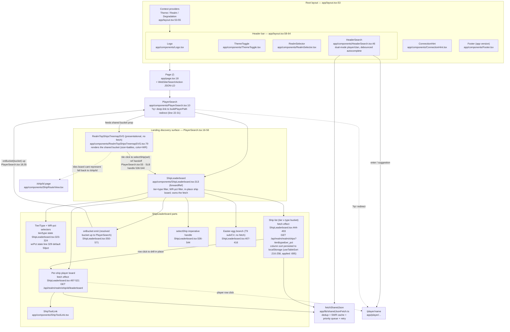

# Landing Page — Component Block Diagram

The `/` route. A thin page that mounts one feature component (`PlayerSearch`), wrapped by
the global app chrome from the root layout. Search is **not** on the landing body itself —
it lives in the header (`HeaderSearch`) and the landing's only job is the discovery surface:
a filter-correlated ship treemap that **mirrors** the inline `ShipLeaderboard`'s current
tier/type/WR bucket → the leaderboard table with in-place ship drilldown. The treemap and the
list read the **same** bucket off one fetch (see the `onBucket` lockstep below).

Boxes are React components; the `file:line` annotations point at the part worth reading.

## Data sources (all proxied through Django, never WG directly)

| Component | Endpoint | Backing |
|---|---|---|
| `RealmTopShipsTreemapSVG` | — (no fetch; renders the `ShipLeaderboard` `ships` bucket) | shares the list's data via the `onBucket` handoff |
| `ShipLeaderboard` list | `GET /api/realm/<realm>/ships?tier&type&wr_pct` | `realm_ships_by_tier_type` (nightly `ShipTopPlayerSnapshot` + pre-warmed WR-pct buckets, warm-before-evict) |
| `ShipLeaderboard` board | `GET /api/realm/<realm>/ship/<id>/leaderboard` | per-ship snapshot read-cache |
| `HeaderSearch` | `GET /api/landing/{player,clan}-suggestions?q=` | 3-tier suggest cache (client Map → Redis → `pg_trgm`) |

`realm_top_ships` (the old independent treemap endpoint) is now **FE-idle** — nothing on the
frontend reads it since the treemap moved to the shared bucket (2026-07-01).

## Notes

- The landing body holds **no search box** — `HeaderSearch` (in the layout header) owns
  search. `PlayerSearch` is named for history; today it's the discovery surface plus a
  `?q=` deep-link redirect for the SEO `SearchAction` (PlayerSearch.tsx:22-31).
- **Treemap mirrors the list, off one fetch.** `ShipLeaderboard` owns the tier/type/WR fetch
  and emits the resolved bucket up via `onBucket` (`PlayerSearch.tsx:18,55`; emit effect
  `ShipLeaderboard.tsx:550-571`); `PlayerSearch` feeds that same bucket to the presentational
  `RealmTopShipsTreemapSVG` (no second fetch, no `random/ranked` toggle — both stay in lockstep
  on the current tier/type/WR selection). Runbook:
  `runbook-landing-treemap-filter-correlation-2026-07-01.md`.
- Treemap → leaderboard drilldown is in-place via an imperative ref
  (`ShipLeaderboardHandle.selectShip`, ShipLeaderboard.tsx:536-544, wired at
  PlayerSearch.tsx:55); only tiles the inline board can't represent fall back to the standalone
  `/ship/<id>` page.
- WR-pct filter defaults to **50%** (top 50% of each ship's players by WR); buckets are
  pre-warmed nightly, with a lazy `X-Ships-WR-Pending` poll fallback (`ttlMs:0`, list fetch
  effect ShipLeaderboard.tsx:444-493). See `runbook-ship-list-wr-percentile-2026-06-23.md`.
- The inline ship-list column sort is persisted per browser to `localStorage`
  (`useTableSort` + `SHIP_LIST_SORT_STORAGE_KEY`, ShipLeaderboard.tsx:216-258).
