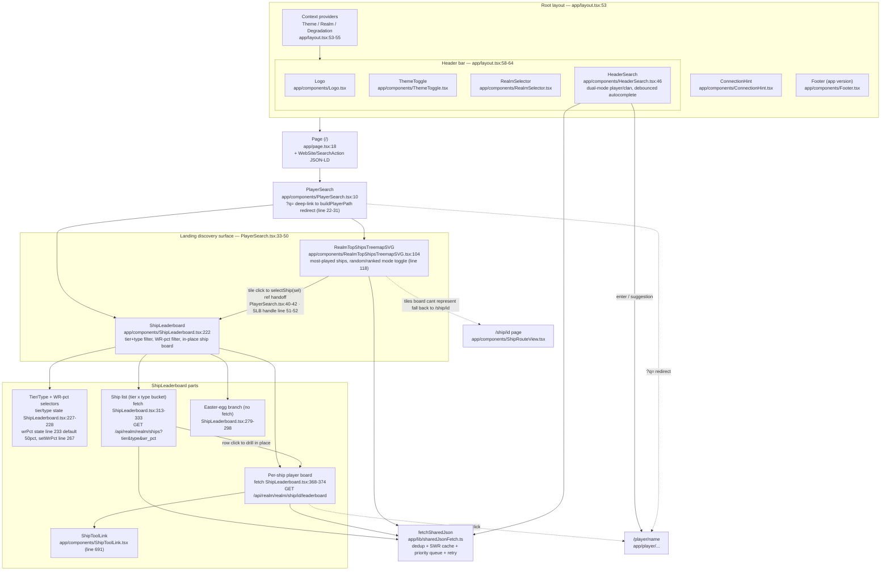

# Landing Page — Component Block Diagram

The `/` route. A thin page that mounts one feature component (`PlayerSearch`), wrapped by
the global app chrome from the root layout. Search is **not** on the landing body itself —
it lives in the header (`HeaderSearch`) and the landing's only job is the discovery surface:
realm top-ships treemap → inline ship leaderboard with in-place drilldown.

Boxes are React components; the `file:line` annotations point at the part worth reading.

## Data sources (all proxied through Django, never WG directly)

| Component | Endpoint | Backing |
|---|---|---|
| `RealmTopShipsTreemapSVG` | `GET /api/realm/<realm>/top-ships?mode=` | nightly snapshot (`realm_top_ships`, warm-before-evict) |
| `ShipLeaderboard` list | `GET /api/realm/<realm>/ships?tier&type&wr_pct` | nightly `ShipTopPlayerSnapshot` + pre-warmed WR-pct buckets |
| `ShipLeaderboard` board | `GET /api/realm/<realm>/ship/<id>/leaderboard` | per-ship snapshot read-cache |
| `HeaderSearch` | `GET /api/landing/{player,clan}-suggestions?q=` | 3-tier suggest cache (client Map → Redis → `pg_trgm`) |

## Notes

- The landing body holds **no search box** — `HeaderSearch` (in the layout header) owns
  search. `PlayerSearch` is named for history; today it's the discovery surface plus a
  `?q=` deep-link redirect for the SEO `SearchAction` (PlayerSearch.tsx:22-31).
- Treemap → leaderboard handoff is in-place via an imperative ref
  (`ShipLeaderboardHandle.selectShip`, ShipLeaderboard.tsx:51-52); only tiles the inline
  board can't represent fall back to the standalone `/ship/<id>` page.
- WR-pct filter defaults to **50%** (top 50% of each ship's players by WR); buckets are
  pre-warmed nightly, with a lazy `X-Ships-WR-Pending` poll fallback (`ttlMs:0`,
  ShipLeaderboard.tsx:333). See `runbook-ship-list-wr-percentile-2026-06-23.md`.
