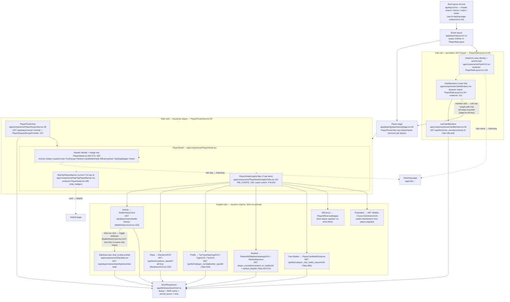

# Player Page — Component Block Diagram

The `/player/[playerName]` route. Two persistent regions under the root-layout chrome: a
**clan rail** that lives in the route layout and stays mounted across a soft-nav player swap,
and a **keyed main well** (`PlayerRouteView`, remounted per player) holding the player header,
the ship-top banner, and the seven-tab insights deck. The Activity tab's `BattleHistoryCard`
hosts one nested drilldown — `ShipStats`, a per-ship combat profile toggled by a table-row
click — which is its own component, not part of the card.

Boxes are React components; `file:line` annotations point at the part worth reading. The root
chrome (header search, theme/realm selectors, footer) is detailed in
[fe-landing-page-components.md](fe-landing-page-components.md) and only stubbed here.

## Tabs → panels → endpoints

| Tab (`InsightsTabId`) | Panel components | Endpoint(s) | Notes |
|---|---|---|---|
| `activity` | `BattleHistoryCard` → `ShipStats` (row drilldown) | `GET /api/player/<name>/battle-history/` · `GET /api/player/<name>/ship/<shipId>/combat-stats` | default tab; day/week/month/year windows resolve to the daily layer. A ship-row click toggles `ShipStats` below the rollup |
| `ships` | `RandomsSVG` | `GET /api/fetch/randoms_data/<id>/?all=true` | per-ship random-battle aggregates |
| `profile` | `TierTypeHeatmapSVG`, `TypeSVG`, `TierSVG` | `GET /api/fetch/player_correlation/tier_type/<id>/` | one payload derives all three charts |
| `ranked` | `RankedWRBattlesHeatmapSVG`, `RankedSeasons` | `…/ranked_wr_battles/<id>/` + `…/ranked_data/<id>/` | cold `ranked_data` serves `[]` + `X-Ranked-Pending` |
| `career` (Clan Battles) | `PlayerClanBattleSeasons` | `GET /api/fetch/player_clan_battle_seasons/<id>/` | request path sends `allow_remote_fetch=False`; `X-Clan-Battle-Seasons-Pending` |
| `badges` (Efficiency) | `PlayerEfficiencyBadges` | — (from the player payload) | |
| `population` | `WRDistributionSVG`, `BattlesDistributionSVG`, `PlayerScoreDistributionSVG` | — (realm distributions in the player payload) | player marker plotted against realm curves |

## Notes

- **Two mount lifetimes.** The clan rail lives in `app/player/layout.tsx` and is **not**
  keyed, so it survives a soft-nav player swap; the main well is `key={playerName}`
  (`page.tsx:46`) and remounts so per-player state (tab, scroll, sort) never bleeds across
  players. A `ClanMembers` row click swaps only the well. Full design:
  `runbook-player-fetch-orchestration-2026-06-21.md`.
- **One critical fetch, lazy tabs.** `PlayerRouteView` issues the single `critical`
  `/api/player/<name>/` fetch; the clan rail dedupes onto it (same URL → same cacheKey).
  Each tab is a `dynamic()` import that fetches on activate (with a low-priority warmup
  prefetch), so the header + Activity tab paint before the heavier charts.
- **Request scoping.** `PlayerRequestScopeProvider` (`PlayerRouteView.tsx:157`) carries one
  per-(player,realm) abort signal so a nav or realm switch cancels the whole page's
  in-flight requests.
- **Badge-dispatch is inline, on purpose.** Which classification icons the header tray
  renders, and in what order, is inlined at `PlayerDetail.tsx:263-270` (the clan-members row
  has its own order in `ClanMembers.tsx`) — the orders genuinely differ per surface.
- **Activity-tab ship drilldown.** `ShipStats` (`app/components/ShipStats.tsx`) is a separate
  component the Activity tab's `BattleHistoryCard` hosts, not part of the card. A ship-row
  click sets `selectedShip` and renders the panel between the stats rollup and the ships table
  (`BattleHistoryCard.tsx:1147`); a second click on the same ship hides it. It fetches
  `GET /api/player/<name>/ship/<shipId>/combat-stats` and charts the player's **career**
  per-ship rate (gunnery / torpedo / secondary accuracy, spotting, objective play, survival)
  against the ship's **30-day population average**, with an All / Top 50% / Top 25% skill
  bracket toggle. Role-irrelevant metric clusters are omitted server-side. Origin:
  `runbook-battle-history-data-operationalization-2026-06-16.md`.
