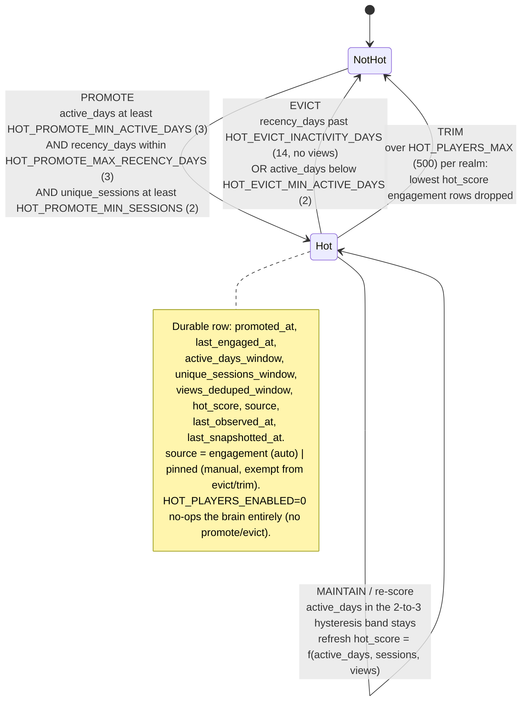
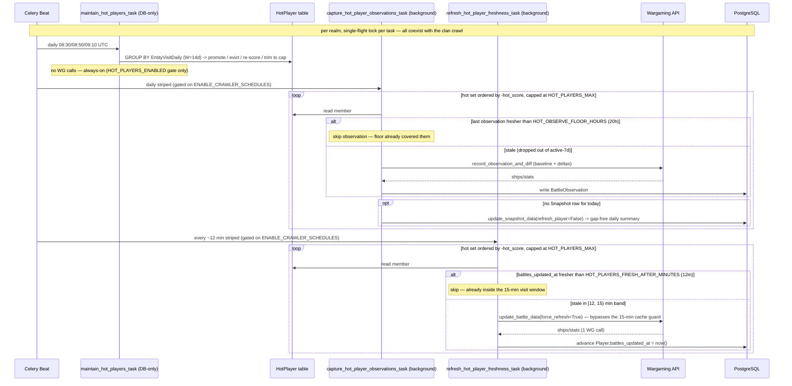
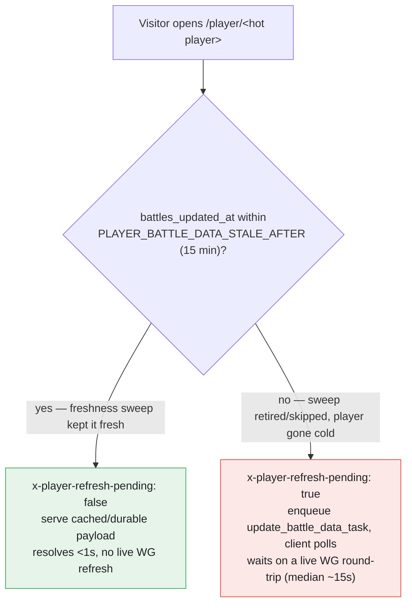

# Hot-Player Engagement Queue — Data Flow

How **durable visitor interest** — not a player's own activity or skill — qualifies a
player for guaranteed daily battle-history capture. Three separate sweeps share one
`HotPlayer` table: a DB-only *brain* that decides membership, and two WG-consuming *hands*
that act on it. This doc drills into that subsystem only; for the wider Celery topology see
`queue-data-flow.md`.

Sources: `runbook-hot-players-engagement-queue-2026-06-10.md`,
`runbook-player-refresh-latency-2026-06-10.md` (Tier 3), code in
`server/warships/{hot_players.py,tasks.py,signals.py,models.py}`.

## Level 1 — the loop at a glance

Visitor views accumulate in `EntityVisitDaily`; the daily *brain* promotes/evicts the
`HotPlayer` set on view-**recurrence**; the daily *capture* hand guarantees a
`BattleObservation` + a gap-free `Snapshot`; the ~12-min *freshness* hand keeps
`battles_updated_at` inside the visit window so a profile view resolves sub-second.

```mermaid
flowchart LR
    FE["Frontend (detail-page view)"]
    WG["Wargaming API (upstream)"]

    VED[("EntityVisitDaily / EntityVisitEvent (bot-filtered, 30-min dedupe, per realm/day)")]
    HP[("HotPlayer table (durable membership + audit; per-realm cap HOT_PLAYERS_MAX=500)")]
    PG[("PostgreSQL: BattleObservation, Snapshot, Player")]

    subgraph BRAIN["maintain_hot_players_task — daily, DB-only (the brain)"]
        B["GROUP BY EntityVisitDaily over W=14d<br/>active_days / recency_days / unique_sessions / views_deduped<br/>promote / evict (hysteresis) / re-score / trim to cap"]
    end
    subgraph CAP["capture_hot_player_observations_task — daily, background (hands)"]
        H["skip-if-fresh vs observation floor (HOT_OBSERVE_FLOOR_HOURS=20)<br/>record_observation_and_diff + update_snapshot_data(refresh_player=False)"]
    end
    subgraph FRESH["refresh_hot_player_freshness_task — ~12-min striped, background (hands)"]
        F["skip-if-fresh vs Player.battles_updated_at (HOT_PLAYERS_FRESH_AFTER_MINUTES=12)<br/>update_battle_data(force_refresh=True)"]
    end

    FE -->|"trackEntityDetailView -> /api/analytics/entity-view"| VED
    VED -->|"engagement signal (recurrence across days, NOT summed views)"| B
    B -->|"promote / evict / re-score / trim"| HP
    HP -->|"hot set (ordered by hot_score, capped)"| H
    HP -->|"hot set (ordered by hot_score, capped)"| F
    H <-->|"fetch only hot players gone stale (floor already has active-7d)"| WG
    F <-->|"force refresh (1 WG call: ships/stats)"| WG
    H -->|"BattleObservation baseline + gap-free daily Snapshot"| PG
    F -->|"advance Player.battles_updated_at (sub-second visit)"| PG

    classDef ext fill:#e8f0fe,stroke:#4285f4,color:#202124;
    classDef store fill:#fff3e0,stroke:#f9a825,color:#202124;
    class FE,WG ext;
    class VED,HP,PG store;
```

**Why it is cheap.** The observation floor already polls every active-7d player within
`BATTLE_OBSERVATION_FLOOR_HOURS` (8h). The marginal work of this queue is therefore only the
hot players who have *dropped out* of the active set — both hands `skip-if-fresh`, so hot
players the floor or a recent visit already covered cost zero WG calls.

## Level 2 — `HotPlayer` membership state machine

A player's membership is decided per realm by `maintain_hot_players()`
(`hot_players.py`) from an `active_days` `GROUP BY` over `EntityVisitDaily` in a trailing
`W=14`-day window. Promote at `>=3` active days, evict only below `2` — the gap gives
**hysteresis** so a player hovering at 2–3 active-days/14 stays put instead of flapping in
and out daily. Intensity (`unique_sessions`, `views_deduped`) is a tiebreak for the cap, not
a gate; there is deliberately **no visitor-breadth gate** so a single devoted fan qualifies.

- **Promotion** keys on **recurrence**, not summed views: one viral spike and a fan who
  returned on five separate days can have identical total views, but only the second clears
  the active-days floor. `compute_hot_score = active_days*1e6 + sessions*1e3 + views` is the
  sortable cap-trim key.
- **Eviction** is OR'd: long inactivity (`recency_days > 14`) or a sustained drop below the
  hysteresis floor (`active_days < 2`). `source='pinned'` rows are a durable manual override
  and are not subject to engagement-driven evict/trim.
- **Cap** bounds the per-realm set to `HOT_PLAYERS_MAX` (500), keeping the hands' WG cost
  predictable (doctrine: no unbounded fan-out). Qualified-but-trimmed counts are logged.

## Level 3 — the three sweeps, scheduling, and skip-if-fresh gates

The brain runs once daily in the 08:00–09:00 UTC maintenance band; the two hands are
per-realm striped so realms never overlap. The brain is **always-enabled** (DB-only, like
enrichment-pool maintenance); both hands are **crawler-class WG consumers gated on
`ENABLE_CRAWLER_SCHEDULES`**. All three **coexist with the clan crawl** (no deferral) and
honor the master `HOT_PLAYERS_ENABLED` kill switch.

| Sweep | Task | Beat name | Cadence (signals.py) | Queue | Enabled gate | Skip-if-fresh against |
|---|---|---|---|---|---|---|
| Brain | `maintain_hot_players_task` | `hot-players-maintain-{realm}` | daily — NA 08:30 / EU 08:50 / ASIA 09:10 UTC | (DB-only) | `HOT_PLAYERS_ENABLED` only | n/a (pure DB) |
| Capture | `capture_hot_player_observations_task` | `hot-players-capture-{realm}` | daily, striped (`HOT_PLAYERS_CAPTURE_CYCLE_MINUTES=1440`, base 10:35 lane) | `background` | `ENABLE_CRAWLER_SCHEDULES` | `BattleObservation.observed_at` < `HOT_OBSERVE_FLOOR_HOURS` (20h) |
| Freshness | `refresh_hot_player_freshness_task` | `hot-players-freshness-{realm}` | `HOT_PLAYERS_FRESH_CYCLE_MINUTES=12` striped — NA :00,12,24,36,48 / EU :04,16,28,40,52 / ASIA :08,20,32,44,56 | `background` | `ENABLE_CRAWLER_SCHEDULES` | `Player.battles_updated_at` < `HOT_PLAYERS_FRESH_AFTER_MINUTES` (12m) |

### Why three sweeps, and how their gates differ

- **Separate tasks, not folded into the floor.** The floor's whole selection *is* the
  activity gate the hot queue exists to override, so hot IDs cannot ride its query; and the
  floor runs under a per-run `limit`, so prepending risks truncating hot players. A separate,
  capped, skip-if-fresh sweep is both safer and — thanks to skip-if-fresh — barely more
  expensive than prepending.
- **Capture and freshness write different things.** `record_observation_and_diff` writes a
  `BattleObservation` (keeps the diff baseline live so the next play session is caught in
  full) but **does not** write a `Snapshot` and **does not** advance `battles_updated_at`.
  So capture additionally calls `update_snapshot_data(refresh_player=False)` for the gap-free
  daily summary, and freshness separately advances `battles_updated_at`. Their skip-if-fresh
  gates are therefore against *different* timestamps (observation age vs `battles_updated_at`)
  — a player can be fresh for one and stale for the other.
- **`force_refresh=True` is load-bearing for freshness.** `update_battle_data` has its own
  15-min cache guard that early-returns *without* advancing `battles_updated_at`, which would
  neuter a 12-min cadence for exactly the `[12, 15)`-min band this sweep targets;
  `force_refresh=True` bypasses that guard (default `False` keeps all other callers unchanged).
- **Interaction:** because freshness advances the observation baseline every ~12 min for
  refreshed players, capture's observation path will usually now skip them — capture still
  uniquely owns the gap-free daily `Snapshot`, which freshness never writes.

> **Prod config note (2026-06-13):** the freshness sweep is gated to once/24h in prod via
> `HOT_PLAYERS_FRESH_AFTER_MINUTES=1440`, trading the sub-second-on-visit guarantee for a
> cheaper "≥1 battle-history refresh per hot player per 24h." Code, beat registration, and
> skip-if-fresh logic are unchanged — re-enabling Tier 3 is a one-knob revert back to `12`.

## Visit fast-path — what the freshness sweep buys (Tier 3)

When the freshness sweep has kept a hot player's `battles_updated_at` inside the 15-min
`PLAYER_BATTLE_DATA_STALE_AFTER` window, a profile view resolves sub-second with no live WG
call on the request thread.

The engagement signal that earns a player a gap-free day-over-day record (capture) *also*
earns them a fast page (freshness) — one durable `HotPlayer` set, three guarantees.
