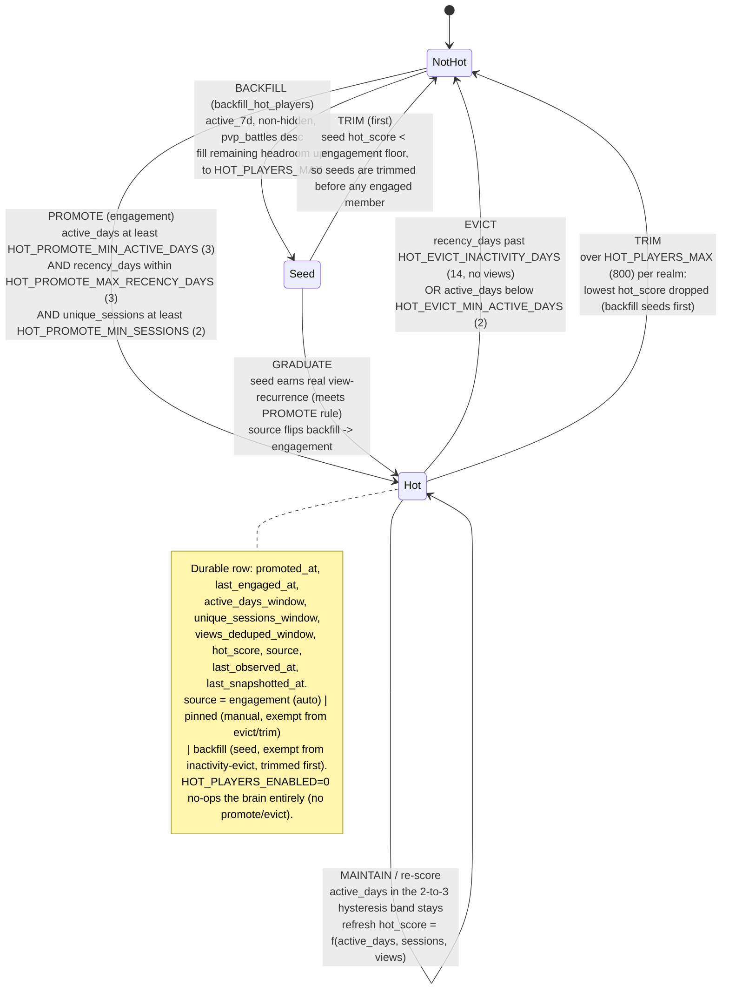
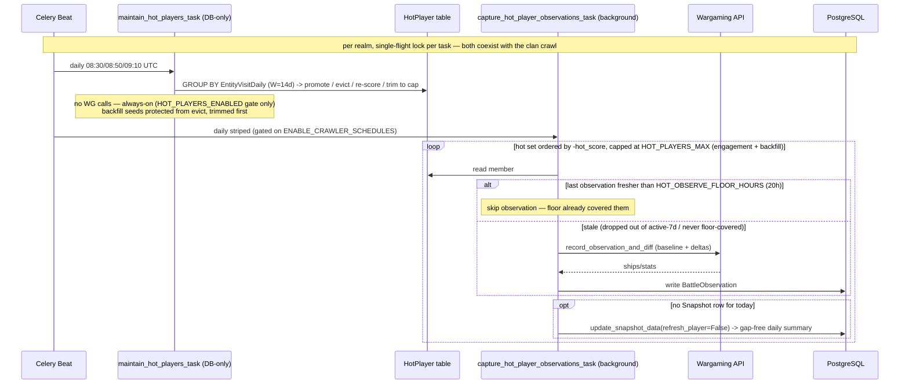
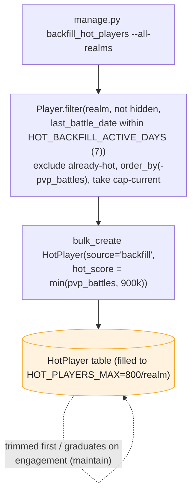

# Hot-Player Engagement Queue — Data Flow

How **durable visitor interest** — not a player's own activity or skill — qualifies a
player for guaranteed daily battle-history capture. Two sweeps share one `HotPlayer`
table: a DB-only *brain* that decides membership, and one WG-consuming *hand* (capture)
that acts on it. A one-time `backfill_hot_players` seed can fill the queue to the cap with
the most-active players. This doc drills into that subsystem only; for the wider Celery
topology see `queue-data-flow.md`.

> **Retired 2026-06-15:** a third sweep — `refresh_hot_player_freshness_task`, the per-12-min
> "Tier 3" sweep that advanced `battles_updated_at` for sub-second visit resolution — was
> **deleted**. The hot queue's sole purpose is now a **≥24h battle-history pull**; a visit to a
> stale hot player takes the normal lazy-refresh-on-view path. The history below reflects the
> current two-sweep design.

Sources: `runbook-hot-players-engagement-queue-2026-06-10.md`,
`runbook-player-refresh-latency-2026-06-10.md` (Tier 3, retired), code in
`server/warships/{hot_players.py,tasks.py,signals.py,models.py}`.

## Level 1 — the loop at a glance

Visitor views accumulate in `EntityVisitDaily`; the daily *brain* promotes/evicts the
`HotPlayer` set on view-**recurrence**; the daily *capture* hand guarantees a
`BattleObservation` + a gap-free `Snapshot` per member (skip-if-fresh against the
observation floor, so active-7d hot players cost zero WG calls).

```mermaid
flowchart LR
    FE["Frontend (detail-page view)"]
    WG["Wargaming API (upstream)"]

    VED[("EntityVisitDaily / EntityVisitEvent (bot-filtered, 30-min dedupe, per realm/day)")]
    HP[("HotPlayer table (durable membership + audit; per-realm cap HOT_PLAYERS_MAX=800)")]
    PG[("PostgreSQL: BattleObservation, Snapshot, Player")]

    subgraph BRAIN["maintain_hot_players_task — daily, DB-only (the brain)"]
        B["GROUP BY EntityVisitDaily over W=14d<br/>active_days / recency_days / unique_sessions / views_deduped<br/>promote / evict (hysteresis) / re-score / trim to cap"]
    end
    subgraph CAP["capture_hot_player_observations_task — daily, background (the hand)"]
        H["skip-if-fresh vs observation floor (HOT_OBSERVE_FLOOR_HOURS=20)<br/>record_observation_and_diff + update_snapshot_data(refresh_player=False)"]
    end
    SEED["backfill_hot_players (one-time / idempotent)<br/>seed most-active players as source='backfill'"]

    FE -->|"trackEntityDetailView -> /api/analytics/entity-view"| VED
    VED -->|"engagement signal (recurrence across days, NOT summed views)"| B
    B -->|"promote / evict / re-score / trim"| HP
    SEED -->|"fill to cap (active_7d, pvp_battles desc, below engagement)"| HP
    HP -->|"hot set (ordered by hot_score, capped)"| H
    H <-->|"fetch only hot players gone stale (floor already has active-7d)"| WG
    H -->|"BattleObservation baseline + gap-free daily Snapshot"| PG

    classDef ext fill:#e8f0fe,stroke:#4285f4,color:#202124;
    classDef store fill:#fff3e0,stroke:#f9a825,color:#202124;
    class FE,WG ext;
    class VED,HP,PG store;
```

**Why it is cheap.** The observation floor already polls every active-7d player within
`BATTLE_OBSERVATION_FLOOR_HOURS` (8h). The marginal work of this queue is therefore only the
hot players who have *dropped out* of the active set — capture is `skip-if-fresh`, so hot
players the floor or a recent visit already covered cost zero WG calls. (At a cap-filled set
most members are active-7d and floor-covered, so a daily capture pass is mostly skips.)

## Level 2 — `HotPlayer` membership state machine

A player's engagement membership is decided per realm by `maintain_hot_players()`
(`hot_players.py`) from an `active_days` `GROUP BY` over `EntityVisitDaily` in a trailing
`W=14`-day window. Promote at `>=3` active days, evict only below `2` — the gap gives
**hysteresis** so a player hovering at 2–3 active-days/14 stays put instead of flapping in
and out daily. Intensity (`unique_sessions`, `views_deduped`) is a tiebreak for the cap, not
a gate; there is deliberately **no visitor-breadth gate** so a single devoted fan qualifies.

- **Promotion** keys on **recurrence**, not summed views: one viral spike and a fan who
  returned on five separate days can have identical total views, but only the second clears
  the active-days floor. `compute_hot_score = active_days*1e6 + sessions*1e3 + views` is the
  sortable cap-trim key.
- **Eviction** is OR'd: long inactivity (`recency_days > 14`) or a sustained drop below the
  hysteresis floor (`active_days < 2`). `source='pinned'` rows are a durable manual override
  exempt from engagement-driven evict/trim.
- **Backfill seeds** (`source='backfill'`) are scored `min(pvp_battles, 900_000)` — always
  below the engagement floor (a surviving engaged member has `active_days >= 2` → score
  `>= 2_000_000`). They are **protected from inactivity-eviction** but are the **first
  trimmed** under cap pressure, and **graduate to `engagement`** if they later earn
  view-recurrence.
- **Cap** bounds the per-realm set to `HOT_PLAYERS_MAX` (800), keeping the hand's WG cost
  predictable (doctrine: no unbounded fan-out). Trim removes the lowest `hot_score` over the
  cap, i.e. backfill seeds before engaged members.

## Level 3 — the two sweeps, scheduling, and skip-if-fresh

The brain runs once daily in the 08:00–09:00 UTC maintenance band; the capture hand is
per-realm striped so realms never overlap. The brain is **always-enabled** (DB-only, like
enrichment-pool maintenance); capture is a **crawler-class WG consumer gated on
`ENABLE_CRAWLER_SCHEDULES`**. Both **coexist with the clan crawl** (no deferral) and honor
the master `HOT_PLAYERS_ENABLED` kill switch.

| Sweep | Task | Beat name | Cadence (signals.py) | Queue | Enabled gate | Skip-if-fresh against |
|---|---|---|---|---|---|---|
| Brain | `maintain_hot_players_task` | `hot-players-maintain-{realm}` | daily — NA 08:30 / EU 08:50 / ASIA 09:10 UTC | (DB-only) | `HOT_PLAYERS_ENABLED` only | n/a (pure DB) |
| Capture | `capture_hot_player_observations_task` | `hot-players-capture-{realm}` | daily, striped (`HOT_PLAYERS_CAPTURE_CYCLE_MINUTES=1440`, base 10:35 lane) | `background` | `ENABLE_CRAWLER_SCHEDULES` | `BattleObservation.observed_at` < `HOT_OBSERVE_FLOOR_HOURS` (20h) |

### Why two sweeps, and how the gates differ

- **Separate task, not folded into the floor.** The floor's whole selection *is* the
  activity gate the hot queue exists to override, so hot IDs cannot ride its query; and the
  floor runs under a per-run `limit`, so prepending risks truncating hot players. A separate,
  capped, skip-if-fresh sweep is both safer and — thanks to skip-if-fresh — barely more
  expensive than prepending.
- **Capture writes two things, on different conditions.** `record_observation_and_diff`
  writes a `BattleObservation` (keeps the diff baseline live so the next play session is
  caught in full) only when the last observation is older than `HOT_OBSERVE_FLOOR_HOURS`;
  `update_snapshot_data(refresh_player=False)` writes the gap-free daily `Snapshot` whenever
  today's row is missing. Neither advances `Player.battles_updated_at` — that's the floor's
  job (`FLOOR_REFRESH_BATTLES_JSON`) for active players, and is not refreshed at all for
  inactive hot players (whose battle data isn't changing anyway).
- **24h guarantee.** Active hot players are observed by the floor every ≤8h; inactive hot
  players (not active-7d, so the floor skips them) are pulled by capture every 24h — its 20h
  skip-window is < the 24h cadence, so the daily pass won't skip them. Floor-or-capture
  therefore guarantees ≥1 battle-history pull per hot player per 24h.

## One-time seed — `backfill_hot_players`

Fills each realm's queue to `HOT_PLAYERS_MAX` with the most-active players so they get the
24h capture guarantee before attracting visitor interest. Pure DB, idempotent (re-running
tops up to the cap). No WG calls — the nightly capture sweep does the actual work.

The engagement signal that earns a player gap-free day-over-day history — and the backfill
seed of the most-active players — both feed one durable `HotPlayer` set with a single
guarantee: **≥1 battle-history pull per hot player per 24h.** (The former sub-second-on-visit
"fast page" guarantee was the retired Tier 3 freshness sweep; a visit to a stale hot player
now takes the normal lazy-refresh-on-view round trip — see `queue-data-flow.md`.)
