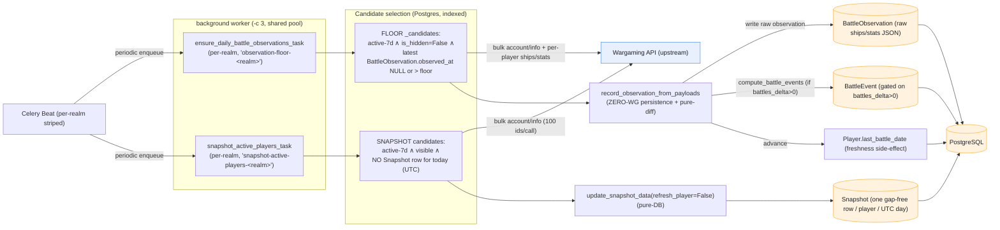
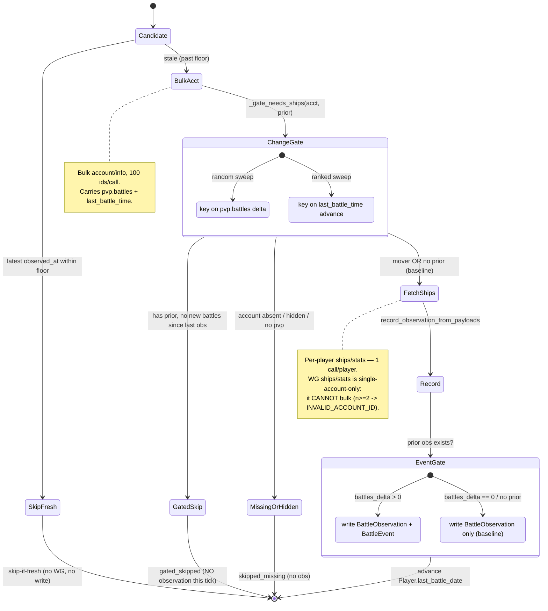
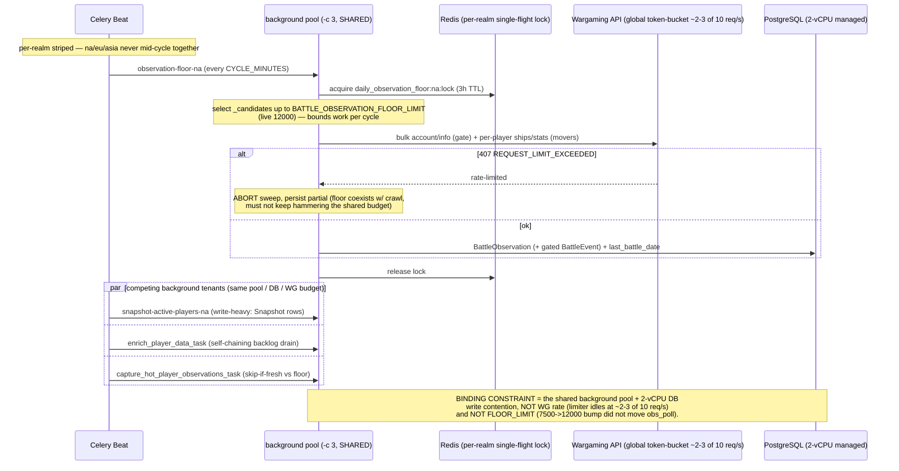

# Observation-Floor & Daily-Active Capture Data Flow

How the **battle-observation floor** and the **daily-active `Snapshot` engine** keep
battle history flowing for active players. These are two *parallel coverage guarantees*
on the `background` Celery queue, each with a **distinct write target**:

- **Observation floor** — no active player goes longer than `BATTLE_OBSERVATION_FLOOR_HOURS`
  (live: 8) without a fresh `BattleObservation`. Writes `BattleObservation` (+ a
  change-gated `BattleEvent`) and advances `Player.last_battle_date`. It does **not**
  write `Snapshot` and does **not** touch `battles_json` / `battles_updated_at`.
- **Daily-active snapshot engine** — every active, visible player gets one gap-free daily
  `Snapshot` row. Writes `Snapshot` (the day-over-day series). This engine exists
  *because* the floor never writes `Snapshot`.

This doc is narrower and deeper than `queue-data-flow.md` — see that for the full
four-queue layout; both subsystems run on the **`background` (`-c 3`)** worker.

Sources: `runbook-bulk-battle-observation-capture-2026-06-06.md`,
`runbook-daily-active-snapshots-2026-06-09.md`,
`runbook-floor-throughput-tuning-2026-06-13.md`, and `signals.py` / `tasks.py` /
`incremental_battles.py` / `ensure_daily_battle_observations.py`.

---

## Level 1 — Two parallel guarantees (overview)

Beat fires both task families per realm (striped, so at most one realm is mid-cycle).
The floor selects active-7d players whose last `BattleObservation` is past the freshness
floor; the snapshot engine selects active-7d players who lack today's `Snapshot`. Both
feed the **zero-WG persistence core** (`record_observation_from_payloads` /
`update_snapshot_data`) after fetching from Wargaming.

**The freshness clock the floor selects on** is the latest `BattleObservation.observed_at`
(the `_candidates` `stale_hours` test) — *not* `battles_updated_at`. `battles_updated_at`
tracks the displayed `battles_json` chart refresh; since 2026-06-14 the floor **also**
advances it for active players from the same `ships/stats` response
(`FLOOR_REFRESH_BATTLES_JSON_ENABLED`), alongside incremental refresh and lazy-refresh-on-view.
(The hot-player Tier-3 freshness sweep that previously advanced it was retired 2026-06-15.)

### The reuse seam

`record_observation_from_payloads(player, *, player_data=None, ship_data,
ranked_ship_data=None, source=None)` (`incremental_battles.py:669`) makes **zero WG
calls**: it coerces the pre-fetched payloads into a snapshot, writes the
`BattleObservation`, finds the prior observation, computes `BattleEvent`s via the pure
`compute_battle_events` / `compute_ranked_battle_events` diff, updates
`PlayerDailyShipStats`, and invalidates caches inside its own `transaction.atomic` +
`on_commit`. Every fetch path — legacy per-player, the bulk floor, hot-player capture —
funnels through this one core, which is why they are parity-by-construction.

---

## Level 2 — Per-player capture decision (two distinct gates)

A player is processed in two stages with **two separate gates**. The *pre-fetch
change-gate* (`_gate_needs_ships`) decides whether to pay for the per-player
`ships/stats` call at all; the *post-fetch event gate* (`battles_delta>0`) decides
whether the resulting observation produces a `BattleEvent` or is a baseline-only
observation. Confusing the two is the easy mistake — they are different decisions at
different stages.

### Why the two gates differ

- **Pre-fetch change-gate (`_gate_needs_ships`, `incremental_battles.py:940`)** — the
  cost-saver. `account/info` bulks cheaply (100 ids/call) and carries each player's
  `statistics.pvp.battles` + `last_battle_time`, so the floor can decide *before* paying
  for the expensive per-player `ships/stats` call whether anything moved:
  - **Random sweep keys on `pvp.battles`** vs the latest `BattleObservation.pvp_battles`.
  - **Ranked sweep keys on `last_battle_time`** — ranked-known players play randoms *and*
    ranked, and `last_battle_time` advances on *any* battle, so a `pvp.battles`-only check
    would miss ranked-only activity.
  - A non-mover is `gated_skipped` and gets **no observation this tick**. Measured ~51%
    of stale candidates skip here — the gate cuts floor `ships/stats` load roughly in half
    (the ~37% WG-load cut reported on rollout).
- **Post-fetch event gate (`battles_delta>0`)** — the correctness gate *inside*
  `record_observation_from_payloads`. Every reached player still gets a
  `BattleObservation` written, but a `BattleEvent` (the per-event delta row) is only
  produced when `compute_battle_events` finds `battles_delta>0`. A first-seen player or a
  no-play tick writes a **baseline observation** with no event.

### The asymmetric "bulk" fetch (refuted ~100× premise)

The fetch is **not** symmetric bulk. WG `ships/stats/` is **single-account-only** — it
rejects `n>=2` `account_id` values with `INVALID_ACCOUNT_ID` (confirmed by raw `curl`:
even the same valid id twice fails). So the path is:

- **bulk `account/info`** — 100 ids/call (~0.01 WG/player), the change-gate signal source.
- **per-player `ships/stats`** — 1 call/player, *unavoidable*, only for gate movers.

The original "~100× cheaper / daily-every-active-player" justification was **refuted on
prod**: enrichment's `_bulk_fetch_ship_stats` had always been silently falling back to
per-player. The real R1 saving is **~2× → ~1×** (drops the per-player `account/info`
call), and the goal is reachable not because of bulk ships but because the active-7d
population was a 3× overcount (~84k, not 255k). The change-gate then removes the wasted
~half of `ships/stats` calls on non-movers.

---

## Level 3 — Scheduling, throughput & contention

Both task families are **per-realm striped** via `REALM_INTERVAL_OFFSETS = {'na': 0,
'eu': 1, 'asia': 2}` so at most one realm is mid-cycle at a time, computed by
`_realm_crontab_for_cycle(realm, cycle_minutes, base_minute=...)` in `signals.py`. The
floor runs on a rolling `BATTLE_OBSERVATION_FLOOR_CYCLE_MINUTES` cycle (live: **180** →
8 slots/realm/day) and the freshness *guarantee* is `BATTLE_OBSERVATION_FLOOR_HOURS`
(live: 8). The snapshot engine runs every `SNAPSHOT_ACTIVE_INTERVAL_MINUTES` (default 30,
48 idempotent runs/day → convergence).

### What actually bounds throughput

The floor is **not** capacity-bound by its own knobs (per the 06-13 throughput runbook):

- **Not WG rate** — the global token-bucket limiter idles at ~2-3 of 10 req/s.
- **Not app CPU** — app droplet load ~1.1-1.3 on 2 vCPU.
- **Not `BATTLE_OBSERVATION_FLOOR_LIMIT`** — already live at 12000; the 7500→12000 bump
  did not move `obs_poll`.

The real throttle is the **shared `background` pool (`-c 3`)**, contended by enrichment
self-chaining, the daily-snapshot engine, and the two hot-player sweeps (brain + capture)
— plus **write contention on the 2-vCPU managed Postgres**, since several of those tenants
(`update_snapshot_data`, the floor's own `battles_json` refresh, hot-player capture) are
concurrent writers. Phase 1 of the tuning runbook bounded a wasteful enrichment
self-chain spin (146 passes / 90 min doing zero useful work, stealing a worker slot);
freeing the pool is the live coverage lever, not raising the floor limit.

### Crawl-coexist (no deferral)

Both the floor and the snapshot engine **coexist with the multi-day clan crawl** — they
do **not** defer (guaranteed coverage is the whole point). When the clan-crawl lock is
held, the floor task detects it (`cache.get(_clan_crawl_lock_key(realm))`) and *gentles
its pacing* instead of skipping: it swaps in `BATTLE_OBSERVATION_FLOOR_CRAWL_DELAY` (0.8)
/ `BATTLE_OBSERVATION_FLOOR_BULK_CRAWL_CHUNK_DELAY` (1.0) and an optional
`BATTLE_OBSERVATION_FLOOR_CRAWL_LIMIT`, so it stays under the shared ~10 req/s budget the
crawl is already drawing on. The crawl is *secondary contention*, never a hard skip.

### Interaction with the hot-player capture queue

`capture_hot_player_observations_task` is **skip-if-fresh against the floor** (its
`HOT_OBSERVE_FLOOR_HOURS` check), so hot players who are *also* active-7d are already
covered by the floor and cost nothing extra — the hot sweep's marginal work is only the
hot-but-inactive set the floor wouldn't reach. (Full hot-player loop: see the hot-players
drill-down in `queue-data-flow.md`.)

---

## Gating & flags (live vs default)

The bulk + change-gate + random-first path is **live in prod for all realms** and
**persisted in `deploy_to_droplet.sh`**, with the legacy per-player path kept intact
behind flags for instant rollback. Defaults below are the *code* defaults (legacy path);
the live prod values differ where noted.

| Flag / knob | Code default | Live prod | Role |
|---|---|---|---|
| `SNAPSHOT_ACTIVE_PLAYERS_ENABLED` | `1` | `1` | Master kill switch for the daily-snapshot engine |
| `BATTLE_OBSERVATION_FLOOR_LIMIT` | `3000` | `12000` | Candidates per floor cycle (bounds work/cycle) |
| `BATTLE_OBSERVATION_FLOOR_CYCLE_MINUTES` | `360` | `180` | Floor cycle (8 slots/realm/day) |
| `BATTLE_OBSERVATION_FLOOR_HOURS` | `8` | `8` | Freshness *guarantee* (max age of latest observation) |
| `BATTLE_OBSERVATION_FLOOR_BULK_ENABLED` | `0` | `1` | Bulk `account/info` path vs legacy per-player |
| `BATTLE_OBSERVATION_FLOOR_CHANGE_GATE_ENABLED` | `0` | `1` | Pre-fetch random change-gate (skip non-movers) |
| `BATTLE_OBSERVATION_FLOOR_RANKED_GATE_ENABLED` | `0` | `1` | Pre-fetch ranked change-gate (`last_battle_time`) |
| `BATTLE_OBSERVATION_FLOOR_RANDOM_FIRST_ENABLED` | `0` | `1` | Route current-season ranked only; Random > Ranked |
| `BATTLE_OBSERVATION_FLOOR_RANKED_DAILY_ENABLED` | `0` | `0` (deferred) | Heavy ranked sweep once/day vs every slot |
| `BATTLE_OBSERVATION_FLOOR_SELF_CHAIN_ENABLED` | `0` | `0` (DB-gated) | Refill idle floor time between Beat slots |

### Notes

- The snapshot engine is **DB-light**: bulk `account/info` (~1 WG call / 100 players,
  ~1.2K calls/day for ~120K active) → `save_player(core_only=True)` →
  `update_snapshot_data(refresh_player=False)`. It deliberately does **not** rebuild
  `battles_json`.
- A daily drop in coverage (`cov/7d`) is usually **maturation, not regression** — the
  bulk floor front-loads never-observed players, then the change-gate makes the sweep
  *more selective* as coverage matures (`productive_rate` rises). Only call a regression
  when sustained ≥2-3 clean snapshots with `distinct_productive` down and `active_7d`
  flat. (`/observation` skill + bulk-capture runbook Benchmarks.)
- `cov/7d` is capped at the daily-active fraction (~40%, declining), not "toward 100%" —
  the `active_7d` denominator plateau is the forecast linchpin.
