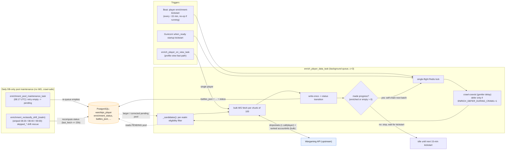
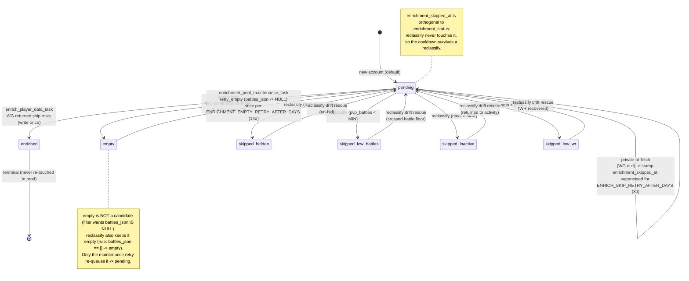
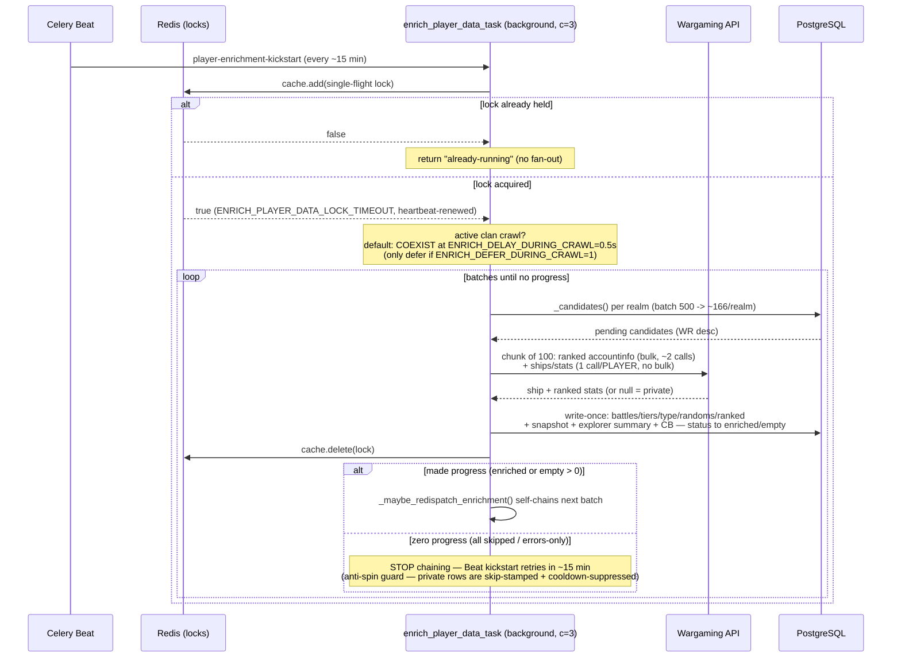
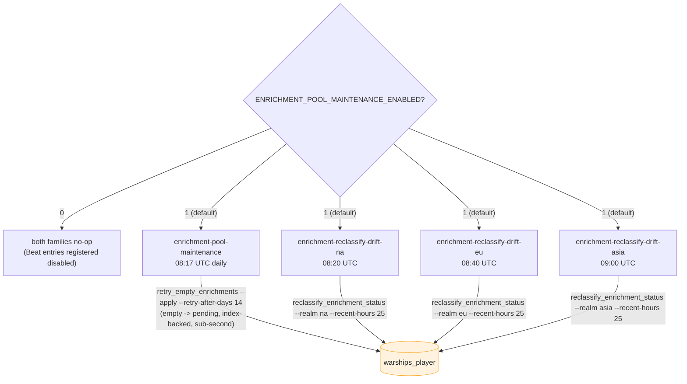

# Player Enrichment — Data Flow

How the **one-time-per-player backfill** pipeline fills `battles_json` (and the
sibling `tiers_json` / `type_json` / `randoms_json` / `ranked_json` + snapshot /
explorer-summary / clan-battle fields), and how the daily DB-only pool-maintenance
machinery keeps the candidate pool correct between runs. This is a narrow drill-down
of the `background`-queue enrichment tenant in `queue-data-flow.md` — read that first
for the broader Celery topology.

Enrichment is **filter-gated, not throughput-gated**: it targets only established,
active, above-average, visible accounts, writes their stats once, marks them
`enriched`, and never re-touches them. Ongoing freshness is a *different* system
(the observation floor + incremental refresh tiers) and is out of scope here.

Code: `server/warships/management/commands/enrich_player_data.py` (`_candidates()`,
`enrich_players()`), `server/warships/tasks.py` (`enrich_player_data_task`,
`enrich_player_on_view_task`, `enrichment_pool_maintenance_task`,
`enrichment_reclassify_drift_task`), `server/warships/signals.py` (Beat
registrations), `server/warships/management/commands/reclassify_enrichment_status.py`.

---

## Level 1 — Lifecycle overview

Three triggers feed one batch task; the batch fetches WG and writes Postgres once;
a daily DB-only maintenance loop keeps the `pending` pool correct so newly-eligible
players keep flowing in.



### The three triggers

- **`player-enrichment-kickstart`** (Beat, `IntervalSchedule` every
  `ENRICH_KICKSTART_MINUTES`, default **15 min**) — re-seeds the self-chaining batch
  task; a no-op if a batch already holds the single-flight lock.
- **Startup kickstart** — the Gunicorn `when_ready` warmer dispatches
  `enrich_player_data_task` ~30 s after boot, so a deploy restart restarts the chain.
- **On-view fast-path** (`enrich_player_on_view_task`, kill switch
  **`ENRICH_ON_VIEW_ENABLED`**, default off) — when a profile-view refresh lands on a
  now-eligible but un-enriched player, this enqueues a single-player enrich
  immediately (debounced 6 h per player) instead of waiting for the next daily drift
  reclassify to surface them. It re-checks eligibility authoritatively against the
  same env thresholds before fetching.

### Write-once, never re-touched

`enrich_players()` selects `pending ∧ battles_json IS NULL`, fetches WG, writes the
full payload, and sets `enrichment_status = enriched`. **No production path
re-enriches an `enriched` player** — only the manual/scheduled `reclassify` state
machine can move a row back. New games for an already-enriched player are *refresh*
work handled by the observation floor / incremental-refresh arm, not enrichment.

---

## Level 2 — Candidate selection & the status state machine

### Eligibility filter (`_candidates()`)

Selected **per realm**, ordered best-players-first, with a private-at-fetch cooldown
suppressing rows that recently came back null:

```
enrichment_status = 'pending'
AND is_hidden = false
AND pvp_battles            >= ENRICH_MIN_PVP_BATTLES   (prod 500)
AND pvp_ratio              >= ENRICH_MIN_WR            (prod 48.0 %)
AND days_since_last_battle <= ENRICH_MAX_INACTIVE_DAYS (prod 7, default 365)
AND battles_json IS NULL
AND name <> ''
AND (enrichment_skipped_at IS NULL                              -- private-at-fetch
     OR enrichment_skipped_at < now - ENRICH_SKIP_RETRY_AFTER_DAYS)  -- cooldown (3d)
ORDER BY pvp_ratio DESC NULLS LAST, pvp_battles DESC NULLS LAST, name
```

`enrich_player_on_view_task` mirrors the same gate for its single player. The order
means the highest-skill / highest-volume accounts are enriched first.

### Status transitions

The key correctness rule: **the enrich task only ever drives `pending → enriched`
or `pending → empty`** (or stamps a private-at-fetch skip and *leaves the row
pending*). The four `skipped_*` statuses are written **exclusively by
`reclassify_enrichment_status`** — never by the enrich task. The maintenance loop
(`empty → pending`) and the drift reclassify (`pending ↔ skipped_*`) are the only
paths back out of a terminal-ish state.



### Two cooldowns, two purposes

| Cooldown | Field gated | Default | Suppresses | Owner |
|---|---|---|---|---|
| `ENRICH_SKIP_RETRY_AFTER_DAYS` | `enrichment_skipped_at` | **3 d** | a *pending* row that was private-at-fetch — keeps it out of `_candidates()` so it doesn't re-clog the WR-ordered queue every pass | `_candidates()` / `_process_player_ship_data` |
| `ENRICHMENT_EMPTY_RETRY_AFTER_DAYS` | `battles_updated_at` | **14 d** | an *empty* row from being re-queued forever — re-fetches a stuck `empty` at most once per N days | `retry_empty_enrichments` / maintenance task |

Both exist because a private/transient WG response is a **false negative**: a 75 %-WR
account can be parked as `empty` or skip-stamped simply because it was private at
fetch time, then go public. The cooldowns make the retry *bounded* (no unbounded
re-fetch loop) while still letting now-public accounts converge to `enriched`. See
`agents/work-items/player-enrichment-map-2026-06-08.md` §11–§12.

### Kill switches

- **`ENRICHMENT_POOL_MAINTENANCE_ENABLED`** (default on) — gates *both* daily
  maintenance families (empty re-queue + drift reclassify). At `0` the tasks no-op
  and the Beat entries register disabled. Note the `post_migrate` handler re-applies
  `enabled` from this env flag on every migrate, so toggle via the env var, not a
  manual DB edit.
- **`ENRICH_ON_VIEW_ENABLED`** (default off) — gates the profile-view fast-path.
- **`ENRICH_DEFER_DURING_CRAWL`** (default off) — opt-in restore of defer-entirely
  during crawls (see Level 3).

---

## Level 3 — Task chaining, scheduling & crawl-coexist

The batch task self-chains across batches under a single-flight lock; the 15-min
Beat kickstart is the safety net; the daily DB-only families run on their own
schedule and never compete for the WG budget.



### Self-chain & the anti-spin guard

After each batch `_maybe_redispatch_enrichment(made_progress=…)` re-dispatches the
task until the candidate pool empties. The guard: a batch that changed **zero state**
(every candidate `skipped`, or errors-only — `enriched == 0 and empty == 0`) does
**not** self-chain; it falls back to the 15-min kickstart. This kills the
~37 s-per-pass spin that otherwise burned a `background` worker slot and WG calls on a
fixed set of private-at-fetch rows that `_candidates()` re-returned forever (the
`enrichment_skipped_at` cooldown is the deeper root-fix that drains those rows to 0
candidates for the cooldown window). A steady ~33 `pending` post-fix is **cooldown-
suppressed, not stuck** — see `runbook-floor-throughput-tuning-2026-06-13.md`.

### Single-flight & crawl-coexist

- **Single-flight lock** (`cache.add`, acquired *first*) — duplicate dispatches (the
  15-min kickstart, `acks_late` redelivery, startup kickstart) return immediately
  without re-enqueuing, so deferrals can't fan out into accumulating 300 s-recurring
  chains (the 2026-05-27 ~1,190/hr churn regression).
- **Crawl-coexist by default** — enrichment **no longer defers entirely** during a
  clan crawl. It runs alongside at a gentler per-player delay
  (`ENRICH_DELAY_DURING_CRAWL` = **0.5 s** vs `ENRICH_DELAY` = **0.2 s**) to bound the
  combined WG rate. The old defer-entirely path is opt-in via
  `ENRICH_DEFER_DURING_CRAWL=1` (it was starving backlog drain through multi-day
  crawls). *(The §5 pipeline diagram in the 2026-06-08 work-item map still shows
  defer-entirely — that is stale; the code coexists.)*

### Daily DB-only maintenance schedule

Both families are **DB-only (no WG calls)**, so unlike the fetch arm they are
crawl-safe and never defer — they relabel/re-queue rows; the self-chaining task does
the actual WG fetching in its next window.



- **`enrichment-pool-maintenance`** (08:17 UTC) — re-surfaces `empty`
  false-negatives into `pending` with the 14-day cooldown guard. Touches only the
  small `empty` set, index-backed on `enrichment_status`, sub-second.
- **`enrichment-reclassify-drift-{realm}`** (per-realm **striped** na 08:20 / eu 08:40
  / asia 09:00 UTC) — **incremental** `reclassify --recent-hours 25`: recomputes
  `enrichment_status` only for rows fetched in the last 25 h (drift fields only change
  on a WG re-fetch, which bumps `last_fetch`), scoped via `player_last_fetch_idx`
  (migration 0067). ~6–11 min/realm; striping keeps the 2-vCPU managed PG to one
  realm's scan at a time rather than an ~18 min multi-realm burst.

The **full-catalog reclassify** (no `--recent-hours`, ~36 min) stays a **supervised
manual op** — needed only for the one-time ~230 K pre-existing backlog and
pure-calendar inactivity crossings (which never bump `last_fetch`, so the incremental
window misses them). Active threshold-crossers / un-hid / WR-recoveries self-clear:
the daily active-snapshot engine refreshes core stats + `last_fetch` daily, landing
them in the 25 h window. Runbook:
`agents/runbooks/runbook-enrichment-pool-maintenance-2026-06-09.md`.

---

## Why "99 % caught up" overstates coverage

Enrichment's "N pending" only counts the **visible** queue. The closed correctness
gaps that motivated the maintenance loop:

- **`empty` false-negatives** — private/transient at fetch → `battles_json = []` →
  excluded from `_candidates()` *and* kept `empty` by reclassify. ~1,000+ elite
  (≥60 % WR) accounts were parked this way; the daily empty re-queue rescues them.
- **`skipped_*` drift** — un-hid / battle-floor crossers / WR recoveries / returnees
  whose `enrichment_status` was never recomputed; the daily incremental drift
  reclassify rescues them (active set), the supervised full pass mops the residue.
- **Private-at-fetch spin** — pending rows WG returns null for, now skip-stamped +
  3-day-cooldown-suppressed so they don't re-clog the WR-ordered queue.

Coverage is ultimately **filter-bound** (~27 % of all accounts under the prod
`≥500 battles ∧ ≥48 % WR` line), not throughput-bound — raising it is a filter
decision, modelled in `player-enrichment-map-2026-06-08.md` §7–§10.
