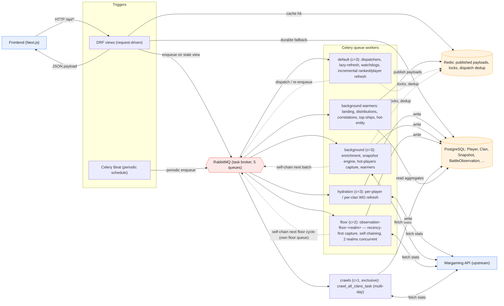
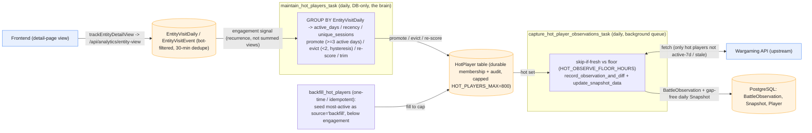
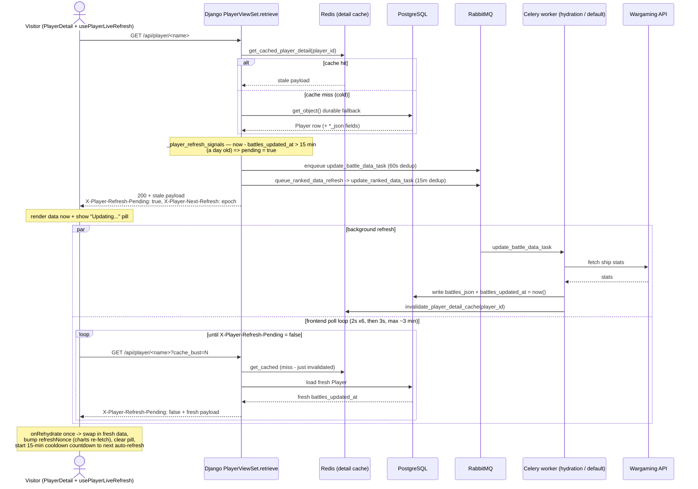

# Queue-Based Data Flow

How data moves through Battlestats' Celery/queue architecture. The diagram is laid
out as a left-to-right pipeline — **triggers → broker → queue workers → WG API →
Postgres → warmers → Redis** — with the read/serve path as the return leg
(`Redis → DRF view → Frontend`).

## The four flows

1. **Serve / read path** — `Frontend → DRF view → Redis (cache hit) / Postgres
   (durable fallback) → JSON`. Cache-first, lazy-refresh; the view never calls WG
   directly.
2. **Lazy-refresh path** — a stale profile/clan view enqueues `update_battle_data_task`
   / `update_ranked_data_task` (hydration) or `update_player_data_task` (default) via
   `_delay_task_safely` (60s dedup). Workers fetch WG and write Postgres.
3. **Scheduled ingest path** — Beat enqueues default/background/floor/crawls work
   (incremental refresh on **default**; the observation floor on its own **floor**
   worker; enrichment, the snapshot engine, hot-players capture on **background**;
   the full clan crawl on **crawls**). Workers fetch WG and write Postgres.
4. **Warming path** — Beat-scheduled warmers (on the background queue) read Postgres
   aggregates and publish payloads to Redis, which the serve path then reads back.

## Notes

- **RabbitMQ** is task transport only; the RPC result backend is unused
  (`CELERY_TASK_IGNORE_RESULT`). **Redis** holds published API payloads, single-flight
  locks, and dispatch-dedup keys — no Celery results.
- **`crawls`** is a single-slot, exclusive, multi-day worker, architecturally distinct
  from the other four concurrent queues (default, hydration, background, floor) — drawn separately.
- Most of the **scheduled ingest path is gated by `ENABLE_CRAWLER_SCHEDULES`**
  (default off): the daily clan crawl, crawl watchdog, observation floor, hot-player
  capture, and incremental player/ranked refresh. Enrichment, snapshots, hot-player
  maintenance, and the cache warmers run regardless.
- Dotted edges are control/coordination (dispatch, self-chaining, locks); solid edges
  are data movement.

## Drill-down: hot-players engagement capture queue

A loop that lets **durable visitor interest** — not the player's own activity or skill —
qualify a player for guaranteed daily capture: **engagement → hot queue → daily capture →
eviction when interest fades**. Two tasks share one `HotPlayer` table — a DB-only *brain*
that decides membership and one WG-consuming *hand* (capture) that acts on it; a one-time
`backfill_hot_players` seed can fill the queue to the cap with the most-active players.
(Runbook: `agents/runbooks/runbook-hot-players-engagement-queue-2026-06-10.md`. The per-12-min
"Tier 3" freshness sweep was **retired 2026-06-15**.)

### How the loop closes

- **Signal** — every detail-page load fires `trackEntityDetailView` → `/api/analytics/entity-view`,
  writing `EntityVisitEvent` / `EntityVisitDaily` (bot-filtered, 30-min dedupe). Already
  recorded; the hot queue is what finally *acts* on it.
- **Brain** (`maintain_hot_players_task`, daily, DB-only, coexists with crawls) — promotes on
  **recurrence** (`active_days` over a 14-day window), *not* summed views, so one viral spike
  ≠ a returning fan. Promote ≥3 active-days / evict <2 gives hysteresis so members don't flap.
  A single devoted visitor qualifies (no visitor-breadth gate).
- **Hand — capture** (`capture_hot_player_observations_task`, daily, `background`) — sweeps
  the hot set and **skip-if-fresh** against the observation floor, so hot players who are
  *also* active-7d cost nothing; marginal work is only the hot players who dropped out of the
  active set. Writes a `BattleObservation` (re-engagement caught the moment they return) and a
  gap-free daily `Snapshot` (day-over-day series stays continuous on no-play days). This is the
  queue's sole guarantee: **≥1 battle-history pull per hot player per 24h** (floor-or-capture).
- **Seed — backfill** (`backfill_hot_players`, one-time / idempotent, DB-only) — fills each
  realm to `HOT_PLAYERS_MAX` with the most-active players (`source='backfill'`, ranked below
  engagement, captured but trimmed first), so they get the 24h guarantee before attracting
  visitor interest.

### Gating

- Kill switch **`HOT_PLAYERS_ENABLED`** (default on) no-ops both tasks.
- **Brain is always-enabled** (DB-only, like enrichment-pool maintenance); the **capture hand
  is a WG consumer gated by `ENABLE_CRAWLER_SCHEDULES`** (default off), same as the observation
  floor. Both **coexist with the clan crawl** (no deferral) — guaranteed coverage is the whole
  point.

## Drill-down: visitor loads a stale player page (lazy-refresh round trip)

A visitor opens `/player/<name>` whose stored data was last refreshed **>1 day ago**. The
staleness threshold is `PLAYER_BATTLE_DATA_STALE_AFTER = 15 min` (`data.py:115`), so a
day-old page always trips it. The request is **stale-while-revalidate**: the cached/durable
payload is served immediately (never blocks on WG), a background refresh is enqueued, and the
browser polls until it lands.

### What makes it cheap and non-blocking

- **Served immediately.** The view returns the cached (or Postgres-durable) payload right
  away with `X-Player-Refresh-Pending: true` — the request never waits on Wargaming.
- **Lean dispatch on a warm cache.** A cache *hit* enqueues only the stale-randoms +
  ranked refresh (`update_battle_data_task` via `_delay_task_safely`, 60s dedup; and
  `update_ranked_data_task` via `queue_ranked_data_refresh`, 15-min dedup) — both on the
  hydration/default workers. A cache *miss* (cold) fans out the fuller hydration suite
  (player + clan + members + battles + clan-battles).
- **Dedup guards a thundering herd.** The 60s / 15-min dispatch windows plus per-player 6h
  locks mean many simultaneous visitors to the same stale player enqueue the work once.
- **Cache-invalidate-on-write closes the loop.** The worker writes Postgres *and* deletes
  the Redis detail entry (`invalidate_player_detail_cache`). The next poll therefore misses
  the cache, re-reads fresh Postgres, and the freshly-bumped `battles_updated_at` flips the
  pending header to `false`.
- **The pill clears on the header, not a body field.** `battles_updated_at` is not in the
  payload; `usePlayerLiveRefresh` polls (2s for the first 6 tries, then 3s, ceiling ~3 min)
  and clears the "Updating…" pill the instant `X-Player-Refresh-Pending` reads `false`,
  calling `onRehydrate` once and bumping a nonce so the charts re-fetch.

> Note: this player-detail GET does **not** write `EntityVisitDaily` (it only bumps
> `last_lookup` + recently-viewed). The hot-players engagement signal comes from a separate
> client telemetry POST to `/api/entity-visits/ingest/` — see the hot-players drill-down above.
