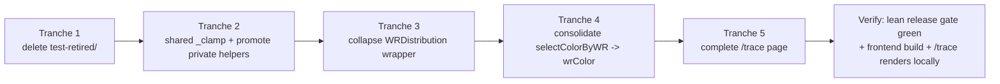

# Runbook: Near-final-form refactor & dead code pass (2026-05-03)

_Status: tranche-5-shipped (PR open) — all 5 tranches landed on branch `refactor/near-final-form-cleanup-2026-05-03`. Lean release gate green after each tranche (242/242 backend, 95/95 frontend, lint clean, build green)._
_Builds on: `agents/runbooks/runbook-dead-code-cleanup-2026-04-28.md` (Tranches A–C shipped commits `2219562`, `a4c51ab`, `7a3b7b0` per `git log`). Picks up the explicitly deferred items + new findings._

## Context

The 2026-04-28 dead-code pass shipped Tranches A–C (orphan Celery tasks, frontend leaf components, doc/env-var reconciliation, runbook archiving). It **explicitly deferred** four items:

1. `selectColorByWR` consolidation across chart components.
2. `useChartFetch()` hook extraction.
3. Test-helpers extraction (`tests/helpers.py`).
4. The `TraceDashboard.tsx` "completion vs. deletion" decision.

A fresh survey of `origin/main` (`6a104df`) on 2026-05-03 also surfaces:

5. Duplicate `_clamp` helpers in `data.py:1555` and `landing.py:180` (semantically identical).
6. `WRDistributionSVG.tsx` is now a 30-line passthrough to `WRDistributionDesign2SVG.tsx` since Design1 was deleted; the "Design2" naming is vestigial.
7. `server/test-retired/` (8.3 KLOC, 26 files) is git-tracked but **not referenced by any CI, script, conftest, pytest config, or runbook** (`grep -rn "test-retired"` returns zero hits). They were renamed-into-existence by commit `2869ebe` ("trim release gate") and have been silently rotting since — they import private helpers (`_inactivity_score_cap`, `_calculate_actual_kdr`, etc.) that have moved or been renamed, so they almost certainly don't pass anymore.
8. `views.py` imports four `_`-prefixed "private" helpers from `data.py` (`_extract_randoms_rows`, `_explorer_summary_needs_refresh`, `_get_published_efficiency_rank_payload`, `_calculate_tier_filtered_pvp_record`). The leading underscore is a lie — they're part of the public surface.

The codebase is at v1.11.0 ("near final form"). This pass closes those eight items in five focused tranches and ships them as five sequential commits on `main`.

## Out of scope (still deferred)

- **`data.py` (5 881 LOC) / `landing.py` (2 392 LOC) splits** — same reason as 2026-04-28: too risky for a cleanup pass; needs a dedicated design.
- **`useChartFetch()` hook extraction** — touches ≥4 chart components, needs a visual-regression smoke test that doesn't exist yet.
- **Test-helpers extraction (`tests/helpers.py`)** — net good but touches every active test file; merits its own PR. Listed in 2026-04-28 Tranche D, still deferred for the same reason.
- **`PopulationDistributionSVG.tsx`'s theme-aware `selectColorByWR`** — different signature (`(wr, theme)`) and uses `chartColors[theme]` so it can't share `wrColor()`. Leave alone.

## QA pass — corrections applied before drafting

| Initial assumption | Verification | Resolution |
|---|---|---|
| `selectColorByWR` in 4 components is identical | `grep -B2 -A12` of all four shows byte-identical bodies (parameter names differ: `winRatio`, `wr`). Output identical for the same numeric input. | Safe to substitute calls with `wrColor(value)` from `client/app/lib/wrColor.ts` (which already returns matching hex codes for non-null `number`). |
| `_clamp` in `data.py` and `landing.py` are equivalent | `data.py:1555` uses `max(lower, min(upper, value))`; `landing.py:180` uses `max(lower, min(value, upper))`. `min` is commutative — semantically identical. | Move one canonical copy to `server/warships/data_support.py` (the existing helper module, currently 150 LOC, already imports cleanly into both). |
| `test-retired/` is reachable by CI | `grep -rn "test-retired"` returns zero hits across `**/*.{yml,yaml,sh,cfg,toml,md,json,py}`. `run_test_suite.sh:31` and `scripts/run_release_gate.sh:33` enumerate the 4-file release gate explicitly. | Delete the directory. Git history preserves the files for archeology. |
| `TraceDashboard.tsx` is dead code | `client/app/components/TraceDashboard.tsx:206,463` is the only ref; backend `agentic_trace_dashboard` is wired in `urls.py:145-148` and gated by `ENABLE_AGENTIC_RUNTIME`; `runbook-langsmith-trace-dashboard.md:39` says "open `/trace` in the client". `client/app/trace/` directory does not exist. | **Complete it**, don't delete. The half-shipped piece is a 12-line `client/app/trace/page.tsx` wrapper. Aligns with documented intent and existing rollback path. |
| `WRDistributionSVG.tsx` is still load-bearing | `PlayerDetailInsightsTabs.tsx:86,370` dynamically imports it. After the 2026-04-28 cleanup it's a pure passthrough. | Delete the wrapper, update the dynamic import to point at `WRDistributionDesign2SVG` directly, then rename `WRDistributionDesign2SVG` → `WRDistributionSVG` since "Design2" is now meaningless. |
| Private `_`-prefixed imports from `data.py` | `views.py:25-29` imports `_extract_randoms_rows`, `_explorer_summary_needs_refresh`, `_get_published_efficiency_rank_payload`, `_calculate_tier_filtered_pvp_record`. Each is also called from inside `data.py` itself (verified via grep). | Rename to drop the leading underscore at definition + every call site (5 sites in `data.py`, 4 in `views.py`, plus `enrich_player_data.py:207,285`). |

Re-runnable verification commands:

```bash
# Confirm test-retired has zero references
grep -rn "test-retired" /home/user/repo/ \
  --include="*.yml" --include="*.yaml" --include="*.sh" \
  --include="*.cfg" --include="*.toml" --include="*.md" \
  --include="*.json" --include="*.py"

# Confirm selectColorByWR bodies are identical across the 4 components
for f in client/app/components/{WRDistributionDesign2SVG,PlayerClanBattleSeasons,ClanBattleSeasons,ClanBattleSeasonsSVG}.tsx; do
  awk '/^const selectColorByWR/,/^};/' "$f" | sed 's/winRatio\|wr/X/g'
done | sort -u | wc -l   # expect: 1

# Confirm both _clamp definitions are equivalent
grep -A2 "^def _clamp" server/warships/data.py server/warships/landing.py

# Confirm TraceDashboard has no client importer
grep -rn "TraceDashboard\b" client/app/ | grep -v components/TraceDashboard.tsx
ls client/app/trace/ 2>&1   # expect: No such file or directory
```

## Plan — five tranches, each its own commit



Tranches are ordered low-risk → low-risk; each independently passes the lean release gate. Order matters only for Tranche 3 → 4 (Tranche 3 renames the file Tranche 4 modifies — doing them in this order avoids touching the same line twice).

### Tranche 1 — delete `server/test-retired/` (1 commit, ~8.3 KLOC removed)

**What:** `git rm -r server/test-retired/`.

**Why safe:** Zero CI / script / conftest / runbook references. The active release-gate suites (`server/warships/tests/test_views.py`, `test_landing.py`, `test_realm_isolation.py`, `test_data_product_contracts.py` plus the rest of `server/warships/tests/`) are unaffected. Git history preserves the deleted files.

**Verify:** `./run_test_suite.sh` → green (no change in covered surface).

**Commit message:** `chore(tests): drop server/test-retired/ — unreachable since 2026-04-02 trim`.

### Tranche 2 — shared `_clamp` + promote leaky private helpers (1 commit)

**What:**

1. Add `clamp(value: float, lower: float, upper: float) -> float` to `server/warships/data_support.py` (the existing helper module already imported by `data.py`).
2. Delete `_clamp` at `server/warships/data.py:1555` and `_clamp` at `server/warships/landing.py:180`. Add `from warships.data_support import clamp` to both modules. Rename all internal callers (28 sites in `landing.py`, 11 in `data.py` per grep counts above) from `_clamp(...)` → `clamp(...)`.
3. Rename four leaky private helpers in `data.py` and update every call site:
   - `_extract_randoms_rows` → `extract_randoms_rows` (def at `data.py:2307`; callers in `data.py:4370,4388,4390,4622`, `views.py:25,425,427`, `enrich_player_data.py:207,285`).
   - `_explorer_summary_needs_refresh` → `explorer_summary_needs_refresh` (def at `data.py:1804`; caller in `views.py:241`).
   - `_get_published_efficiency_rank_payload` → `get_published_efficiency_rank_payload` (def at `data.py:821`; callers in `views.py:1101` plus internal references).
   - `_calculate_tier_filtered_pvp_record` → `calculate_tier_filtered_pvp_record` (def at `data.py:1359`; caller in `views.py` line in the long import + internal references in `data.py`).
4. Re-flow the wrapped `from warships.data import …` line in `views.py:25-29` so each name fits on one line (one name per line, isort/black format).

**Why safe:** Pure rename + relocation. No behavior change. The release-gate test files (`test_views.py`, `test_landing.py`, …) only import the public names and a couple of the soon-to-be-public ones; the only friction is updating those test imports (1 line each).

**Verify:** Lean release gate green. `grep -rn "_extract_randoms_rows\|_explorer_summary_needs_refresh\|_get_published_efficiency_rank_payload\|_calculate_tier_filtered_pvp_record" server/` returns zero (or only inside test-retired, which is gone after Tranche 1).

**Commit message:** `refactor: share clamp() in data_support; promote 4 leaky private helpers to public`.

### Tranche 3 — collapse the `WRDistributionSVG` passthrough (1 commit)

**What:**

1. `git rm client/app/components/WRDistributionSVG.tsx` (30 lines, pure passthrough since Design1 was removed).
2. `git mv client/app/components/WRDistributionDesign2SVG.tsx client/app/components/WRDistributionSVG.tsx`.
3. Inside the moved file, rename the React component `WRDistributionDesign2SVG` → `WRDistributionSVG` (def at line ~381, default export at line ~448, props interface `WRDistributionDesign2Props` → `WRDistributionProps`).
4. In `client/app/components/PlayerDetailInsightsTabs.tsx:86`, the `dynamic(() => resilientDynamicImport(() => import('./WRDistributionSVG'), …))` import path is unchanged — but the module label string `'PlayerDetailInsightsTabs-WRDistributionSVG'` is fine as-is.

**Why safe:** The public name imported by `PlayerDetailInsightsTabs.tsx:86,370` (`WRDistributionSVG`) does not change. Only the file holding the implementation changes. No props change.

**Verify:** `cd client && npm run lint && npm test && npm run build` → green. Manual: load `/player/<name>` in the dev server, switch to the Insights tab, confirm the WR distribution chart renders identically.

**Commit message:** `refactor(client): collapse WRDistributionSVG passthrough into the only design that ships`.

### Tranche 4 — replace four inline `selectColorByWR` with shared `wrColor` (1 commit)

**What:** In each of the four files below, delete the local `const selectColorByWR = …;` block, add `import wrColor from '../lib/wrColor';` (some files already have it), and rewrite every call site `selectColorByWR(x)` → `wrColor(x)`.

| File | `selectColorByWR` def line | Call sites |
|---|---|---|
| `client/app/components/WRDistributionSVG.tsx` (after Tranche 3 rename) | ~51 | ~302 |
| `client/app/components/PlayerClanBattleSeasons.tsx` | 44 | 136, 167 |
| `client/app/components/ClanBattleSeasons.tsx` | 41 | (per grep, used in same render path) |
| `client/app/components/ClanBattleSeasonsSVG.tsx` | 27 | 208, 210, 276 |

**Behavioral note:** `wrColor(n: number | null)` returns `'#c6dbef'` for `null`. The four inline functions take `number` only and never see `null`. For all numeric inputs the return values are byte-identical to the hex codes already produced. Substitution is value-preserving.

**Do NOT touch:** `PopulationDistributionSVG.tsx:48` — that variant is `(wr, theme)` and pulls colors from `chartColors[theme]`; it cannot share `wrColor()` and is intentionally distinct.

**Verify:** `cd client && npm run lint && npm test && npm run build` → green. Manual: load a clan with completed CB seasons (`/clan/<id>-<slug>`) and a player CB tab; confirm the per-season cells and the season-table colors are unchanged. Then check `/player/<name>` Insights → WR distribution chart.

**Commit message:** `refactor(client): replace 4 inline selectColorByWR with shared wrColor`.

### Tranche 5 — finish the `/trace` route (1 commit)

**What:** Add the missing `client/app/trace/page.tsx`. This is a Next.js App Router server-component wrapper that renders the existing `<TraceDashboard />` client component. The runbook `runbook-langsmith-trace-dashboard.md:39` explicitly says "Open `/trace` in the client" and documents a rollback path if it ever needs to be removed. Backend endpoint and CLAUDE.md entry already exist; only the page is missing.

```tsx
// client/app/trace/page.tsx
import TraceDashboard from "../components/TraceDashboard";

export const metadata = {
    title: "Agentic Trace Dashboard",
    robots: { index: false, follow: false },
};

export default function TracePage() {
    return <TraceDashboard />;
}
```

`TraceDashboard.tsx:206` is already a `"use client"` component that fetches `/api/agentic/traces/` itself and renders the dashboard, so no additional plumbing is needed.

**Why safe:** The endpoint returns 404 unless `ENABLE_AGENTIC_RUNTIME=1` (which is `0` on production). Adding the page does not expose anything that wasn't already reachable.

**Verify:** Locally `cd client && npm run dev`; in another shell `cd server && ENABLE_AGENTIC_RUNTIME=1 python manage.py runserver 8888`; visit `http://localhost:3000/trace` and confirm the dashboard renders (or shows the documented "no LangSmith credentials configured" panel — both are healthy). Production deploy unaffected because the endpoint is still gated.

**Commit message:** `feat(client): add /trace page wrapping the existing TraceDashboard component`.

## Critical files

- `server/warships/data_support.py` — gains canonical `clamp()`. (Tranche 2)
- `server/warships/data.py` — `_clamp` removed, four `_`-helpers renamed. (Tranche 2)
- `server/warships/landing.py` — `_clamp` removed, imports `clamp` from `data_support`. (Tranche 2)
- `server/warships/views.py` — import line re-flowed; private-name imports updated. (Tranche 2)
- `server/warships/management/commands/enrich_player_data.py` — updated for `extract_randoms_rows` rename. (Tranche 2)
- `server/test-retired/` — deleted. (Tranche 1)
- `client/app/components/WRDistributionSVG.tsx` — passthrough deleted; replaced by renamed Design2. (Tranche 3)
- `client/app/components/WRDistributionDesign2SVG.tsx` — renamed to `WRDistributionSVG.tsx`. (Tranche 3)
- `client/app/components/PlayerClanBattleSeasons.tsx`, `ClanBattleSeasons.tsx`, `ClanBattleSeasonsSVG.tsx` — inline `selectColorByWR` replaced with `wrColor` import. (Tranche 4)
- `client/app/trace/page.tsx` — new file. (Tranche 5)

## Existing functions / utilities to reuse

- `server/warships/data_support.py` — already exists for shared helpers; perfect home for `clamp()`. (Tranche 2)
- `client/app/lib/wrColor.ts` — already canonical for the WR-to-color mapping; the four inline duplicates can call it directly. (Tranche 4)
- `server/warships/agentic/dashboard.py:get_agentic_trace_dashboard()` — already wired via `views.py:380` and `urls.py:145`; Tranche 5 only needs the page that mounts the existing client component.

## Verification — end-to-end

After all five tranches land:

1. Lean backend release gate: `./run_test_suite.sh` → all 5 steps green.
2. Frontend: `cd client && npm run lint && npm test && npm run build` → green; bundle size delta should be a small reduction (4 inline functions removed; `WRDistributionSVG` wrapper removed).
3. Spot-check rendering on dev server (`docker compose up -d`):
   - `/player/<known-player>` → Insights tab → WR distribution renders.
   - `/clan/<known-clan>` → CB seasons block colors unchanged.
   - `/trace` with `ENABLE_AGENTIC_RUNTIME=1` → dashboard renders.
4. `grep -rn "_clamp\b" server/warships/` → no hits outside `data_support.py` definition.
5. `grep -rn "selectColorByWR" client/app/` → only the `PopulationDistributionSVG.tsx` variant remains (intentional).
6. `grep -rn "test-retired" .` → zero hits.

## Doctrine pre-commit checklist (per `agents/knowledge/agentic-team-doctrine.json`)

- **Documentation review:** Tranche 5 honors the documented `/trace` intent in `runbook-langsmith-trace-dashboard.md`. CLAUDE.md citations of `/trace` (lines 114, 292) remain accurate. No other doc updates needed — the renames in Tranche 2 don't touch documented surface area.
- **Doc-vs-code reconciliation:** none required (this pass *removes* drift; doesn't introduce any).
- **Test coverage:** No behavior change. Existing release-gate tests cover all renamed surfaces (`test_views.py` exercises the players/clans endpoints that depend on the renamed helpers; `test_landing.py` exercises `landing.py`'s `clamp` callers).
- **Runbook archiving:** Archive **this** runbook plus `runbook-dead-code-cleanup-2026-04-28.md` once all five tranches ship. Use the `runbook-archive` skill.
- **Contract safety:** No API or payload changes. `/api/agentic/traces/` already exists and its contract is unchanged.
- **Runbook reconciliation:** Update **Status** between tranches: `planned` → `tranche-1-shipped` → `tranche-2-shipped` → `tranche-3-shipped` → `tranche-4-shipped` → `tranche-5-shipped` → `resolved`.

## References

- `server/warships/data.py:1555` — `_clamp` (data.py copy).
- `server/warships/landing.py:180` — `_clamp` (landing.py copy).
- `server/warships/data_support.py` — existing helper module destined to host `clamp()`.
- `server/warships/views.py:25-29` — wrapped import line with leaky `_`-helpers.
- `server/warships/data.py:2307,1804,821,1359` — definitions of the four leaky private helpers.
- `server/warships/management/commands/enrich_player_data.py:207,285` — also imports `_extract_randoms_rows`.
- `client/app/components/WRDistributionSVG.tsx` — current 30-line passthrough.
- `client/app/components/WRDistributionDesign2SVG.tsx` — current real implementation.
- `client/app/components/PlayerClanBattleSeasons.tsx:44`, `ClanBattleSeasons.tsx:41`, `ClanBattleSeasonsSVG.tsx:27` — inline `selectColorByWR` copies.
- `client/app/components/PopulationDistributionSVG.tsx:48` — theme-aware variant; **excluded** from Tranche 4.
- `client/app/lib/wrColor.ts` — canonical WR-color helper (target of consolidation).
- `client/app/components/TraceDashboard.tsx` — existing client dashboard awaiting its page wrapper.
- `server/warships/views.py:1537`, `server/battlestats/urls.py:145-148` — backend `/api/agentic/traces/` endpoint.
- `agents/runbooks/runbook-langsmith-trace-dashboard.md:39,79-80` — documented intent + rollback path for the `/trace` route.
- `server/test-retired/warships/` — 26 files, ~8.3 KLOC, zero CI references.
- `agents/runbooks/runbook-dead-code-cleanup-2026-04-28.md` — predecessor runbook (Tranches A–C shipped, Tranche D deferred, TraceDashboard deferred).
