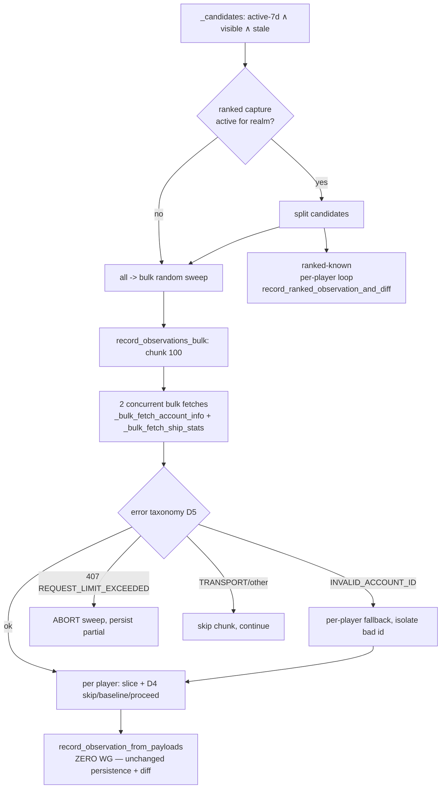

# Runbook: Bulk-Batched Battle-Observation Capture (R1 + R3)

_Created: 2026-06-06_
_Context: The observation floor captures battle history one player at a time at 2–3 WG calls/player, so only a slice of active players is covered each sweep. Enrichment already proves bulk `ships/stats`/`account/info` at 100 ids/call. This spec moves capture onto that bulk path (~100× cheaper) so we can observe every active player daily._
_Status: **implemented — phase 1 (code landed, flag default OFF).** Not yet enabled on any realm; phases 2–5 (shadow/parity-on-prod, per-realm enable, all-realms, R3 floor-limit raise) remain operational. See "Implementation status" at the bottom._

## Purpose

Replace the floor's per-player WG fetch with a **bulk fetch** path that reuses the existing
zero-WG persistence core (`record_observation_from_payloads`), then **raise the floor limit**
to cover the full active-player set daily. The persistence/diff logic is unchanged — only *how
payloads are fetched* changes — so the bulk path is parity-by-construction with the legacy path.

## Context (why this is worth doing)

Measured on prod 2026-06-06:

| Metric | Value |
|---|---|
| Active-7d players | 254,908 |
| Distinct players observed, last 24h | ~50,570 |
| Distinct players with a real battle captured (`battles_delta>0`), last 24h | ~26,129 |
| Productive capture rate | 51.7% |
| WG budget (1 app-id, shared, no global limiter) | ~10 req/s |

The floor spends 2–3 WG calls/player; enrichment fetches the same `ships/stats` data in bulk,
100 players/call (~0.02 WG/player) — `enrich_player_data.py:131`. Covering all 254,908 active-7d
players daily costs ~510k per-player WG calls/day vs ~5k/day bulk — a ~100× reduction that turns
"daily battle history for every active player" from unaffordable into trivial. Sparse capture
also mis-buckets the day a battle is attributed to, so near-daily observation of active players
is a correctness need, not just a coverage nicety.

## Premise / goal

- **R1:** bulk-capture random battle observations; preserve byte-identical observation + event output.
- **R3:** once bulk lands and cost is confirmed, raise `BATTLE_OBSERVATION_FLOOR_LIMIT` from 3,000
  toward the full daily-active set so every active player is observed near-daily.

## Scope

**In scope:** a reusable `record_observations_bulk()` engine; a bulk path in the floor command +
task behind a flag; ranked handled per-player for the ranked-known subset; phased rollout; the
floor-limit expansion (R3).

**Out of scope:** the global WG token-bucket (R4 — `runbook-wg-rate-limiter-token-bucket-2026-06-05.md`);
the clan crawl `core_only` change (R2 — separate); period rollup (unrelated, stays off).

## The reuse seam

`record_observation_from_payloads(player, *, player_data=None, ship_data, ranked_ship_data=None,
source=None)` — `incremental_battles.py:669` — makes **zero WG calls**. It coerces payloads →
`PlayerSnapshot`, writes the `BattleObservation`, finds the prior obs, computes `BattleEvent`s via
the pure-diff `compute_battle_events` / `compute_ranked_battle_events`, writes events, updates
`PlayerDailyShipStats`, and invalidates caches inside its own `transaction.atomic` + `on_commit`.
The bulk path simply feeds it pre-fetched slices in a loop. (Legacy parity reference:
`record_observation_and_diff`, `incremental_battles.py:1532`.)

## Bulk capture path (shape)

## Design decisions

### D1 — New typed bulk `account/info` fetcher (do not reuse `fetch_players_bulk`)
`fetch_players_bulk` (`clan_crawl.py:139`) routes through `_api_get` (`clan_crawl.py:65`), which
collapses every failure (RequestException, bad JSON, `status != "ok"`) to `{}` — it cannot
distinguish `INVALID_ACCOUNT_ID` (→ per-player fallback) from `REQUEST_LIMIT_EXCEEDED` (→ abort)
from a transient. Add a typed sibling mirroring `_bulk_fetch_ship_stats`:

    def _bulk_fetch_account_info(player_ids: list[int], realm: str) -> tuple[dict, str | None]:
        """Bulk account/info for up to 100 players → (data, error_code).
        No fields filter, so each per-key value matches _fetch_player_personal_data's shape."""
        from warships.api.client import make_api_request_typed
        params = {"account_id": ",".join(str(p) for p in player_ids)}
        data, err = make_api_request_typed("account/info/", params, realm=realm)
        return (data if isinstance(data, dict) else {}), err

`make_api_request_typed` (`api/client.py:124`) returns `error_code ∈ {None, INVALID_ACCOUNT_ID,
REQUEST_LIMIT_EXCEEDED, TRANSPORT_ERROR, UNKNOWN_ERROR, …}`. Parity: `_fetch_player_personal_data`
(`api/players.py:13`) sends no fields filter and returns `data[str(pid)]` — identical to the bulk
per-key value.

### D2 — New engine `record_observations_bulk()` in `incremental_battles.py`

    def record_observations_bulk(player_ids, realm, *, chunk_delay=0.0, source=None,
                                 progress_callback=None) -> dict:
        """Chunk 100; per chunk: 2 concurrent bulk WG fetches (account/info + ships/stats),
        apply the 3-way error taxonomy (D5), then per player slice the responses and call
        record_observation_from_payloads(player, player_data=<dict>, ship_data=<list>).
        Random-only (seasons/shipstats is per-player). `chunk_delay` is per-CHUNK pacing —
        NOT the legacy per-player `--delay`. Returns {status, completed, baseline, events,
        wg_failed, not_found, skipped_missing, other, aborted}."""

Per chunk: (1) `players = {p.player_id: p for p in Player.objects.filter(player_id__in=chunk,
realm=realm)}`; (2) concurrent `_bulk_fetch_account_info` + `_bulk_fetch_ship_stats` via
`ThreadPoolExecutor(max_workers=2)` (mirror `enrich_player_data.py:504`); (3) apply D5 to **both**
errors; (4) per player: slice → D4 → `record_observation_from_payloads(...)`, tally result;
(5) `time.sleep(chunk_delay)` once per chunk.

### D3 — Always pass the fresh `account/info` dict (never the column path)
`record_observation_from_payloads` with `player_data=None` builds the snapshot from stale
`player.pvp_*` columns via `_snapshot_from_player_row` (`incremental_battles.py:406`) — diffing
fresh ships against stale aggregates yields wrong/missed deltas. The floor exists *because* those
columns are stale. Pass `player_data=<bulk acct slice>`, exactly as legacy
`record_observation_and_diff` does.

### D4 — Per-player slice handling (safe divergence from legacy)
- `ships = bulk_ships.get(str(pid))`:
  - `None` (player absent from response) **or** the `"SKIP"` sentinel returned by
    `_per_player_ship_fallback` (transient per-player failure, `enrich_player_data.py:178`) →
    **skip this tick**. Do NOT write an empty-ships observation — that creates a broken prior that
    trips the `random_prior_broken` guard (`incremental_battles.py:760`) next tick, silently
    suppressing a real diff.
  - `[]` (present, no ships) → genuine baseline, proceed.
  - list → proceed.
- `acct = bulk_acct.get(str(pid))`: `None` → skip. Hidden profile → `coerce_observation_payload`
  returns `None` → `record_observation_from_payloads` skips for free.
- This `None/"SKIP" → skip` is **strictly safer** than legacy's `{}→[]→write`; comment it so a
  reviewer doesn't read it as a parity bug.

### D5 — Error taxonomy (floor diverges from enrichment on 407)
Per bulk fetch: `INVALID_ACCOUNT_ID` → per-player fallback (isolate the bad id; reuse
`_per_player_ship_fallback`, add a thin `_per_player_account_fallback`). `REQUEST_LIMIT_EXCEEDED`
(407) → **abort the whole sweep** (set `aborted=True`, break, persist partial) — unlike enrichment
which logs-and-continues (`enrich_player_data.py:521`), because the floor coexists with the clan
crawl under the shared ~10 req/s budget and must not keep hammering. Other / `TRANSPORT_ERROR` →
skip this chunk, continue.

### D6 — Ranked split with mutual exclusion (realm-gated)
Applies **only when `_ranked_capture_active_for_realm(realm)` is true** (`ensure_daily_battle_observations.py:86`).
When ranked capture is off for the realm, ALL candidates go bulk and no ranked sweep runs (today's
behavior on ranked-off realms is preserved). When on, two mutually-exclusive candidate sets so a
ranked-known player never gets two observations per tick:
- `bulk_candidates` = active-7d ∧ `is_hidden=False` ∧ stale ∧ **NOT** ranked-known → bulk random sweep.
- `ranked_candidates` = active-7d ∧ `is_hidden=False` ∧ stale ∧ ranked-known → existing per-player
  `record_ranked_observation_and_diff` (captures random + ranked in one obs).

ranked-known marker (mirror `management/commands/incremental_ranked_data.py:142-143`):
`.exclude(ranked_json__isnull=True).exclude(ranked_json=[])`. Give the ranked sweep its own
`--ranked-limit` + pacing.

### D7 — Player instances per chunk; per-player transaction
Candidate query returns ids; fetch `Player` objects once per chunk **filtered by realm**
(`player_id` is not globally unique — legacy uses `get(player_id, realm=realm)`).
`record_observation_from_payloads` keeps its own per-player `transaction.atomic`; do **not** wrap
the whole chunk — one bad player must not roll back the chunk.

### D8 — Accept the ranked walk-back query for v1 (don't optimize yet)
The bulk-random path always writes `ranked_ships_stats_json=None`, so
`_hydrate_previous_ranked_snapshot` (called unconditionally at `incremental_battles.py:775`) fires
its walk-back query (`:391`) every tick for bulk-captured players. Net ~3 indexed point-lookups per
player — all tiny. **Acceptable for v1; do not add a `previous=` param** (keeps the path
byte-identical for parity). Measure chunk wall-time; optimize only if these dominate.

### D9 — New `BattleObservation` source constant
Add `SOURCE_BULK_FLOOR = 'bulk_floor'` alongside `SOURCE_POLL`/`SOURCE_MANUAL` (`models.py:469`)
and pass it as `source=`. The `source` column is `max_length=12` (`models.py:493`) — `'bulk_floor'`
(10 chars) fits. Adding a `choices` entry generates a **no-op Django state-migration** (no SQL);
it is additive and harmless to rollback. Makes shadow/parity diffing and post-rollout auditing
trivial ("which observations came from the bulk path").

### D10 — Relocate the bulk fetchers to the shared API layer
`_bulk_fetch_ship_stats` / `_per_player_ship_fallback` currently live in the enrich `Command`
module; importing them from `incremental_battles.py` is a command←core inversion. Move the bulk
fetchers + fallbacks to `api/ships.py` and `api/players.py`; have both enrichment and the bulk
floor import from there. `incremental_battles.py` already does function-local imports from
`api.ships`/`api.players` (`:1540`, `:1591`), so this introduces no import cycle. Pure relocation,
no behavior change.

### Flags (inline `os.getenv`, house style)
- `BATTLE_OBSERVATION_FLOOR_BULK_ENABLED` (default `0`) — selects bulk vs legacy path; legacy stays intact for instant rollback.
- `BATTLE_OBSERVATION_FLOOR_BULK_REALMS` (csv) — per-realm gating during rollout.
- `BATTLE_OBSERVATION_FLOOR_BULK_CHUNK_DELAY` (default `0.5`) — per-CHUNK pacing for the bulk path.
  Distinct from the legacy per-player `--delay` (`ensure_daily_battle_observations.py:231`); the
  bulk branch must read this flag and NOT also sleep per player. Keep the existing crawl-coexist
  branch (raise chunk delay while the crawl lock is held, `tasks.py:1485`).

## Files to change (implementation, post-approval)

| File | Change |
|---|---|
| `server/warships/api/ships.py`, `api/players.py` | (D10) house the bulk fetchers + per-player fallbacks; add `_bulk_fetch_account_info` (D1) |
| `server/warships/incremental_battles.py` | add `record_observations_bulk()` (D2–D8) |
| `server/warships/models.py` | add `BattleObservation.SOURCE_BULK_FLOOR` (D9) + the no-op choices migration |
| `server/warships/management/commands/ensure_daily_battle_observations.py` | `--bulk` + `--ranked-limit`; realm-gated candidate split (D6); call bulk engine for randoms, per-player loop for ranked |
| `server/warships/tasks.py` | read bulk flags; pass `bulk=`/chunk-delay into `call_command`; keep crawl-coexist (`tasks.py:1485`) |
| `server/warships/management/commands/enrich_player_data.py` | update imports after D10 relocation |
| `server/warships/tests/test_observations_bulk.py` | new test module (see Test plan) |

## Rollout (flag-gated, instant rollback)

**Pre-rollout:** size the ranked-known active set per realm (read-only) so the per-player ranked
sweep is bounded:

    Player.objects.filter(realm=R, is_hidden=False, last_battle_date__gte=cutoff)\
      .exclude(ranked_json__isnull=True).exclude(ranked_json=[]).count()

1. **Land code, flag off.** Legacy path live. Tests green.
2. **Shadow / parity validation** (no cutover): ~50 active players on one realm, capture each via
   both legacy `record_observation_and_diff` and a one-off `record_observations_bulk` over the same
   ids → assert identical `BattleObservation.ships_stats_json` and identical `BattleEvent` rows.
   Also assert `_fetch_player_personal_data(pid)` deep-equals `_bulk_fetch_account_info([pid])[0][str(pid)]`,
   and single `ships/stats` deep-equals the bulk slice (incl. Phase 7 `main_battery`/`torpedoes`).
3. **Enable on one realm** (smallest active count). Watch: WG 407 rate, observations/day,
   events/day, `random_prior_broken` log frequency, chunk wall-time. Keep `FLOOR_LIMIT=3000`.
4. **All realms.** Confirm aggregate WG load stays under budget alongside the crawl.
5. **R3 — raise `BATTLE_OBSERVATION_FLOOR_LIMIT`** toward the full daily-active set. Bulk makes
   ~255k randoms feasible at ~2 fetches × ~2,550 chunks ≈ 5,100 WG calls (~8.5 min @10/s). If
   the ranked-known active set (from pre-rollout count) is large, the per-player ranked sweep
   becomes the new bottleneck — give it its own limit/pacing and stage its expansion separately.

Rollback at any phase: remove the realm from `BULK_REALMS` or set the flag `0`.

## Test plan

New `tests/test_observations_bulk.py`. Reuse the inline `_ship_payload` builder from
`test_incremental_battles.py:248`; add `_account_payload(**pvp)` for the account/info shape. Mock
`_bulk_fetch_account_info` / `_bulk_fetch_ship_stats` (+ fallback) with `unittest.mock.patch`. Cases:

- **Happy two-player chunk** — both have priors → exact N observations + correct deltas + counters.
- **Parity** — one player via legacy single-fetch vs bulk with same payloads → identical `ships_stats_json` + event rows.
- **Missing key → skip** — pid absent from ships → no obs, `skipped_missing++`, guard not tripped next tick.
- **`"SKIP"` sentinel → skip** — fallback returns `"SKIP"` for a pid → no obs, treated as transient.
- **`[]` ships → baseline** — present-but-empty → obs written, 0 events, `baseline++`.
- **Hidden in bulk** — `hidden_profile=True` → skipped, no obs.
- **Poison batch** — ships err `INVALID_ACCOUNT_ID` → `_per_player_ship_fallback` invoked, bad id isolated.
- **407 mid-sweep** — chunk 2 err `REQUEST_LIMIT_EXCEEDED` → sweep aborts, chunk 1 persisted, `aborted=True`.
- **Transient** — `TRANSPORT_ERROR` → chunk skipped, `wg_failed++`, continue.
- **One bad player ≠ chunk rollback** — patch `record_observation_from_payloads` to raise for one pid → others committed.
- **Command-level** — `call_command("ensure_daily_battle_observations", realm=…, bulk=True)` with
  ranked capture on: ranked-known routed to per-player path, excluded from bulk sweep (no double obs);
  with ranked off: all candidates bulk, no ranked sweep.
- **Task-level** — `ensure_daily_battle_observations_task.apply(args=[realm]).get()` with flag on →
  calls command with `bulk=True`, lock acquired/released.

Celery tests use `.apply().get()` (in-memory broker). Run the new file in the battle-history ad-hoc
gate (the CLAUDE.md release gate does not include battle-history by default).

## Verification (end-to-end, post-implementation)

- `cd server && python -m pytest warships/tests/test_observations_bulk.py warships/tests/test_incremental_battles.py -x`
- Parity shadow run on prod (phase 2) and diff observations/events by `source`.
- After phase-3 enable: query observations/day + productive rate and confirm coverage rises with no
  407 spike:

      -- distinct players observed, last 24h, by source
      SELECT source, COUNT(DISTINCT player_id)
      FROM warships_battleobservation
      WHERE observed_at >= NOW() - INTERVAL '24 hours'
      GROUP BY source;

## Rollback

Flag `BATTLE_OBSERVATION_FLOOR_BULK_ENABLED=0` (or drop the realm from `BULK_REALMS`) → legacy
per-player floor resumes immediately. The only schema artifact is the additive no-op `choices`
migration for `SOURCE_BULK_FLOOR` — nothing to unwind.

## Follow-ups

- **R4 — global WG token-bucket.** Bulk capture frees headroom; land the designed token-bucket
  (`runbook-wg-rate-limiter-token-bucket-2026-06-05.md`). **Caveat discovered here:**
  `make_api_request_typed` (used by all bulk fetchers) does **not** route through
  `_request_api_payload`, so a gate placed only at `_request_api_payload` would be bypassed by the
  bulk path — the bucket must cover `make_api_request_typed` too, or both must be refactored onto
  one gated path.
- **R2 — clan crawl `core_only`.** Frees the dominant consumer that pre-empts capture today.
- **D8 optimization** — bulk-prefetch latest observation per chunk (optional `previous=` param) only
  if walk-back queries measurably dominate chunk wall-time.

## Implementation status

_Phase 1 landed 2026-06-06 (flag default OFF — no production behavior change). Branch `work`._

**Code as built (matches the design; deltas noted):**

| Decision | File | Notes / delta from spec |
|---|---|---|
| D10 relocation | `api/ships.py`, `api/players.py`, `enrich_player_data.py` | `_bulk_fetch_ship_stats` + `_per_player_ship_fallback` moved to `api/ships.py` (verbatim, logger → module `logging`); `_bulk_fetch_account_info` + `_per_player_account_fallback` **added** to `api/players.py`. Enrichment imports them function-locally. Pure relocation — enrichment + task-routing tests green. |
| D1 typed account fetcher | `api/players.py` | As specced (no fields filter → per-key parity with `_fetch_player_personal_data`). |
| D9 source constant | `models.py` + migration `0064_alter_battleobservation_source.py` | `SOURCE_BULK_FLOOR='bulk_floor'`. `sqlmigrate` confirms the AlterField is `-- (no-op)` (choices-only, no DDL). |
| D2–D8 engine | `incremental_battles.py` `record_observations_bulk()` | As specced. **Delta:** added an explicit `isinstance(ships, dict) → []` coercion in the per-player slice (D4) to match legacy `record_observation_and_diff`'s `if isinstance(ship_data, dict): ship_data = []` — required for byte parity. `ThreadPoolExecutor` import added to the module. |
| D6 command | `ensure_daily_battle_observations.py` | `--bulk`, `--ranked-limit`, `--chunk-delay` added; legacy per-player `handle()` left byte-identical (rollback). Bulk path in `_handle_bulk()`; `_ranked_known_ids()` does the split. `--ranked-limit` defaults to `--limit`. |
| Task + flags | `tasks.py` | `_bulk_floor_active_for_realm()` gates on `BULK_ENABLED==1` **and** realm ∈ `BULK_REALMS` (mirrors `_ranked_capture_active_for_realm`; empty `BULK_REALMS` ⇒ no realm ⇒ off — phase-4 "all realms" must list all realms). Crawl-coexist preserved; **added** `BATTLE_OBSERVATION_FLOOR_BULK_CRAWL_CHUNK_DELAY` (default `1.0`) to raise per-chunk pacing while the crawl lock is held. |

**Flags (all default to the legacy path):**
- `BATTLE_OBSERVATION_FLOOR_BULK_ENABLED` (default `0`)
- `BATTLE_OBSERVATION_FLOOR_BULK_REALMS` (csv, default empty)
- `BATTLE_OBSERVATION_FLOOR_BULK_CHUNK_DELAY` (default `0.5`)
- `BATTLE_OBSERVATION_FLOOR_BULK_CRAWL_CHUNK_DELAY` (default `1.0`)

**Validation (2026-06-06):** new `warships/tests/test_observations_bulk.py` (18 cases). The parity test proves the **persistence/diff half**: identical in-memory payloads → identical `ships_stats_json` + `BattleEvent` rows (both paths funnel through the same `record_observation_from_payloads`). It does **NOT** prove **fetch-shape parity (D1)** — that `_bulk_fetch_account_info([pid])[0][str(pid)]` byte-equals `_fetch_player_personal_data(pid)`, and the bulk ships slice equals the single fetch. That cross-fetcher equality is only checkable against live WG and is the explicit job of the **phase-2 prod shadow** (`deep-equals` step). **Do not enable a realm without the phase-2 shadow run.** Full run on the sqlite gate (`--nomigrations`, `DB_ENGINE=sqlite3`): `test_observations_bulk` + `test_incremental_battles` + `test_enrichment_task` + `test_task_routing` = **177 passed**; curated release-gate subset = **262 passed**. Battle-history endpoint tests need `DJANGO_SECRET_KEY` set in the env. Parity test omits `last_battle_time` (sqlite rejects tz-aware datetimes under `USE_TZ=False`; prod Postgres accepts them).

**Next (operational, not code):** phase 2 prod parity-shadow by `source`, then per-realm enable via `BULK_REALMS`, then R3 floor-limit raise.
