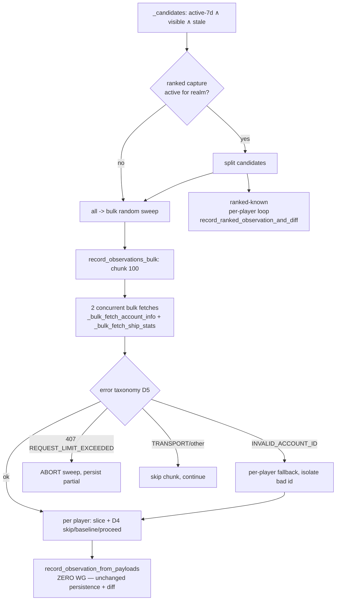

# Runbook: Bulk-Batched Battle-Observation Capture (R1 + R3)

_Created: 2026-06-06_
_Context: The observation floor captures battle history one player at a time at 2–3 WG calls/player, so only a slice of active players is covered each sweep. Enrichment already proves bulk `ships/stats`/`account/info` at 100 ids/call. This spec moves capture onto that bulk path (~100× cheaper) so we can observe every active player daily._
_Status: **LIVE on na/eu/asia (2026-06-07): R1 bulk capture + random change-gate + ranked change-gate, all enabled, validated, and persisted in `deploy_to_droplet.sh`.** The original ~100× premise was REFUTED on prod (WG `ships/stats/` is single-account-only — see "🛑 CRITICAL" below); reframed around the real ~84k active population, the goal is achievable and the gates cut floor WG load ~37%. **Next: R3** — raise `BATTLE_OBSERVATION_FLOOR_LIMIT` (currently default 3,000/realm/cycle) toward the full active set, now affordable. Baseline benchmark captured 2026-06-07 (28.5% of active-7d covered/24h) — see "Benchmarks" at the bottom; re-run before R3._

## Purpose

Replace the floor's per-player WG fetch with a **bulk fetch** path that reuses the existing
zero-WG persistence core (`record_observation_from_payloads`), then **raise the floor limit**
to cover the full active-player set daily. The persistence/diff logic is unchanged — only *how
payloads are fetched* changes — so the bulk path is parity-by-construction with the legacy path.

## Context (why this is worth doing)

Measured on prod 2026-06-06:

| Metric | Value |
|---|---|
| Active-7d players | 254,908 |
| Distinct players observed, last 24h | ~50,570 |
| Distinct players with a real battle captured (`battles_delta>0`), last 24h | ~26,129 |
| Productive capture rate | 51.7% |
| WG budget (1 app-id, shared, no global limiter) | ~10 req/s |

The floor spends 2–3 WG calls/player; enrichment fetches the same `ships/stats` data in bulk,
100 players/call (~0.02 WG/player) — `enrich_player_data.py:131`. Covering all 254,908 active-7d
players daily costs ~510k per-player WG calls/day vs ~5k/day bulk — a ~100× reduction that turns
"daily battle history for every active player" from unaffordable into trivial. Sparse capture
also mis-buckets the day a battle is attributed to, so near-daily observation of active players
is a correctness need, not just a coverage nicety.

## Premise / goal

- **R1:** bulk-capture random battle observations; preserve byte-identical observation + event output.
- **R3:** once bulk lands and cost is confirmed, raise `BATTLE_OBSERVATION_FLOOR_LIMIT` from 3,000
  toward the full daily-active set so every active player is observed near-daily.

## Scope

**In scope:** a reusable `record_observations_bulk()` engine; a bulk path in the floor command +
task behind a flag; ranked handled per-player for the ranked-known subset; phased rollout; the
floor-limit expansion (R3).

**Out of scope:** the global WG token-bucket (R4 — `runbook-wg-rate-limiter-token-bucket-2026-06-05.md`);
the clan crawl `core_only` change (R2 — separate); period rollup (unrelated, stays off).

## The reuse seam

`record_observation_from_payloads(player, *, player_data=None, ship_data, ranked_ship_data=None,
source=None)` — `incremental_battles.py:669` — makes **zero WG calls**. It coerces payloads →
`PlayerSnapshot`, writes the `BattleObservation`, finds the prior obs, computes `BattleEvent`s via
the pure-diff `compute_battle_events` / `compute_ranked_battle_events`, writes events, updates
`PlayerDailyShipStats`, and invalidates caches inside its own `transaction.atomic` + `on_commit`.
The bulk path simply feeds it pre-fetched slices in a loop. (Legacy parity reference:
`record_observation_and_diff`, `incremental_battles.py:1532`.)

## Bulk capture path (shape)



## Design decisions

### D1 — New typed bulk `account/info` fetcher (do not reuse `fetch_players_bulk`)
`fetch_players_bulk` (`clan_crawl.py:139`) routes through `_api_get` (`clan_crawl.py:65`), which
collapses every failure (RequestException, bad JSON, `status != "ok"`) to `{}` — it cannot
distinguish `INVALID_ACCOUNT_ID` (→ per-player fallback) from `REQUEST_LIMIT_EXCEEDED` (→ abort)
from a transient. Add a typed sibling mirroring `_bulk_fetch_ship_stats`:

    def _bulk_fetch_account_info(player_ids: list[int], realm: str) -> tuple[dict, str | None]:
        """Bulk account/info for up to 100 players → (data, error_code).
        No fields filter, so each per-key value matches _fetch_player_personal_data's shape."""
        from warships.api.client import make_api_request_typed
        params = {"account_id": ",".join(str(p) for p in player_ids)}
        data, err = make_api_request_typed("account/info/", params, realm=realm)
        return (data if isinstance(data, dict) else {}), err

`make_api_request_typed` (`api/client.py:124`) returns `error_code ∈ {None, INVALID_ACCOUNT_ID,
REQUEST_LIMIT_EXCEEDED, TRANSPORT_ERROR, UNKNOWN_ERROR, …}`. Parity: `_fetch_player_personal_data`
(`api/players.py:13`) sends no fields filter and returns `data[str(pid)]` — identical to the bulk
per-key value.

### D2 — New engine `record_observations_bulk()` in `incremental_battles.py`

    def record_observations_bulk(player_ids, realm, *, chunk_delay=0.0, source=None,
                                 progress_callback=None) -> dict:
        """Chunk 100; per chunk: 2 concurrent bulk WG fetches (account/info + ships/stats),
        apply the 3-way error taxonomy (D5), then per player slice the responses and call
        record_observation_from_payloads(player, player_data=<dict>, ship_data=<list>).
        Random-only (seasons/shipstats is per-player). `chunk_delay` is per-CHUNK pacing —
        NOT the legacy per-player `--delay`. Returns {status, completed, baseline, events,
        wg_failed, not_found, skipped_missing, other, aborted}."""

Per chunk: (1) `players = {p.player_id: p for p in Player.objects.filter(player_id__in=chunk,
realm=realm)}`; (2) concurrent `_bulk_fetch_account_info` + `_bulk_fetch_ship_stats` via
`ThreadPoolExecutor(max_workers=2)` (mirror `enrich_player_data.py:504`); (3) apply D5 to **both**
errors; (4) per player: slice → D4 → `record_observation_from_payloads(...)`, tally result;
(5) `time.sleep(chunk_delay)` once per chunk.

### D3 — Always pass the fresh `account/info` dict (never the column path)
`record_observation_from_payloads` with `player_data=None` builds the snapshot from stale
`player.pvp_*` columns via `_snapshot_from_player_row` (`incremental_battles.py:406`) — diffing
fresh ships against stale aggregates yields wrong/missed deltas. The floor exists *because* those
columns are stale. Pass `player_data=<bulk acct slice>`, exactly as legacy
`record_observation_and_diff` does.

### D4 — Per-player slice handling (safe divergence from legacy)
- `ships = bulk_ships.get(str(pid))`:
  - `None` (player absent from response) **or** the `"SKIP"` sentinel returned by
    `_per_player_ship_fallback` (transient per-player failure, `enrich_player_data.py:178`) →
    **skip this tick**. Do NOT write an empty-ships observation — that creates a broken prior that
    trips the `random_prior_broken` guard (`incremental_battles.py:760`) next tick, silently
    suppressing a real diff.
  - `[]` (present, no ships) → genuine baseline, proceed.
  - list → proceed.
- `acct = bulk_acct.get(str(pid))`: `None` → skip. Hidden profile → `coerce_observation_payload`
  returns `None` → `record_observation_from_payloads` skips for free.
- This `None/"SKIP" → skip` is **strictly safer** than legacy's `{}→[]→write`; comment it so a
  reviewer doesn't read it as a parity bug.

### D5 — Error taxonomy (floor diverges from enrichment on 407)
Per bulk fetch: `INVALID_ACCOUNT_ID` → per-player fallback (isolate the bad id; reuse
`_per_player_ship_fallback`, add a thin `_per_player_account_fallback`). `REQUEST_LIMIT_EXCEEDED`
(407) → **abort the whole sweep** (set `aborted=True`, break, persist partial) — unlike enrichment
which logs-and-continues (`enrich_player_data.py:521`), because the floor coexists with the clan
crawl under the shared ~10 req/s budget and must not keep hammering. Other / `TRANSPORT_ERROR` →
skip this chunk, continue.

### D6 — Ranked split with mutual exclusion (realm-gated)
Applies **only when `_ranked_capture_active_for_realm(realm)` is true** (`ensure_daily_battle_observations.py:86`).
When ranked capture is off for the realm, ALL candidates go bulk and no ranked sweep runs (today's
behavior on ranked-off realms is preserved). When on, two mutually-exclusive candidate sets so a
ranked-known player never gets two observations per tick:
- `bulk_candidates` = active-7d ∧ `is_hidden=False` ∧ stale ∧ **NOT** ranked-known → bulk random sweep.
- `ranked_candidates` = active-7d ∧ `is_hidden=False` ∧ stale ∧ ranked-known → existing per-player
  `record_ranked_observation_and_diff` (captures random + ranked in one obs).

ranked-known marker (mirror `management/commands/incremental_ranked_data.py:142-143`):
`.exclude(ranked_json__isnull=True).exclude(ranked_json=[])`. Give the ranked sweep its own
`--ranked-limit` + pacing.

### D7 — Player instances per chunk; per-player transaction
Candidate query returns ids; fetch `Player` objects once per chunk **filtered by realm**
(`player_id` is not globally unique — legacy uses `get(player_id, realm=realm)`).
`record_observation_from_payloads` keeps its own per-player `transaction.atomic`; do **not** wrap
the whole chunk — one bad player must not roll back the chunk.

### D8 — Accept the ranked walk-back query for v1 (don't optimize yet)
The bulk-random path always writes `ranked_ships_stats_json=None`, so
`_hydrate_previous_ranked_snapshot` (called unconditionally at `incremental_battles.py:775`) fires
its walk-back query (`:391`) every tick for bulk-captured players. Net ~3 indexed point-lookups per
player — all tiny. **Acceptable for v1; do not add a `previous=` param** (keeps the path
byte-identical for parity). Measure chunk wall-time; optimize only if these dominate.

### D9 — New `BattleObservation` source constant
Add `SOURCE_BULK_FLOOR = 'bulk_floor'` alongside `SOURCE_POLL`/`SOURCE_MANUAL` (`models.py:469`)
and pass it as `source=`. The `source` column is `max_length=12` (`models.py:493`) — `'bulk_floor'`
(10 chars) fits. Adding a `choices` entry generates a **no-op Django state-migration** (no SQL);
it is additive and harmless to rollback. Makes shadow/parity diffing and post-rollout auditing
trivial ("which observations came from the bulk path").

### D10 — Relocate the bulk fetchers to the shared API layer
`_bulk_fetch_ship_stats` / `_per_player_ship_fallback` currently live in the enrich `Command`
module; importing them from `incremental_battles.py` is a command←core inversion. Move the bulk
fetchers + fallbacks to `api/ships.py` and `api/players.py`; have both enrichment and the bulk
floor import from there. `incremental_battles.py` already does function-local imports from
`api.ships`/`api.players` (`:1540`, `:1591`), so this introduces no import cycle. Pure relocation,
no behavior change.

### Flags (inline `os.getenv`, house style)
- `BATTLE_OBSERVATION_FLOOR_BULK_ENABLED` (default `0`) — selects bulk vs legacy path; legacy stays intact for instant rollback.
- `BATTLE_OBSERVATION_FLOOR_BULK_REALMS` (csv) — per-realm gating during rollout.
- `BATTLE_OBSERVATION_FLOOR_BULK_CHUNK_DELAY` (default `0.5`) — per-CHUNK pacing for the bulk path.
  Distinct from the legacy per-player `--delay` (`ensure_daily_battle_observations.py:231`); the
  bulk branch must read this flag and NOT also sleep per player. Keep the existing crawl-coexist
  branch (raise chunk delay while the crawl lock is held, `tasks.py:1485`).

## Files to change (implementation, post-approval)

| File | Change |
|---|---|
| `server/warships/api/ships.py`, `api/players.py` | (D10) house the bulk fetchers + per-player fallbacks; add `_bulk_fetch_account_info` (D1) |
| `server/warships/incremental_battles.py` | add `record_observations_bulk()` (D2–D8) |
| `server/warships/models.py` | add `BattleObservation.SOURCE_BULK_FLOOR` (D9) + the no-op choices migration |
| `server/warships/management/commands/ensure_daily_battle_observations.py` | `--bulk` + `--ranked-limit`; realm-gated candidate split (D6); call bulk engine for randoms, per-player loop for ranked |
| `server/warships/tasks.py` | read bulk flags; pass `bulk=`/chunk-delay into `call_command`; keep crawl-coexist (`tasks.py:1485`) |
| `server/warships/management/commands/enrich_player_data.py` | update imports after D10 relocation |
| `server/warships/tests/test_observations_bulk.py` | new test module (see Test plan) |

## Rollout (flag-gated, instant rollback)

**Pre-rollout:** size the ranked-known active set per realm (read-only) so the per-player ranked
sweep is bounded:

    Player.objects.filter(realm=R, is_hidden=False, last_battle_date__gte=cutoff)\
      .exclude(ranked_json__isnull=True).exclude(ranked_json=[]).count()

1. **Land code, flag off.** Legacy path live. Tests green.
2. **Shadow / parity validation** (no cutover) — run the **read-only** shadow command (ships with
   phase 1, writes nothing): `python manage.py shadow_bulk_observation_parity --realm <r> --limit 50`.
   It fetches each sampled player both ways and compares the **would-be observation payloads** —
   the coerced+serialized `ships_stats_json` (incl. Phase 7 `main_battery`/`torpedoes`) and the
   account aggregates — without persisting. Verdicts: `match`, `mismatch` (bulk would write wrong
   data — **abort, do not enable**), `bulk_skips_capturable` (bulk would miss a player legacy
   captures — coverage gap to investigate), `legacy_skips_only`. `--verbose` dumps per-player diffs;
   `--json` for machine output; `--player-ids` to target specific accounts. **A clean run here is
   the gate that the unit-test parity (persistence/diff only) cannot provide** — it exercises live
   WG, proving the D1 fetch-shape equality.
3. **Enable on one realm** (smallest active count). Watch: WG 407 rate, observations/day,
   events/day, `random_prior_broken` log frequency, chunk wall-time. Keep `FLOOR_LIMIT=3000`.
4. **All realms.** Confirm aggregate WG load stays under budget alongside the crawl.
5. **R3 — raise `BATTLE_OBSERVATION_FLOOR_LIMIT`** toward the full daily-active set. Bulk makes
   ~255k randoms feasible at ~2 fetches × ~2,550 chunks ≈ 5,100 WG calls (~8.5 min @10/s). If
   the ranked-known active set (from pre-rollout count) is large, the per-player ranked sweep
   becomes the new bottleneck — give it its own limit/pacing and stage its expansion separately.

Rollback at any phase: remove the realm from `BULK_REALMS` or set the flag `0`.

## Test plan

New `tests/test_observations_bulk.py`. Reuse the inline `_ship_payload` builder from
`test_incremental_battles.py:248`; add `_account_payload(**pvp)` for the account/info shape. Mock
`_bulk_fetch_account_info` / `_bulk_fetch_ship_stats` (+ fallback) with `unittest.mock.patch`. Cases:

- **Happy two-player chunk** — both have priors → exact N observations + correct deltas + counters.
- **Parity** — one player via legacy single-fetch vs bulk with same payloads → identical `ships_stats_json` + event rows.
- **Missing key → skip** — pid absent from ships → no obs, `skipped_missing++`, guard not tripped next tick.
- **`"SKIP"` sentinel → skip** — fallback returns `"SKIP"` for a pid → no obs, treated as transient.
- **`[]` ships → baseline** — present-but-empty → obs written, 0 events, `baseline++`.
- **Hidden in bulk** — `hidden_profile=True` → skipped, no obs.
- **Poison batch** — ships err `INVALID_ACCOUNT_ID` → `_per_player_ship_fallback` invoked, bad id isolated.
- **407 mid-sweep** — chunk 2 err `REQUEST_LIMIT_EXCEEDED` → sweep aborts, chunk 1 persisted, `aborted=True`.
- **Transient** — `TRANSPORT_ERROR` → chunk skipped, `wg_failed++`, continue.
- **One bad player ≠ chunk rollback** — patch `record_observation_from_payloads` to raise for one pid → others committed.
- **Command-level** — `call_command("ensure_daily_battle_observations", realm=…, bulk=True)` with
  ranked capture on: ranked-known routed to per-player path, excluded from bulk sweep (no double obs);
  with ranked off: all candidates bulk, no ranked sweep.
- **Task-level** — `ensure_daily_battle_observations_task.apply(args=[realm]).get()` with flag on →
  calls command with `bulk=True`, lock acquired/released.

Celery tests use `.apply().get()` (in-memory broker). Run the new file in the battle-history ad-hoc
gate (the CLAUDE.md release gate does not include battle-history by default).

## Verification (end-to-end, post-implementation)

- `cd server && python -m pytest warships/tests/test_observations_bulk.py warships/tests/test_incremental_battles.py -x`
- Parity shadow run on prod (phase 2) and diff observations/events by `source`.
- After phase-3 enable: query observations/day + productive rate and confirm coverage rises with no
  407 spike:

      -- distinct players observed, last 24h, by source
      SELECT source, COUNT(DISTINCT player_id)
      FROM warships_battleobservation
      WHERE observed_at >= NOW() - INTERVAL '24 hours'
      GROUP BY source;

## Rollback

Flag `BATTLE_OBSERVATION_FLOOR_BULK_ENABLED=0` (or drop the realm from `BULK_REALMS`) → legacy
per-player floor resumes immediately. The only schema artifact is the additive no-op `choices`
migration for `SOURCE_BULK_FLOOR` — nothing to unwind.

## Follow-ups

- **R4 — global WG token-bucket.** Bulk capture frees headroom; land the designed token-bucket
  (`runbook-wg-rate-limiter-token-bucket-2026-06-05.md`). **Caveat discovered here:**
  `make_api_request_typed` (used by all bulk fetchers) does **not** route through
  `_request_api_payload`, so a gate placed only at `_request_api_payload` would be bypassed by the
  bulk path — the bucket must cover `make_api_request_typed` too, or both must be refactored onto
  one gated path.
- **R2 — clan crawl `core_only` (IMPLEMENTED 2026-06-07, flag `CLAN_CRAWL_CORE_ONLY`, default 0).** The clan crawl is the dominant WG consumer and pre-empts the floor (crawl-coexist slows every realm — the cause of the 2026-06-07 coverage dip). ~85% of its WG cost (~100k of ~120k/pass) is per-player efficiency+achievements enrichment that is **redundant** with `enrich_player_data` and is what makes it hold the realm lock for hours. `core_only=True` skips that (the `save_player` enrichment at `clan_crawl.py:241` is already gated on it); Player/Clan discovery + `refresh_clan_cached_aggregates` (Best Clans, `clan_crawl.py:349`) still run, proven by `test_crawl_clan_members_populates_cached_aggregates_for_realm`. The flag is OR'd inside `crawl_all_clans_task` so the Beat schedule **and** the watchdog re-dispatch honour it. Net: crawl WG ~6× lower (~20k/pass) and the floor stops being throttled — likely a bigger coverage lever than the R3 limit ramp. Per-player efficiency/achievements just shift to the dedicated enrichment crawler.
- **D8 optimization** — bulk-prefetch latest observation per chunk (optional `previous=` param) only
  if walk-back queries measurably dominate chunk wall-time.

## Implementation status

_Phase 1 landed 2026-06-06 (flag default OFF — no production behavior change). Branch `work`._

**Code as built (matches the design; deltas noted):**

| Decision | File | Notes / delta from spec |
|---|---|---|
| D10 relocation | `api/ships.py`, `api/players.py`, `enrich_player_data.py` | `_bulk_fetch_ship_stats` + `_per_player_ship_fallback` moved to `api/ships.py` (verbatim, logger → module `logging`); `_bulk_fetch_account_info` + `_per_player_account_fallback` **added** to `api/players.py`. Enrichment imports them function-locally. Pure relocation — enrichment + task-routing tests green. |
| D1 typed account fetcher | `api/players.py` | As specced (no fields filter → per-key parity with `_fetch_player_personal_data`). |
| D9 source constant | `models.py` + migration `0064_alter_battleobservation_source.py` | `SOURCE_BULK_FLOOR='bulk_floor'`. `sqlmigrate` confirms the AlterField is `-- (no-op)` (choices-only, no DDL). |
| D2–D8 engine | `incremental_battles.py` `record_observations_bulk()` | As specced. **Delta:** added an explicit `isinstance(ships, dict) → []` coercion in the per-player slice (D4) to match legacy `record_observation_and_diff`'s `if isinstance(ship_data, dict): ship_data = []` — required for byte parity. `ThreadPoolExecutor` import added to the module. |
| D6 command | `ensure_daily_battle_observations.py` | `--bulk`, `--ranked-limit`, `--chunk-delay` added; legacy per-player `handle()` left byte-identical (rollback). Bulk path in `_handle_bulk()`; `_ranked_known_ids()` does the split. `--ranked-limit` defaults to `--limit`. |
| Task + flags | `tasks.py` | `_bulk_floor_active_for_realm()` gates on `BULK_ENABLED==1` **and** realm ∈ `BULK_REALMS` (mirrors `_ranked_capture_active_for_realm`; empty `BULK_REALMS` ⇒ no realm ⇒ off — phase-4 "all realms" must list all realms). Crawl-coexist preserved; **added** `BATTLE_OBSERVATION_FLOOR_BULK_CRAWL_CHUNK_DELAY` (default `1.0`) to raise per-chunk pacing while the crawl lock is held. |

**Flags (all default to the legacy path):**
- `BATTLE_OBSERVATION_FLOOR_BULK_ENABLED` (default `0`)
- `BATTLE_OBSERVATION_FLOOR_BULK_REALMS` (csv, default empty)
- `BATTLE_OBSERVATION_FLOOR_BULK_CHUNK_DELAY` (default `0.5`)
- `BATTLE_OBSERVATION_FLOOR_BULK_CRAWL_CHUNK_DELAY` (default `1.0`)

**Validation (2026-06-06):** new `warships/tests/test_observations_bulk.py` (26 cases, incl. the read-only phase-2 shadow command `shadow_bulk_observation_parity` and its pure comparison logic). The parity test proves the **persistence/diff half**: identical in-memory payloads → identical `ships_stats_json` + `BattleEvent` rows (both paths funnel through the same `record_observation_from_payloads`). It does **NOT** prove **fetch-shape parity (D1)** — that `_bulk_fetch_account_info([pid])[0][str(pid)]` byte-equals `_fetch_player_personal_data(pid)`, and the bulk ships slice equals the single fetch. That cross-fetcher equality is only checkable against live WG and is the explicit job of the **phase-2 prod shadow** (`deep-equals` step). **Do not enable a realm without the phase-2 shadow run.** Full run on the sqlite gate (`--nomigrations`, `DB_ENGINE=sqlite3`): `test_observations_bulk` + `test_incremental_battles` + `test_enrichment_task` + `test_task_routing` = **177 passed**; curated release-gate subset = **262 passed**. Battle-history endpoint tests need `DJANGO_SECRET_KEY` set in the env. Parity test omits `last_battle_time` (sqlite rejects tz-aware datetimes under `USE_TZ=False`; prod Postgres accepts them).

**Next (operational, not code):** phase 2 — run `shadow_bulk_observation_parity` on prod (read-only) until a clean run; then per-realm enable via `BULK_REALMS`; then R3 floor-limit raise. The phase-2 shadow tool shipped with phase 1.

### Phase-2 shadow findings (2026-06-06, asia)

Backend deployed (release `20260606192653`, flag off, migration `0064` applied). First shadow run on 10 active asia players:

- **Parity (D1) holds.** With the engine's poison-batch fallback applied, **all 10 players match** — bulk `account/info` + `ships/stats` slices produce byte-identical observation payloads (incl. Phase 7 `main_battery`/`torpedoes`) to the single-fetch path. `mismatch=0`. The bulk path is correct on real data.
- **Shadow-command fix.** The first run reported `bulk_skips_capturable=10` because the command did **not** mirror the engine's D5 `INVALID_ACCOUNT_ID → _per_player_ship_fallback`. Fixed: the command now applies the same fallback and reports `poison_fallback_chunks`. Without the fix the tool gave a false "bulk would skip everyone."
- **Poison-batch frequency was suspicious** — every 25-player sample on all 3 realms (asia/na/eu: 25/25 match, `poison_fallback_chunks=1` each) fell back to per-player. That triggered a deeper probe, which found the real cause below.

## 🛑 CRITICAL — bulk ships premise refuted (2026-06-06)

**WG `ships/stats/` is single-account-only. It cannot bulk.** Measured on prod (asia, 100 known-good active ids):

| batch size | `ships/stats/` | `account/info/` |
|---|---|---|
| n=1 | OK (1 key) | OK |
| n=2,3,5,10,20,50,100 | **`INVALID_ACCOUNT_ID`** (0 keys) | OK (n keys) |

All 100 ids fetch fine individually (good=100, bad=0), so it is **not** a poison id — the multi-account `ships/stats/` request itself is rejected at n≥2. `account/info/` bulks correctly to 100.

**Independently confirmed via raw `curl` directly against WG (bypassing all our code):**

| raw request | result |
|---|---|
| `ships/stats/?account_id=<X>` | `status=ok`, 1 key |
| `ships/stats/?account_id=<X>,<X>` (same valid id twice) | `status=error` `INVALID_ACCOUNT_ID` |
| `ships/stats/?account_id=<X>,<Y>` (two distinct valid ids) | `status=error` `INVALID_ACCOUNT_ID` |
| `account/info/?account_id=<X>,<Y>` (control) | `status=ok`, 2 keys |

The **same-valid-id-twice** case is decisive: an id that returns `ok` alone cannot be "invalid," so `X,X → INVALID_ACCOUNT_ID` can only mean the endpoint rejects multiple `account_id` values. Rules out poison ids, our param encoding, and realm-specificity.

**Consequence — the cost model in the _Context_ line and in `analysis-update-process-cost-map-2026-06-06.md` is wrong.** The claim "enrichment fetches the same `ships/stats` data in bulk, 100 players/call (~0.02 WG/player)" is false: enrichment's `_bulk_fetch_ship_stats` has **always** been hitting `INVALID_ACCOUNT_ID` and silently falling back to `_per_player_ship_fallback` (1 call/player) on every batch. Nobody noticed because the fallback is transparent.

**What R1 actually buys.** The bulk path = 1 bulked `account/info` per ~100 (~0.01/player) + **1 per-player `ships/stats` per player** (unavoidable). vs legacy 2/player (`account/info` + `ships/stats`). So R1 ≈ **2/player → ~1/player, a ~2× saving** — it removes the `account/info` call, not the binding `ships/stats` cost. The **~100× claim does not hold**, and **R3 (daily every active player) remains infeasible**: ~255k active randoms × 1 `ships/stats` call ≈ 255k WG calls/day for the ships half alone, far over the shared ~10 req/s budget.

**Parity is still proven and the code is correct** — `record_observations_bulk` produces byte-identical observations (75/75 match across realms). It just doesn't deliver the cost win the project was justified on.

**Decision needed (do NOT enable meanwhile):**
1. **Ship R1 for the ~2× `account/info` saving anyway?** Low risk (flag-gated, parity-proven), modest benefit. The per-chunk fallback already works.
2. **Drop R1/R3?** If the only goal was daily-every-active-player coverage, that needs bulk ships, which WG doesn't offer — so the goal is unreachable this way regardless.
3. **Reframe.** Is there any other WG mechanism for ships deltas (e.g. a different endpoint, or accepting partial coverage)? Needs investigation.

**Also correct `analysis-update-process-cost-map-2026-06-06.md`** — its R1 row and the "~0.02/player bulk ships" figure are refuted by this measurement.

## ✅ Reframed plan — the goal IS achievable (2026-06-06)

A second bad number in the cost map flips the conclusion to positive. **Measured on prod:**

| metric | cost-map claimed | measured |
|---|---|---|
| active-7d players (floor target) | 254,908 | **83,842 visible** (88,862 incl. hidden); active-1d 48,459; active-30d 129,559 |
| productive-capture rate | 51.7% | **50.8%** (23,773 of 46,790 distinct players observed/24h had a real battle) |
| realm split (active-7d visible) | — | asia 22k · eu 37k · na 25k |

**Consequence:** the daily target is ~84k, not 255k — so **per-player ships at ~1 call/player ≈ ~84k WG calls/day ≈ ~1 req/s averaged**, which *fits* the ~10 req/s shared budget. The headline goal (daily battle history for every active player) was never blocked by the absence of bulk ships; it was blocked by a **3× overcounted population**. No bulk-ships endpoint is needed.

**Recommended path (grounded in the verified numbers):**

- **A. Ship R1 (bulk `account/info`) + raise the floor limit (R3) toward ~84k active-7d.** R1 halves the floor's per-player cost (2 → ~1, dropping the `account/info` call). Already built, parity-proven, flag-gated. At ~84k that's ~84k ships + ~840 bulk-account calls/day — feasible. This alone achieves daily coverage.
- **B. (Optimization) Bulk `account/info` as a change-detector gate.** `account/info` bulks fine and returns `statistics.pvp.battles` + `last_battle_time`. Bulk-fetch the active set (~840 calls), compare each to the stored `Player.pvp_battles`/last observation, and issue the expensive per-player `ships/stats` **only for players whose battle count moved** — skipping the ~49% who didn't play. Cuts ships calls to ~24–30k/day (~0.3 req/s) and removes the wasted-capture problem the cost map flagged. Reuses the R1 `_bulk_fetch_account_info` already built — so R1 is the foundation, not wasted work.

Net: keep R1, add the change-detector gate, raise the limit. The ~100× framing dies but the objective is comfortably reachable.

### Digging pass — change-detector validated (2026-06-06)

Pressure-tested the reframed plan's assumptions against prod before committing to it:

- **Bulk `account/info` carries the change signal.** Verified the bulk response includes per-player `statistics.pvp.battles` + `last_battle_time` for every id (not stripped in bulk). The gate's data dependency holds.
- **The stored prior is sound and the gate is selective.** On 80 stale na candidates, comparing live bulk `pvp.battles` to each player's latest `BattleObservation.pvp_battles`: **38 moved (need ships), 41 unchanged (skip ships), 0 missing-prior, 1 no-acct.** So the gate skips ~51% of ships calls — independently corroborating the 50.8% productive-rate measurement via a different method. Comparison is apples-to-apples (both are WG `account/info` `pvp.battles`).
- **Budget headroom.** ~84k active-7d × ~1 ships call ≈ ~1 req/s; with the gate, ~24–42k ships/day ≈ ~0.3–0.5 req/s — a small slice of the ~10 req/s shared budget, alongside the (already crawl-coexist-paced) floor.

**Test faithfulness fix.** The engine's happy-path tests mock bulk `ships/stats` returning a multi-key dict — which **cannot occur** on live WG (it rejects ≥2 ids). Added two tests for the *real* production path (account/info bulks, ships → `INVALID_ACCOUNT_ID` → `_per_player_ship_fallback`): a multi-player capture-with-correct-deltas test and a **legacy-vs-bulk parity test on the fallback path**. So parity is now proven on the flow production actually takes, not just the synthetic one. 29 cases in `test_observations_bulk.py`; 189 across the battle-history + enrichment suite.

## Change-detector gate — as built (2026-06-06)

Built option B. `record_observations_bulk(..., change_gate=True)` restructures each chunk to **bulk `account/info` first**, then fetch the per-player `ships/stats` ONLY for players who need it:

- **Decision** (`_gate_needs_ships(acct, prior_battles)`): `True` (fetch) if the player's current `account/info` `statistics.pvp.battles` exceeds their **latest `BattleObservation.pvp_battles`**, OR they have no prior (→ baseline). `False` (skip, counted `gated_skipped`) if the count is unchanged. `None` (counted `skipped_missing`) if the account is absent/hidden/has no pvp stats. The prior is read via a `Subquery` annotation on the per-chunk `Player` fetch — one extra query per chunk.
- **Why account/info first** (not the old concurrent both-fetches): the gate needs the account battle count before deciding whether to pay for ships. The lost concurrency is negligible — ships always falls back to per-player anyway, which dominates and isn't parallelized either way. The non-gate path (`change_gate=False`) is behaviour-preserving (ships fetched for all), confirmed by the full existing suite.
- **Error taxonomy** unchanged per fetch: 407 → abort sweep; `INVALID_ACCOUNT_ID` → per-player fallback (ships fallback now scoped to the gated subset); other transient → skip.
- **Flag:** `BATTLE_OBSERVATION_FLOOR_CHANGE_GATE_ENABLED` (default `0`), separate from the bulk flag so it rolls out / is measured independently. Command: `--change-gate`. Task passes it when both bulk + gate flags are on.
- **Expected effect** (from the digging-pass measurement): ~51% of stale candidates are `gated_skipped`, cutting per-player ships calls roughly in half.
- **Tests:** 6 gate cases (skip-unchanged, fetch-mover, no-prior→baseline, hidden-skip, mixed-chunk-only-fetches-movers, gate-off-fetches-all) + command/task flag wiring. **199 across the battle-history + enrichment suite.**

### Live enable on asia — validated (2026-06-07)

Enabled on asia: `BATTLE_OBSERVATION_FLOOR_BULK_ENABLED=1`, `_BULK_REALMS=asia`, `_CHANGE_GATE_ENABLED=1` in `/etc/battlestats-server.env` (ad-hoc edit — **wiped on next deploy**; promote to `.env.cloud` to persist), `battlestats-celery` restarted.

- **Scheduled task ran healthily:** `bulk_floor` observations in prod jumped to **108 in the last hour** (movers captured via the gate), `poll` (legacy + ranked) unchanged. No `REQUEST_LIMIT_EXCEEDED` in logs — only the expected `INVALID_ACCOUNT_ID` on the bulk `ships/stats` call (the can't-bulk rejection), each handled by per-player fallback.
- **Bounded watch sweep** (`--limit 200`): of 18 bulk candidates, `gated_skipped=17`, `skipped_missing=1`, `aborted=False` — the gate correctly skipped non-movers (non-ranked-known active players are mostly inactive; skip rate ~94% here, higher than the 51% general figure).
- **Write path validated:** a found mover → `record_observations_bulk(change_gate=True)` → `completed=1, events=1`, one `bulk_floor` observation + one `BattleEvent` written. Gate → ships-fallback → persist → diff confirmed end-to-end on prod.
- **Incidental finding:** WG `account/info` also caps at **100 ids/call** (`ACCOUNT_ID_LIST_LIMIT_EXCEEDED` at 300) — the engine already chunks at 100, so it's unaffected.
- **Minor follow-up:** `make_api_request_typed` logs the (expected, handled) bulk-`ships/stats` `INVALID_ACCOUNT_ID` at ERROR every chunk — log noise now that the bulk floor runs each sweep. Consider downgrading anticipated bulk-ships rejections to WARNING/INFO.

Rollback: drop the three flags from `/etc/battlestats-server.env` + restart `battlestats-celery`. **Persisted 2026-06-07** in `deploy_to_droplet.sh` (re-asserted every deploy, mirroring the RANKED_CAPTURE block) so a deploy no longer wipes them.

## Ranked-sweep gate — built (2026-06-07)

The bulk+gate above only helps the non-ranked-known minority — with ranked capture on for all realms, ~88% of stale candidates are ranked-known and go the per-player ranked sweep (3 WG calls each: `account/info` + `ships/stats` + `seasons/shipstats`). The ranked-sweep gate extends the change detector to them — **the bigger win**.

- **Signal = `account/info` `last_battle_time`, NOT `pvp.battles`.** Ranked-known players play randoms *and* ranked; `last_battle_time` advances on ANY battle, so it never drops ranked-only activity (a `pvp.battles` random-only check would). Minor over-fetch for coop/ops-only players is accepted.
- **`_ranked_movers(realm, ranked_ids)`** (command module): bulk `account/info` in 100-id chunks, compare each player's `last_battle_time` to their latest `BattleObservation.last_battle_time` (Subquery-annotated), keep only those who advanced or have no prior. Hidden/absent → dropped (the ranked worker would skip them anyway). On a bulk-fetch error → keep the whole chunk (never miss a capture because the gate couldn't read the signal). `_lbt_to_unix()` handles naive (USE_TZ=False) vs aware datetimes robustly.
- **Flag:** `BATTLE_OBSERVATION_FLOOR_RANKED_GATE_ENABLED` (code default `0`), **separate** from the random `CHANGE_GATE` flag so it's validated/enabled independently. Command: `--ranked-gate`. **Enabled in prod** — `server/deploy/deploy_to_droplet.sh` pins it to `1` on every deploy, so the ranked-sweep change-gate is live on all realms (reconciled 2026-06-13; this line previously read "NOT yet enabled in prod").
- **Tests:** `_ranked_movers` unit cases (mover via lbt advance, unchanged-skip, no-prior→baseline, hidden-skip, bulk-error→sweep-all) + command (`--ranked-gate` sweeps only movers) + task flag wiring. **204 across the battle-history + enrichment suite.**
- **Expected effect:** the ranked sweep is the floor's dominant WG cost (~2,654 × 3 calls on asia); gating it to movers should cut that by roughly the productive-rate fraction — the largest single saving in this whole effort.

## Operator checklist (deploy → shadow → enable → R3)

Concrete command-level companion to the Rollout section. **Prod facts:** systemd (not docker) backend; env in `/etc/battlestats-server.env` (+ `.secrets.env`), loaded as a systemd `EnvironmentFile`; venv at `/opt/battlestats-server/venv`. The floor task runs on the **default** Celery queue → `battlestats-celery` worker, and reads the bulk flags via `os.getenv` **at task runtime**, so a flag change needs that worker restarted. The deploy script **overwrites** `/etc/battlestats-server.env` from the local gitignored `server/.env.cloud` (+ `migrate_env_value` sed patches), so a manual `/etc/...env` edit is clobbered on the next deploy — see step 3 for the persistent path.

**0 — Deploy phase-1 code (flag off, no behavior change).**
- `./client/deploy/... ` not needed (backend-only). Run `./server/deploy/deploy_to_droplet.sh battlestats.online`.
- Applies migration `0064` via the deploy's `manage.py migrate` (no-op alter — no DDL).
- Verify: no `BATTLE_OBSERVATION_FLOOR_BULK_*` in `/etc/battlestats-server.env` ⇒ flags default off ⇒ legacy floor unchanged. Confirm observations/day stay steady.

**1 — Pre-rollout sizing (read-only).** Bounds the phase-5 ranked sweep. Per realm (UTC dates; `USE_TZ=False`):
```sql
SELECT COUNT(*) FROM warships_player
WHERE realm = :r AND is_hidden = false
  AND last_battle_date >= (NOW()::date - 7)
  AND ranked_json IS NOT NULL AND ranked_json <> '[]'::jsonb;
```

**2 — Phase-2 parity shadow (READ-ONLY — writes nothing).** On the droplet. `current/server` is the live symlink (systemd `WorkingDirectory`); its `server/.env`/`.env.secrets` symlink to `/etc/battlestats-server.env`, so manage.py auto-loads prod env (DB creds, WG_APP_ID) — no manual sourcing needed:
```bash
ssh root@battlestats.online
cd /opt/battlestats-server/current/server
/opt/battlestats-server/venv/bin/python manage.py shadow_bulk_observation_parity --realm asia --limit 5 --verbose
# then widen:
/opt/battlestats-server/venv/bin/python manage.py shadow_bulk_observation_parity --realm asia --limit 50
```
Repeat per realm. **GATE: `mismatch=0`.** Any `mismatch` ⇒ STOP, inspect with `--verbose`/`--json`, do not enable. `bulk_skips_capturable > 0` ⇒ investigate (sparse `BattleObservation`s, hidden, bad id) but it is a coverage gap, not data corruption.

**3 — Enable one realm (smallest active = asia).**
- _Controlled test (clobbered on next deploy — fine for a first look):_
  ```bash
  printf 'BATTLE_OBSERVATION_FLOOR_BULK_ENABLED=1\nBATTLE_OBSERVATION_FLOOR_BULK_REALMS=asia\n' >> /etc/battlestats-server.env
  systemctl restart battlestats-celery   # default-queue worker; reloads EnvironmentFile. Beat needs no restart.
  ```
- _Persistent (survives deploys):_ add the two vars to the local gitignored `server/.env.cloud`, **or** add a `migrate_env_value` sed block in `deploy_to_droplet.sh` next to `BATTLE_HISTORY_RANKED_CAPTURE_ENABLED`, then redeploy.
- Keep `BATTLE_OBSERVATION_FLOOR_LIMIT=3000`. Watch over the next 6–24h (floor runs every 6h/realm, striped):
  - 407 rate — the engine aborts a sweep on 407 (`"aborting sweep"` warning); should be rare.
  - Coverage by source:
    ```sql
    SELECT source, COUNT(DISTINCT player_id) FROM warships_battleobservation
    WHERE observed_at >= NOW() - INTERVAL '24 hours' GROUP BY source;
    ```
    expect `bulk_floor` rows for asia.
  - events/day not collapsing; `random_prior_broken` warning frequency not spiking; chunk wall-time in floor logs.

**4 — All realms.** `BATTLE_OBSERVATION_FLOOR_BULK_REALMS=na,eu,asia`; restart `battlestats-celery`. Confirm aggregate WG load stays under ~10 req/s alongside the clan crawl (the crawl-coexist chunk delay raises pacing automatically while the crawl lock is held).

**5 — R3, raise the floor limit.** Step `BATTLE_OBSERVATION_FLOOR_LIMIT` up (3000 → 10000 → toward full active ~255k ≈ 5,100 WG calls, ~8.5 min @10/s). **Note:** the task currently passes one `limit` to both sweeps (the command's `--ranked-limit` defaults to it), so the per-player ranked sweep shares the cap. If the ranked-known set (step 1) is large enough to bottleneck, that needs a small follow-up — wire a `BATTLE_OBSERVATION_FLOOR_RANKED_LIMIT` env → task kwarg → command `ranked_limit` — and stage the ranked expansion separately.

**Rollback (any phase, instant).** Drop the realm from `BATTLE_OBSERVATION_FLOOR_BULK_REALMS` or set `BATTLE_OBSERVATION_FLOOR_BULK_ENABLED=0`; restart `battlestats-celery`. Legacy per-player floor resumes on the next 6h tick. Nothing to unwind (migration `0064` is a no-op).

## Benchmarks — coverage/cost progress tracking

**Reproduce identically** (read-only, **~7 min** at current scale — dominated by the per-realm `fresh` annotate joining active-7d players to `BattleObservation`; the daily cron has no timeout wrapper): `python manage.py benchmark_observation_floor [--json]` on the droplet (`/opt/battlestats-server/current/server`, venv python). Diff the `--json` totals day-over-day. Headline metric = `coverage_ratio_vs_7d` (distinct players productively captured in 24h ÷ active-7d) — R3 should drive it + `fresh_frac` toward 1.0 and shrink `never_observed`.

**Mover-capture KPI (added 2026-06-15).** `coverage_ratio_vs_7d` divides by *active-7d*, a denominator padded with players who didn't play that day — so it structurally understates how well we capture the players who **actually battled**. The per-ship-daily goal is defined over *movers*, so the benchmark now also emits, per realm + total:
- `snapshot_movers` — distinct non-hidden **active-7d** players whose cumulative `Snapshot.battles` rose between the two most-recent snapshot dates (the cheap bulk snapshot engine writes that cumulative daily, so this is the *true mover* set, derived independently of the floor). Scoped to active-7d both because that's the goal's population and to keep the query off a 2.5M-row `Snapshot`↔`Player` join (computed as two independent reads intersected in Python). `interval_battles` is deliberately **not** used — it's only populated on the per-player view path, not by the bulk engine. **Measured live 2026-06-15: 16,766 / 67,255 movers captured = 24.9%** (snapshot_coverage_frac 100%) — the floor captures ~¼ of daily movers, the ~4× headroom the per-ship-daily goal must close.
- `mover_capture_rate` = `distinct_productive` (BattleEvent numerator) ÷ `snapshot_movers`. **This is the metric the goal is actually defined over** — drive it toward 1.0.
- `snapshot_today` / `snapshot_coverage_frac` (÷ active-7d) — guards the denominator: if snapshot coverage is well under 100%, the mover denominator is itself incomplete and the snapshot engine (`SNAPSHOT_ACTIVE_LIMIT`) needs scaling before the KPI can be trusted.
- All four are `null` until two snapshot days exist (`snapshot_dates` in the JSON shows which two were diffed).

**24h-gap decomposition (`gap_1d`, added 2026-07-08).** With `mover_capture_rate` sustained at 1.1–1.4 (the floor captures essentially every PvP mover), the residual `coverage_ratio_vs_1d` gap (~23% overall; NA ~40%) needed decomposing before spending more capture budget on it. Per realm + total, `gap_1d` classifies every active-1d player who produced **no BattleEvent** in the window:
- `pvp_mover` — snapshot pair shows cumulative PvP battles rose but no event in the window. Sub-count `pvp_mover_no_event_48h` narrows it to movers with no event in the trailing 48h either (fixed lookback, independent of `--window-hours`). **This is capture LATENCY, not loss** (verified live 2026-07-11, below), so do not read it as "genuinely uncaptured."
- `non_pvp_active` — account-level `last_battle_date` moved but cumulative PvP battles stayed flat: activity outside Random PvP (co-op / Operations), structurally invisible to the PvP-only `ships/stats` extraction. Upper-bound caveat: a player whose battles rose only after today's snapshot was taken lands here today and re-presents as a mover tomorrow.
- `no_snapshot_pair` — missing today/prior `Snapshot` row; unclassifiable.
- `null` until two snapshot days exist. Human output adds a `GAP-1D:` line after `MOVER-CAPTURE:`.

Read it as a routing decision: a dominant `non_pvp_active` means the remaining gap is a **capture-surface question** (widen `ships/stats` with `extra=` PvE/Operations blocks, or declare non-PvP out of scope and define the goal over `snapshot_movers`), not a floor-throughput question. `pvp_mover_no_event_48h` is a latency tail, not a loss count — only a **material, sustained RISE** in it (or any rise in `never_observed`) justifies more floor cadence/limit.

**`pvp_mover_no_event_48h` is latency, not loss (verified live 2026-07-11).** Sampling the flagged players against `BattleObservation`/`BattleEvent` on prod: **0 of 25 were never-observed** — every one is already in the pipeline. ~¾ were players the floor last polled >48h ago (their cumulative stats backfill on the next observation; only per-battle *timeline resolution* across the gap is lost), the rest baseline / broken-prior diffs that structurally can't emit an event. The count is also heavily **time-of-day inflated**: a mid-day reproduction returned 885 (788 EU, EU mid-session with `last_battle_date` bumped by the daily snapshot but the floor not yet cycled back), while the same day's canonical 04:30Z snapshot showed EU at 37 once the floor caught up overnight. So the honest steady-state tail is the 04:30Z **~250–380/day**, not the mid-day figure.

**24h goal re-baseline (2026-07-08 → 2026-07-11, branch 1b).** PvP capture is declared **complete**: the goal is `mover_capture_rate ≥ 1.0` (sustained 1.1–1.4) with `never_observed` ~0, defined over `snapshot_movers` (true PvP movers), **not** over `active_1d`. The residual `coverage_ratio_vs_1d` gap is ~80–84% `non_pvp_active` (co-op/Operations, structurally invisible to PvP-only `ships/stats`) plus the `pvp_mover_no_event_48h` latency tail; neither is a throughput deficit. Non-PvP players remain visible via `non_pvp_active` should priorities change (that would be Step 1a: widen `ships/stats` with `extra=` blocks — a product decision, no capture-completeness pressure behind it). Diagnosis + decision: `runbook-ingress-gap-decomposition-2026-07-08.md`.

The `config` block now also records `RANDOM_FIRST_ENABLED`, `RANKED_DAILY_ENABLED`, `SELF_CHAIN_ENABLED`, and the feeding engines (`SNAPSHOT_ACTIVE_PLAYERS_ENABLED`, `SNAPSHOT_ACTIVE_LIMIT`, `HOT_PLAYERS_ENABLED`, `HOT_PLAYERS_MAX`) so each daily snapshot is self-describing about the floor/snapshot config that produced it (e.g. confirming `CHANGE_GATE=1` is live rather than assuming the `"0"` default). Tests: `server/warships/tests/test_benchmark_observation_floor.py`.

### Crawl yield-by-source instrumentation (added 2026-06-17) — does the daily clan crawl still earn its cost?

The floor benchmark above is blind to the **clan crawl**, which is a *separate* instrument answering a different question: of every player the crawl walks, how many does it surface that the floor **structurally cannot** (the floor is gated on `last_battle_date >= today-DAYS`, so it only ever touches already-active players). The crawl owns exactly two floor-impossible jobs — **net-new account-ID discovery** and **dormant→active re-detection** (bulk-refreshing `last_battle_date` for not-currently-active players so a returner re-enters active-7d without a profile view). This instrument measures that marginal yield per pass so we can decide whether the daily full re-walk is still earning its DB-write cost or has saturated into mostly re-confirmation.

- **Where:** `save_player` (`server/warships/clan_crawl.py`) classifies every saved player against a cutoff that mirrors `BATTLE_OBSERVATION_FLOOR_DAYS` (so "active" means the identical thing in both instruments) into one of five buckets: `discovered_active` / `discovered_dormant` / `reactivated` / `refreshed_active` / `still_dormant`. **Yield = `discovered_active + reactivated`** (floor-impossible); **overlap = `refreshed_active`** (the floor already covers these). Credit goes to the crawl only when *its own write* crossed the threshold — if the floor/on-view already moved a player active between passes, it counts as overlap, not yield.
- **Accrual:** counts buffer in-process and flush every 25 clans (and at end) into a per-pass Redis aggregate keyed on the run-scoped pass marker (`crawl:yield:{realm}:{pass_started_at}`, 21d TTL) so they survive the `acks_late` task redelivery that spans a multi-day pass. `crawl_clan_members` also returns the execution's running totals under `summary["yield"]`.
- **Emit:** at pass completion (`crawl_all_clans_task`, where the resume marker is cleared) `emit_crawl_yield_snapshot()` writes a durable per-pass JSON — `/opt/battlestats-server/shared/benchmarks/crawl-yield/YYYY-MM-DD_HHMMZ_{realm}.json` (sibling of the observation-floor series; override dir via `CRAWL_YIELD_BENCHMARK_DIR`) — plus a structured `crawl-yield realm=… pass=… {…}` log line, then clears the Redis key.
- **Reading it:** **flat active-7d + high `yield_frac`** → discovery is load-bearing, exactly offsetting churn — don't trim the crawl. **flat active-7d + low `yield_frac`, high `overlap_frac`** → saturated; the daily re-walk is mostly waste — lengthen crawl cadence and hand the freed DB-write headroom to the floor. **Trap 1 (don't trim on a low ratio alone):** a low `yield_frac` driven by high `discovered_dormant` means the universe is *still growing* — and those dormant discoveries are the seed corn for *future* `reactivated` hits, so trimming discovery there would starve the very re-detection this measures. Only "saturated" when **both** `yield_frac` and `discovered_dormant` are low. **Trap 2 (don't read cov/7d alone when testing crawl-off):** killing re-detection *shrinks* active-7d (reactivations stay invisible until viewed), which makes `coverage_ratio_vs_7d` look artificially *better* while real coverage worsens. Watch `active_7d` + reactivation count, not the headline ratio.
- **Kill switch:** `CRAWL_YIELD_INSTRUMENT_ENABLED` (default 1; near-zero cost — no added WG calls or DB reads, only Redis INCRs on data already in hand). Best-effort throughout: a flush/emit failure logs and is swallowed, never breaking the crawl. Tests: `server/warships/tests/test_crawl_yield.py`.

**Automated daily snapshot (the durable series to diff).** A root cron on the droplet captures a validated `--json` snapshot every day at **04:30 UTC** (droplet runs on UTC):
- **Snapshots:** `/opt/battlestats-server/shared/benchmarks/observation-floor/YYYY-MM-DD_HHMMZ.json` (under `shared/`, survives deploys; newest 180 retained)
- **Script:** `/opt/battlestats-server/shared/bin/snapshot_observation_floor.sh` (stable copy, deploy-proof) — version-controlled source is `server/scripts/snapshot_observation_floor.sh`; if you edit it, re-`scp` to refresh the droplet copy
- **Cron log:** `/opt/battlestats-server/shared/logs/observation-floor-snapshot.log`
- **Pull the series locally:** `rsync -a root@battlestats.online:/opt/battlestats-server/shared/benchmarks/observation-floor/ logs/benchmarks/observation-floor/` (local `logs/` is gitignored)

**Protocol:** capture before each change (baseline → before R3 → after R3), same trailing-24h window. Note the trailing-24h here is mostly *legacy*-cadence data (gated cadence went live ~01:15 the same day), so this is effectively the pre-optimization baseline; the **before-R3** capture (a full day of gated cadence) is the one to compare R3 against.

### Baseline — 2026-06-07 ~04:37 UTC (gated cadence live ~3.5h; FLOOR_LIMIT=3000 default)

config: `BULK_ENABLED=1 BULK_REALMS=na,eu,asia CHANGE_GATE=1 RANKED_GATE=1 LIMIT=(default 3000) HOURS=8`

| realm | active-7d | distinct observed | distinct productive | cov/7d | prodRate | fresh<24h | stale>24h | bulk_floor |
|---|---|---|---|---|---|---|---|---|
| asia | 21,369 | 15,129 | 8,152 | 38.2% | 53.9% | 14,192 | 248 | 124 |
| eu | 36,582 | 14,874 | 7,767 | 21.2% | 52.2% | 13,793 | 4,405 | 133 |
| na | 23,825 | 13,022 | 7,413 | 31.1% | 56.9% | 12,449 | 8,466 | 160 |
| **TOTAL** | **81,776** | **43,025** | **23,332** | **28.5%** | **54.2%** | **40,434** | **13,119** | **417** |

Totals (JSON, for exact diff): `active_1d=39,050 active_7d=81,776 distinct_observed=42,825 distinct_productive=23,288 coverage_ratio_vs_7d=0.285 coverage_ratio_vs_1d=0.596 productive_rate=0.544 fresh_within_24h=40,235 stale_over_24h=13,318 never_observed=28,223 fresh_frac=0.492 obs_bulk_floor=417 obs_poll=57,942`

**Read:** only **28.5%** of active-7d players get their battles captured per 24h, and **28,223 (34%) have never been observed** — that is the coverage gap R3 closes. `coverage_ratio_vs_1d=59.6%` (active-1d players are covered better, as expected). `productive_rate 54%` (about half of observations catch a battle — the gates remove much of the other half's wasted ships calls). `bulk_floor` counts are small here only because the gated cadence had run ~3.5h; expect them far higher in the before-R3 capture.

### Before R3 — _(capture 2026-06-08, full day of gated cadence; then start R3)_
### After R3 — _(capture after the floor-limit raise settles)_

### Interpreting day-over-day variance — don't misread a settling floor as a regression (2026-06-11)

A drop in total `observations`/`coverage_ratio_vs_7d` between two daily snapshots is **usually
benign maturation, not a capture regression.** Decompose before crying regression:

1. **Is the decline the never-observed backfill finishing?** Watch `never_observed` and
   `obs_bulk_floor` *together* across the series. The bulk floor is front-loaded onto
   never-seen players, so during initial population the daily observation count is **inflated**
   by one-time catch-up and falls back to steady-state as the pool drains. Worked example
   (na/eu/asia totals, all at FLOOR_LIMIT=7500, no config change):

   | snapshot | observations | obs_bulk_floor | never_observed | cov/7d |
   |---|---|---|---|---|
   | 06-08 04:30Z | 53,055 | 21,890 | 47,601 | 17.8% |
   | 06-09 04:30Z | 119,736 | 87,700 | 5,425 | 10.3% |
   | 06-10 04:30Z | 58,598 | 25,701 | 245 | 15.1% |
   | 06-11 04:30Z | 34,200 | 15,802 | 8 | 9.3% |

   The 120k→34k slide is dominated by `never_observed` draining 47.6k→8 (one-time backfill done)
   plus the **change gate** (`CHANGE_GATE_ENABLED=1`) skipping more already-fresh/unchanged players
   as coverage matures. Fewer raw observations here is the floor getting *more selective*, not
   falling behind: in the same window `productive_rate` **rose** (55.7%→65.5%) — less wasted polling.
   The cost surfaces as higher `stale_over_24h`; at a fixed LIMIT a smaller slice is refreshed per
   window. That staleness is exactly what raising `FLOOR_LIMIT` cuts (R3 / the 12000 bump).

2. **Is the clan crawl involved?** It can be, but it's a *secondary contention* factor, never a
   hard skip (floor coexists with crawls since 833851c). A crawl starting mid-window competes for
   the **global WG rate-limiter token bucket** (shared egress) and **Postgres write capacity**
   (2-vCPU DB), and back-to-back ~850–940s **enrichment** batches saturate the `background` worker
   (`-c 3`), squeezing floor cycles. Confirm from logs over the window:
   ```bash
   journalctl -u battlestats-celery-crawls   --since "<L-24h>" --until "<L>" | grep -iE "crawl|resume|lock"
   journalctl -u battlestats-celery-background --since "<L-24h>" --until "<L>" | grep -iE "floor|defer|skip|crawl"
   ```
   Tell:  a crawl that ran NA-only but EU/ASIA observations dropped *more* argues the crawl is **not**
   the dominant cause — look to maturation (point 1) instead. (Real example: 06-11 window had a
   mid-window NA `core_only` crawl + saturated enrichment queue, yet EU/ASIA fell harder — so the
   floor settling, not the crawl, was the driver.)

**Verdict discipline:** at a fixed *live* config, cov/7d bounces wide day-to-day (≈9–18% over four
consecutive days here) from per-realm 6h striping, time-of-day, and crawl coexistence. One down day
inside that band is noise. Only call a regression when it's **sustained ≥2–3 clean daily snapshots**
under the same live config *and* `distinct_productive` is down while `active_7d` is flat. Also confirm
the config block is **live** (the snapshot reads the env file at cron time, not the running worker —
a `FLOOR_LIMIT` change only takes effect after the `background` worker restarts; see the `/observation`
skill step 3).

## Random-first routing + R3 prep (2026-06-07, flags OFF)

**Why:** the floor routed *ranked-known* players (ever-played-ranked, ~77-88% of active) to the slow 3-call path, so most players' **Random** capture rode the slow lane *because of* Ranked — a niche mode (only ~27% of NA ranked-known played Ranked in 7d). Standing rule: **Random > Ranked** (`feedback_prioritize_random_over_ranked`).

**Constraint:** can't split Random/Ranked into two observations per tick (`(player, observed_at)` unique-constraint collision + rollup double-count). So we **route** each player to one path/cycle. Path-switching is safe: every obs carries `ships_stats_json` (Random diff continuous) and `_hydrate_previous_ranked_snapshot` walks back past intervening Random-only (`ranked=NULL`) obs (covered by `RandomFirstPathSwitchTests`).

**Change (flag `BATTLE_OBSERVATION_FLOOR_RANDOM_FIRST_ENABLED`, default 0):**
- New `Player.ranked_last_season_id` (migration `0065`, nullable, no index) = highest season with ranked battles, set by `data.update_ranked_data` on each ~2h ranked refresh. Routing self-heals: a player who (re)starts the current season is re-promoted within ~2h.
- `_current_ranked_season_ids()` → `[max, max-1]` from the **highest `Player.ranked_last_season_id` in the DB** (the live season anyone is playing, enrichment-fed). **Not** `seasons/info` dates — those lag: observed 2026-06-07, `seasons/info` topped out at season 1028 ("ended" May 20) while players were accumulating battles in 1029, so date-based detection wrongly reported off-season and would have killed ranked capture. `None` when the field is cold → **fall back to ever-ranked** (never silently drop ranked).
- `_ranked_active_ids()` filters candidates on `ranked_last_season_id in current_seasons` — simple indexed IN, bounded by `player_id__in`.
- Renamed `--ranked-limit` -> `--ranked-sweep-limit` (`RANKED_SWEEP_LIMIT`, default 5000) with its **own** bound so it stays small as `FLOOR_LIMIT` rises. `--skip-ranked` + `RANKED_DAILY_ENABLED` run ranked once/day (realm's earliest slot), not every 6h.

**Rollout (flag-gated, benchmark-measured):** land flags OFF -> deploy (behaviour-neutral; `ranked_last_season_id` populates via the ~2h ranked refresh) -> capture *before-R3* benchmark -> enable `--random-first` on na, watch the floor summary (`routing=current-season(...)`, `bulk_random=` up, ranked count down, no 407) + re-benchmark -> expand -> enable daily-ranked -> **Phase B: ramp `FLOOR_LIMIT` toward active-1d** (na ~11k), benchmarking each step until Random `coverage_ratio_vs_1d`/`fresh_frac` near 1.0 with safe cycle time.

**Tests:** `RandomFirstRoutingTests`, `RandomFirstPathSwitchTests`, daily-slot task wiring. 214 across battle-history + enrichment; 262 release-gate subset.
