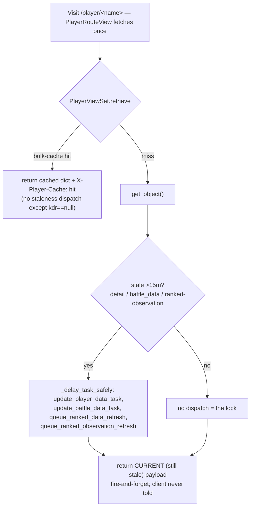

# Runbook: visit-based live-update + 15-min cooldown UI

_Created: 2026-05-27_
_Context: Players want the player page to "live update" on visit. On landing on a player not refreshed in >15 min, the page should show a **Loading** affordance to the LEFT of the Share button, pull fresh **randoms + ranked** stats, and rehydrate; when done it shows **"Next update: <n> minutes"** counting 15→0. A visit during the cooldown must NOT trigger a refresh (anti-spam lock). This runbook documents current behavior, the gap, and a phased, file-referenced implementation design._
_Status: **PLANNED** (2026-05-27). Analysis + design complete; no application code changed yet — implementation is a separately-authorized follow-up._

## Key finding

**The backend cooldown + visit-refresh machinery already exists and already prevents spam.** The
15-min windows, the visit-triggered refresh of randoms + ranked, and the dedup/lock are all enforced
server-side today. The feature is mostly **surfacing that state to the client**:

1. two response headers on `/api/player/<name>/` (a pending flag + a next-refresh anchor),
2. a **poll-to-rehydrate** loop on the player route (modeled on the existing `BattleHistoryCard`
   pending-poll), and
3. two **UI affordances** next to the Share button (a "Loading" pill and a "Next update: N min" countdown).

No new throttling/locking is required — only exposing and consuming existing state, plus one small
uniformity fix on the cache-hit path.

## Current behavior (verified in code)

- **15-min windows already defined:** `PLAYER_DETAIL_STALE_AFTER`, `PLAYER_BATTLE_DATA_STALE_AFTER`,
  `PLAYER_ACTIVITY_DATA_STALE_AFTER` (`server/warships/data.py:114-116`) and
  `RANKED_OBSERVATION_RENDER_STALE_AFTER` (`data.py:274`) are all `timedelta(minutes=15)`. Helpers:
  `player_detail_needs_refresh` (`data.py:149`), `player_battle_data_needs_refresh` (`:156`),
  `_ranked_observation_is_stale` (`:277`).
- **Visit-based refresh already dispatched:** `PlayerViewSet.get_object` (`views.py:197-333`) enqueues
  randoms (`update_battle_data_task`) and ranked (`queue_ranked_data_refresh`) when stale;
  `fetch_player_summary` (`data.py:2098-2161`) does the same plus `queue_ranked_observation_refresh`.
- **The 15-min lock already exists, two ways:** (1) the `*_needs_refresh()` staleness gates mean a second
  visit inside 15 min enqueues nothing; (2) dispatch-dedup `cache.add` keys
  (`RANKED_OBSERVATION_REFRESH_DISPATCH_TIMEOUT = 15*60`, `tasks.py:39`; 60-s dedup in
  `_delay_task_safely`). Spamming is already prevented.
- **Pending-signal + poll precedent already exists — but only for ranked battle-history:** `battle_history`
  sets `X-Ranked-Observation-Pending: true` (`views.py:1213`) via `is_ranked_observation_refresh_pending`
  (`tasks.py:374`); `BattleHistoryCard` polls on that header (`client/app/components/BattleHistoryCard.tsx:459-508`).
  `sharedJsonFetch` already supports reading response headers + cache-busting `cacheKey`
  (`client/app/lib/sharedJsonFetch.ts:11-12,52-94`).

## The gap (what's missing for the requested feature)

1. **No "Loading" / "Next update" UI** anywhere near the Share button (`PlayerDetail.tsx:424-439`). The
   page renders cached data immediately with no sign a refresh is in flight or when the next is allowed.
2. **`/api/player/<name>/` exposes no freshness signal.** Unlike `battle_history`, `PlayerViewSet.retrieve`
   emits only `X-Player-Cache` (`views.py:171,175`). The client can't tell whether a visit triggered a
   refresh, nor compute the cooldown.
3. **No rehydration of the main profile.** `PlayerRouteView` (`PlayerRouteView.tsx:38-70`) fetches the
   player payload exactly once; the header summary cards read straight from that prop, so even after the
   background task completes the user sees stale numbers until a manual reload. The chart tabs
   (`PlayerDetailInsightsTabs`, fetch by `playerId`, cacheKeys like `tier-type:${playerId}:0:0` at
   `PlayerDetailInsightsTabs.tsx:180`) and `BattleHistoryCard` likewise don't re-fetch.
4. **No countdown.** Nothing surfaces `last_fetch + 15min`. `useIntervalRefresh.ts` exists and is a
   suitable 1-s tick building block.
5. **Cache-hit path skips visit-refresh.** `retrieve()`'s bulk-cache branch (`views.py:144-176`) returns
   early without the staleness dispatch, so for bulk-cached/hot players a visit wouldn't trigger the
   feature uniformly.

## Next steps (phased implementation design — not built in this runbook)

### Phase 1 — Backend: expose cooldown + pending on the player-detail response
Add two headers to **both** branches of `PlayerViewSet.retrieve` (`views.py:144-176`) via a small shared
helper `_player_refresh_signals(player_id, realm) -> (pending: bool, next_refresh_epoch: int)`:
- `X-Player-Refresh-Pending: true|false` — true when core/battle/ranked payloads are stale (>15 min),
  i.e. a visit-triggered refresh is in flight or warranted. Reuse `player_detail_needs_refresh` +
  `player_battle_data_needs_refresh` (+ `_ranked_observation_is_stale` when ranked capture is enabled for
  the realm). Stays `true` until the async task bumps the timestamps → clean "still loading" signal that
  flips to `false` on a later poll.
- `X-Player-Next-Refresh: <epoch_seconds>` = `max(last_fetch, battles_updated_at[, observed_at]) + 15min`,
  read with a cheap `.values(...)`.
- **Uniformity fix (gap #5):** on the cache-hit branch, add the same staleness-gated randoms+ranked
  dispatch (guarded by the existing `*_needs_refresh` checks so the lock still holds). Leave
  `get_object`'s richer miss-path dispatch unchanged.
- Tests (`server/warships/tests/test_views.py`): headers present on hit + miss; `pending=true` when
  stale; `false` + correct next-refresh when fresh; a second visit inside 15 min enqueues no task (lock).
  Update the API-contract doc per doctrine rule 5.

### Phase 2 — Frontend: capture signal, poll-to-rehydrate, countdown
- `PlayerRouteView.tsx:46-49`: pass `responseHeaders: ['X-Player-Refresh-Pending','X-Player-Next-Refresh']`
  to `fetchSharedJson`; lift `playerData` + the two header values into state so the poll can update them.
- New hook `client/app/components/usePlayerLiveRefresh.ts` (poll loop modeled on
  `BattleHistoryCard.tsx:459-508`; countdown tick via `useIntervalRefresh.ts`):
  - **phase = loading** while pending: poll `/api/player/<name>/` ~every 5 s with a cache-busting
    `cacheKey` (e.g. `player-live:<name>:<realm>:<attempt>`), bounded retry cap; each poll updates
    `playerData` (rehydrates header cards) and bumps a `refreshNonce`. When pending flips `false`,
    transition to cooldown using `X-Player-Next-Refresh`.
  - **phase = cooldown:** 1-s tick `secondsRemaining = nextRefreshEpoch - now` clamped ≥0; render minutes
    (`Next update: 12 min`, switching to `m:ss` under a minute). At 0, show "update available" — the
    actual next pull happens on the next visit (no auto-fire), matching the existing lock model.
- Thread `refreshNonce` `PlayerRouteView → PlayerDetail → BattleHistoryCard` (fold into its fetch
  deps/cacheKey, `BattleHistoryCard.tsx:466-472,508`) and `→ PlayerDetailInsightsTabs` (fold into chart
  cacheKeys, e.g. `tier-type:${playerId}:${refreshNonce}`, `PlayerDetailInsightsTabs.tsx:177-190`) so
  randoms + ranked surfaces re-fetch on rehydrate.

### Phase 3 — UI affordance in PlayerDetail
- In the header action row (`PlayerDetail.tsx:424-439`), render the live-refresh status as the **first
  child** (left of the Share `<button>`): a small themed pill (existing CSS vars `--accent-light`,
  `animate-pulse` for loading) — `Loading…` in phase loading, `Next update: N min` in phase cooldown.
  Driven by the hook's state. Suppress for hidden players (`PlayerDetail.tsx:460`).

### Cross-cutting (doctrine)
- Reuse, don't reinvent: the staleness helpers, dispatch-dedup keys, `fetchSharedJson`
  header/`cacheKey` support, `useIntervalRefresh`, and the BattleHistoryCard poll pattern all exist.
- Versioning: a user-facing feature is a **minor** bump; remember the mandatory client rebuild after
  `release.sh` (CLAUDE.md).

## Open questions
1. Countdown display granularity (minutes per spec vs `m:ss` under a minute) and tick cadence.
2. Should ranked **metadata** join the 15-min visit cooldown, or stay at its 1-h staleness (its dispatch
   is already 15-min deduped)?
3. Exact rehydration set (which charts/cards re-fetch when pending clears).
4. Headers vs a single JSON field on the payload for the pending + next-refresh contract.

## Verification
- **This runbook (docs only):** file follows the repo runbook header convention; code references
  reconciled against live files (done 2026-05-27 — all line refs above verified).
- **When implementation is authorized:** Phase-1 pytest list above + the lean release gate; manually:
  visit a >15-min-stale player → "Loading" left of Share → fresh randoms+ranked appear with no reload →
  flips to "Next update: 15 min" ticking down; re-visit inside the window → no dispatch (lock) + countdown
  reflects the shared server anchor.

## Critical files
- Backend: `server/warships/views.py` (144-176 retrieve, 197-333 get_object, 1213 header precedent),
  `server/warships/data.py` (114-116, 149/156/277, 274, 2098-2161), `server/warships/tasks.py` (39, 374),
  `server/warships/serializers.py` (100).
- Frontend: `client/app/components/PlayerRouteView.tsx` (38-70), `client/app/components/PlayerDetail.tsx`
  (424-439, 460), new `client/app/components/usePlayerLiveRefresh.ts`,
  `client/app/components/useIntervalRefresh.ts`, `client/app/components/BattleHistoryCard.tsx` (459-508),
  `client/app/components/PlayerDetailInsightsTabs.tsx` (177-190),
  `client/app/components/entityTypes.ts`, `client/app/lib/sharedJsonFetch.ts` (11-12,52-94).
