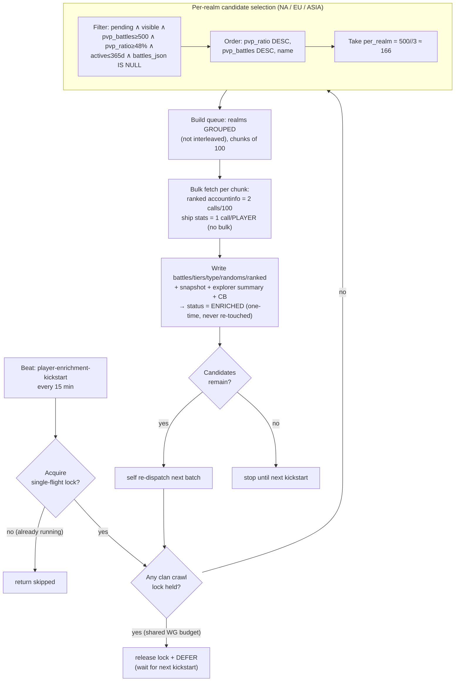
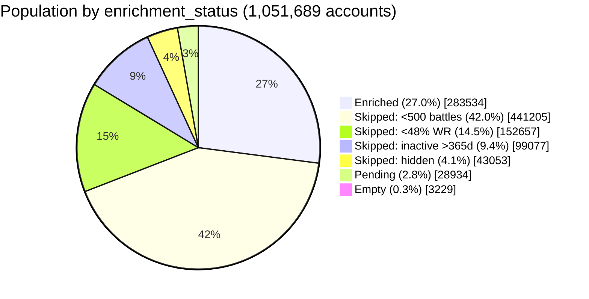

# Player Enrichment — Data-Level Map (2026-06-08)

**Author:** systems-eng/analyst pass · **Source data:** live prod query against `warships_player` (single seqscan, all 3 realms) at 2026-06-08 ~23:20 UTC · **Code refs:** `server/warships/management/commands/enrich_player_data.py`, `server/warships/tasks.py:1789` (`enrich_player_data_task`), `server/warships/signals.py:478` (`player-enrichment-kickstart`).

---

## TL;DR

- **Coverage is ~27% of all known accounts (283,534 / 1,051,689) — and that is essentially the ceiling under the current eligibility filter.**
- Enrichment is **filter-gated, not throughput-gated.** The addressable backlog (eligible + still pending) is only **2,402 players (0.23%)** — the crawler is **~99% caught up** against its own definition of "eligible."
- **70% of the population is excluded by design** (mostly the 500-battle floor: 42% of all accounts).
- Enrichment is a **one-time backfill per player**: select `PENDING ∧ battles_json IS NULL`, write data once, mark `enriched`, never re-touch. Ongoing freshness is a *different* system (`incremental_player_refresh` tiers).
- **The lever for more coverage is the filter, not crawler speed** — but lowering it converts "free" throughput into a real backlog that then hits the per-player ships/stats wall and full crawl-deferral.

---

## 1. WHO gets enriched — the eligibility filter

`_candidates()` (`enrich_player_data.py:86`) selects, **per realm**:

```
enrichment_status = 'pending'
AND is_hidden = false
AND pvp_battles      >= 500        # ENRICH_MIN_PVP_BATTLES
AND pvp_ratio        >= 48.0       # ENRICH_MIN_WR  (win-rate %)
AND days_since_last_battle <= 365  # DEFAULT_MAX_INACTIVE_DAYS
AND battles_json IS NULL
AND name <> ''
```

Intent: only **established, active, above-average, visible** accounts — the players a stats site actually features. Everything below the bar is permanently skipped (and bucketed into a `skipped_*` status by the manual `reclassify_enrichment_status` command).

## 2. ORDER — highest win-rate first

```
ORDER BY pvp_ratio DESC NULLS LAST,
         pvp_battles DESC NULLS LAST,
         name
```

Best players first, within each realm. Highest-skill / highest-volume accounts are enriched ahead of marginal ones.

## 3. WHEN — self-chaining background task, deferred under crawls

| Mechanism | Detail |
|---|---|
| Worker | Celery `background` queue (`-c 3`), never competes with user-facing tasks |
| Batch size | `ENRICH_BATCH_SIZE=500`, split **per_realm = 500 // 3 ≈ 166** per na/eu/asia |
| Realm handling | **Grouped, not interleaved** — queue built realm-by-realm, processed in chunks of 100 for bulk API. (`_interleave` helper exists but is **unused** in this path.) |
| Self-chaining | After each batch, `_maybe_redispatch_enrichment()` re-dispatches until the candidate pool is empty, then stops |
| Kickstart | Beat `player-enrichment-kickstart` every **15 min** (`ENRICH_KICKSTART_MINUTES`) re-seeds the chain; no-op if already running |
| Single-flight | Redis lock (`ENRICH_PLAYER_DATA_LOCK_TIMEOUT`, 6h TTL + heartbeat) prevents concurrent runs |
| **Crawl deferral** | **Enrichment defers entirely while ANY clan crawl holds its realm lock** (shared WG rate budget). It releases the lock and waits for the next kickstart. |
| Pacing | `ENRICH_DELAY=0.2s`; bulk fetch = 2 API calls per 100 players for ranked accountinfo... |
| ...**but** ship stats is **1 call/player** | WG `ships/stats/` is single-account-only; `_bulk_fetch_ship_stats` always falls back per-player (the docstring's "~0.02 calls/player" is wrong for ship stats — see `[[reference_wg_ships_stats_no_bulk]]`). Ranked accountinfo bulks correctly. |

> **Right now (2026-06-08 ~23:20 UTC) enrichment is DEFERRED** — an asia clan crawl holds the lock; the enrichment lock reads "none". Batch history is empty. This is the dominant control on *when* enrichment actually runs: during multi-day crawls it is paused.

## 4. Population coverage — hard numbers

Per-realm `enrichment_status` histogram (live prod, 2026-06-08):

| Realm | Total | Enriched | Enr % | Eligible-pending | Low-battles | Low-WR | Inactive | Hidden | Pending(all) | Empty |
|---|--:|--:|--:|--:|--:|--:|--:|--:|--:|--:|
| NA   | 292,371 | 76,591 | 26.2% | 779 | 137,830 | 35,030 | 23,209 | 8,726 | 10,303 | 682 |
| EU   | 493,747 | 132,243 | 26.8% | 939 | 210,830 | 72,611 | 43,358 | 22,763 | 10,761 | 1,181 |
| ASIA | 265,571 | 74,700 | 28.1% | 684 | 92,545 | 45,016 | 32,510 | 11,564 | 7,870 | 1,366 |
| **All** | **1,051,689** | **283,534** | **27.0%** | **2,402** | **441,205** | **152,657** | **99,077** | **43,053** | **28,934** | **3,229** |

*(Histogram sums exactly to the 1,051,689 total.)*

### Coverage math

| Quantity | Count | % of pop |
|---|--:|--:|
| **Enriched today** | 283,534 | **27.0%** |
| Addressable universe (enriched + eligible-pending + empty) | 289,165 | **27.5%** |
| **Caught-up ratio** (enriched ÷ [enriched + eligible-pending]) | — | **~99%** |
| Permanently excluded by filter (4 `skipped_*` buckets) | 735,992 | **70.0%** |
| ‑ of which: < 500 battles | 441,205 | 42.0% |
| ‑ of which: < 48% WR | 152,657 | 14.5% |
| ‑ of which: inactive > 365d | 99,077 | 9.4% |
| ‑ of which: hidden | 43,053 | 4.1% |
| Pending-but-ineligible (limbo) | 26,532 | 2.5% |

### Expected coverage going forward

**~27% now → ~27.5% asymptote under the current thresholds.** This is a **steady-state fraction, not a hard stop**: population grows and players cross the thresholds, so the crawler keeps finding new eligibles — the *absolute* enriched count climbs, but the *percentage* holds near 27%. **Coverage will not materially rise without changing the eligibility filter.**

> **Throughput caveat:** enrichment-crawler throughput was **not directly measured** (crawler idle under the crawl, batch-history empty). Counts of players with `battles_updated_at` in the last 24h (8,519) / 7d (26,067) are **battle-data refresh activity across ALL systems** (floor + refresh tiers + enrichment), not enrichment output — last-24h running ~3× the prior daily rate confirms a refresh burst, not enrichment. The structural conclusion (filter-gated) does not depend on the throughput figure.

---

## 5. Pipeline diagram





---

## 6. Findings & opportunities for the analyst

1. **Enrichment is caught up; coverage is filter-bound.** ~99% of eligible players are already enriched; the live backlog is 2,402. Investing in crawler *speed* buys almost nothing today.

2. **The 500-battle floor is the single biggest coverage lever** — it locks out **441,205 accounts (42% of the population)**. The 48% WR floor locks out another 152,657 (14.5%). These are deliberate "feature only good/active players" choices, not bugs.

3. **The cost side of lowering the filter (honest framing):** throughput is "free" *today only because the filter keeps the backlog at 2,402*. Drop the floor and you create a real backlog that then collides with (a) the **per-player ships/stats wall** — every newly-eligible player is ~1 dedicated WG call, no bulk amortization — and (b) **full crawl-deferral**, since enrichment yields to multi-day clan crawls. Coverage gains would be throughput-throttled and could take a long time to drain.

4. **~26,532 pending-but-ineligible players are in limbo (2.5% of pop).** They fail the filter but still carry `status='pending'`; `reclassify_enrichment_status` is a **manual command, not scheduled**, so they never auto-settle into a `skipped_*` bucket. This inflates the raw "pending" count (28,934) ~12× above the true addressable backlog (2,402) and is worth either scheduling or one-shotting for clean reporting.

5. **Realm coverage is even** (NA 26.2% / EU 26.8% / ASIA 28.1%) — no realm is starved. EU is the largest population (494K) but proportionally identical, consistent with the per-realm `batch//3` split.

### Suggested next probes (if pursuing the opportunity)
- ~~Model the realized eligible-population delta for `min_pvp_battles` 500 → {250, 100}~~ — **done, see §7.**
- ~~Model the `min_wr` 48 → {45, 0} delta~~ — **done, see §8. WR is the dominant lever.**
- Estimate drain time at the per-player ships/stats rate under crawl-coexistence, tying back to the WG-bandwidth ceiling work (~6/s avg, ~22/s peak, single shared `WG_APP_ID` across realms).
- Decide whether expanded coverage is even desirable for the product (featuring sub-48%-WR / sub-500-battle accounts) before spending the WG budget.

---

## 7. Model: lowering `min_pvp_battles` 500 → 250 → 100

Live prod query (2026-06-08, pop = 1,051,746), counting players who pass **every other eligibility filter** (`visible ∧ pvp_ratio≥48 ∧ active≤365d ∧ name<>''`) at each battle floor. WR/active/visible held fixed — only the battle floor moves.

| Floor | Eligible population (snapshot) | % of pop | Δ eligible vs 500 | New **unenriched** backlog* |
|---|--:|--:|--:|--:|
| **500** (current) | 247,533 | 23.5% | — | 9,260 |
| **250** | 269,510 | 25.6% | **+21,977** | 30,949 |
| **100** | 294,840 | 28.0% | **+47,307** | 56,003 |

\* "New unenriched backlog" = eligible-at-floor `AND status <> 'enriched'` — the players the crawler would actually have to fetch (assuming a `reclassify_enrichment_status` pass repopulates `pending`).

**Incremental band detail (passing all other filters):**

| Band | Players | % of pop | Realm split (NA / EU / ASIA) |
|---|--:|--:|---|
| 250–499 battles (unlocked by 500→250) | 21,977 | 2.1% | 5,705 / 10,159 / 6,113 |
| 100–249 battles (unlocked by 250→100) | 25,330 | 2.4% | 7,130 / 11,777 / 6,423 |
| **Cumulative 100–499 (500→100)** | **47,307** | **4.5%** | 12,835 / 21,936 / 12,536 |

### Projected coverage ceiling

Enriched is cumulative/retained (one-time backfill), so draining the new band raises the eventual enriched fraction:

| Floor | Projected enriched (≈ 283,534 + band) | Coverage |
|---|--:|--:|
| 500 | 283,534 | 27.0% |
| 250 | ~305,500 | **~29.0%** (+2.0 pts) |
| 100 | ~330,800 | **~31.5%** (+4.5 pts) |

### Findings

1. **The raw `skipped_low_battles` = 441,205 (42% of pop) massively overstates the prize.** After the WR + active + visible filters, lowering the floor all the way to 100 battles unlocks only **~47K players (4.5 pts of coverage)** — a **~9×** overlap discount. Most low-battle accounts are *also* low-WR, inactive, or barely-crawled (`core_only`, null/0 WR). **The 500-battle floor is not an independent 42% gate.**

2. **Diminishing returns.** 500→250 buys +2.1 pts for a ~22K backlog; the next step 250→100 buys only +2.4 more pts for another ~25K. Each step roughly doubles the backlog for a flat ~2-pt coverage gain.

3. **Status-drift is hiding eligible players even at today's floor.** 9,260 players pass *all* current filters but aren't enriched — yet only 2,402 are correctly labelled `pending`; the other **~6,858 are mislabelled `skipped_*`/`empty`** (came back from inactivity, or WR recovered above 48) and are **invisible to the crawler** until a `reclassify_enrichment_status` pass runs. Any floor change must be paired with a reclassify, or the new band players never enter the `pending` pool the crawler reads.

4. **Drain cost (qualitative).** Per `[[reference_wg_ships_stats_no_bulk]]`, each new player ≈ 1 dedicated WG `ships/stats` call (no bulk amortization), and enrichment defers entirely under multi-day clan crawls. A 30–56K backlog is 12–23× today's 2.4K and would drain over many crawl-gap windows rather than continuously — the binding constraint becomes crawl-deferral + the per-player ship-stats wall, not the filter. (Not directly timed; enrichment was idle during this analysis.)

---

## 8. Model: lowering `min_wr` 48 → 45 → 0

Same method, now moving the **WR floor** with **battles held ≥ 500** (apples-to-apples with §7). `min_wr=0` removes the WR filter entirely. Live prod, pop = 1,051,746.

| WR floor | Eligible population | % of pop | Δ eligible vs 48 | New **unenriched** backlog |
|---|--:|--:|--:|--:|
| **48** (current) | 247,533 | 23.5% | — | 9,260 |
| **45** | 342,511 | 32.6% | **+94,978** | 100,992 |
| **0** (no WR floor) | 407,847 | 38.8% | **+160,314** | 164,764 |

**Incremental band detail (battles≥500, active, visible):**

| Band | Players | % of pop | Realm split (NA / EU / ASIA) |
|---|--:|--:|---|
| 45–48% WR (unlocked by 48→45) | 94,978 | 9.0% | 22,517 / 44,047 / 28,414 |
| < 45% WR (unlocked by 45→0) | 65,336 | 6.2% | 16,290 / 31,128 / 17,918 |
| **Cumulative < 48% (48→0)** | **160,314** | **15.2%** | 38,807 / 75,175 / 46,332 |

### Projected coverage ceiling

| WR floor | Projected enriched (≈ 283,534 + band) | Coverage |
|---|--:|--:|
| 48 | 283,534 | 27.0% |
| 45 | ~378,500 | **~36.0%** (+9.0 pts) |
| 0 | ~443,800 | **~42.2%** (+15.2 pts) |

### Findings

1. **WR is the dominant lever — ~4× the battles lever per step.** Relaxing WR by just **3 points (48→45) unlocks +94,978 players (+9.0 coverage pts)** — more than *double* what lowering the battle floor all the way to 100 achieves (+47K / +4.5 pts). The 14.5% `skipped_low_wr` bucket converts far more efficiently than the 42% `skipped_low_battles` bucket, because low-WR players are still **high-battle and active** — they pass every other filter.

2. **WoW win-rate is tightly packed just below the floor.** A mere 3-point WR band (45–48%) holds 94,978 established-active players — the distribution centers right around the current cutoff, so the floor sits on the steepest part of the curve. Small WR moves = large population swings.

3. **It's a curation decision, not a throughput one.** Dropping to 45% means featuring slightly-below-average players; dropping to 0 enriches *everyone* with ≥500 battles (incl. bots/beginners at 30% WR). The 48% floor is the product's quality gate, not an accident.

4. **Even the most aggressive single lever caps at ~42%.** WR→0 with battles≥500 reaches only ~42% coverage; the rest of the population is genuinely low-battle, inactive (>365d), or hidden. Breaking past ~45–50% would require relaxing the **active-365d** or **hidden** filters too.

### Lever comparison (single-lever, other filters fixed)

| Change | +Eligible | +Coverage | New backlog | Who it adds |
|---|--:|--:|--:|---|
| `min_pvp_battles` 500→250 | +21,977 | +2.1 pts | ~31K | mid-tier grinders |
| `min_pvp_battles` 500→100 | +47,307 | +4.5 pts | ~56K | casual / newer |
| **`min_wr` 48→45** | **+94,978** | **+9.0 pts** | ~101K | slightly-below-avg |
| **`min_wr` 48→0** | **+160,314** | **+15.2 pts** | ~165K | everyone (incl. bots) |

> **Joint-lever caveat:** §7 and §8 each hold the *other* filter fixed (battles model assumes WR≥48; WR model assumes battles≥500). The bands therefore **do not overlap**, and the quadrant {battles<500 **and** WR<48} is counted by *neither*. Lowering both floors together unlocks that extra cell **on top of** the sum of the two single-lever gains — so a combined relaxation needs a proper 2-D model (**§9**), and its real gain is *larger* than naively adding these rows.

---

## 9. Joint 2-D model: battles × WR

Full cross-product, holding `active≤365d ∧ visible ∧ named` fixed. Cumulative thresholds (≥). Live prod, pop = 1,051,746. The top-left cell `(≥500, ≥48)` is the **current production filter**.

### 9a. Eligible population (all statuses) — count / % of pop

| battles ↓ \ WR → | **≥48** | **≥45** | **≥0** (none) |
|---|--:|--:|--:|
| **≥500** (current) | **247,533** / 23.5% | 342,510 / 32.6% | 407,846 / 38.8% |
| **≥250** | 269,510 / 25.6% | 380,021 / 36.1% | 469,087 / 44.6% |
| **≥100** | 294,840 / 28.0% | 418,119 / 39.8% | **533,901 / 50.8%** |

### 9b. New unenriched backlog to drain (status ≠ enriched; assumes a `reclassify` pass)

| battles ↓ \ WR → | **≥48** | **≥45** | **≥0** |
|---|--:|--:|--:|
| **≥500** (current) | **9,260** | 100,991 | 164,763 |
| **≥250** | 30,949 | 138,015 | 225,205 |
| **≥100** | 56,003 | 175,677 | **289,259** |

### 9c. Projected coverage ceiling (≈ 283,534 retained-enriched + backlog, ÷ pop)

| battles ↓ \ WR → | **≥48** | **≥45** | **≥0** |
|---|--:|--:|--:|
| **≥500** (current) | **27.8%** | 36.6% | 42.6% |
| **≥250** | 29.9% | 40.1% | 48.4% |
| **≥100** | 32.3% | 43.7% | **54.5%** |

*(9c uses the unenriched-backlog basis + a reclassify pass; it supersedes the rougher all-status estimates in §7/§8 by ~0.5–1 pt.)*

### The joint quadrant the single-lever models missed

Going from the current corner all the way to `(≥100, ≥0)`:

| Path | Eligible added |
|---|--:|
| Battles lever alone (500→100, WR≥48) | +47,307 |
| WR lever alone (48→0, battles≥500) | +160,313 |
| **Naive sum** | +207,620 |
| **Actual joint addition** (corner → (100,0)) | **+286,368** |
| **⇒ Interaction quadrant {battles<500 ∧ WR<48}** | **+78,748 (7.5% of pop)** |

By inclusion–exclusion, the `{100–499 battles ∧ 0–48% WR}` cell holds **78,748** players that *neither* §7 nor §8 saw — so the two single-lever analyses **under**-count a combined relaxation by ~38%.

### Findings

1. **WR dominates both axes.** Moving across a row (relaxing WR) always buys far more than moving down a column (relaxing battles). The single biggest one-step move from the current corner is `48→45` WR (+94,977), ~2× the entire `500→100` battles column.

2. **The corner `(≥100, ≥0)` is the practical max ≈ 50.8% eligible / ~54.5% coverage** — but at a **289K backlog** (~120× today's 2,402, ~31× the 9,260 latent). At the per-player `ships/stats` rate under crawl-deferral, that is a multi-week-to-month drain, and it means enriching the entire active mid-core including sub-40% accounts.

3. **A balanced middle option exists.** `(≥250, ≥45)` → **36.1% eligible, ~40% coverage, 138K backlog** captures most of the WR upside while keeping a light battle/quality floor — a defensible "broaden coverage without enriching bots" setting if the product wants more depth.

4. **Backlog scales ~linearly with reach, coverage sub-linearly.** The bottom-right is 31× the backlog of the top-left for only ~2× the coverage — the WG-budget cost rises much faster than the coverage payoff once you leave the high-WR core.

### Recommendation framing (not a decision)

The lever ranking is unambiguous: **WR > battles** for coverage per unit backlog. If the goal is *modest, safe* depth, `min_wr 48→45` alone (stay at battles≥500) is the highest-ROI single move (+9 pts for ~101K). If the goal is *maximum* reach, `(≥100, ≥0)` roughly doubles coverage but turns enrichment into a sustained months-long crawl-gated backfill and abandons quality curation. Any move must ship with a scheduled `reclassify_enrichment_status` (today it is manual) or the newly-eligible never enter the `pending` pool the crawler reads.

---

## 10. "Can we catch up?" + the chosen target: ≥500 battles, ≥46% WR

### What "99% caught up" actually means

At the **current** filter (`≥500 battles, ≥48% WR, active≤365d, visible`) the crawler is genuinely caught up: only **2,402 eligible-pending** remain and that residual is continuously drained — newly-eligible players churn in, the crawler clears them.

**But "the population we monitor" ≠ the enrichable population.** We track ~1.05 M accounts; enrichment *by design* only ever targets the eligible subset (~27% today). It will **never** reach 100% of the monitored 1.05 M, because ~70% is permanently filtered out (low-battle / low-WR / inactive / hidden). So "caught up" always means **caught up against whatever eligibility line you draw** — not against the full monitored population. Lowering the line just defines a new, larger target and creates a one-time backfill to reach it.

### The ≥500 battles, ≥46% WR target (live prod)

| Metric | Value |
|---|--:|
| Eligible population (`≥500 ∧ ≥46% ∧ active ∧ visible`) | **314,834** (29.9% of pop) |
| Already enriched within it | 240,897 |
| **Caught-up at the 46% line** | **76.5%** |
| **One-time backlog to drain** (status≠enriched) | **73,937** |
| ‑ of which the new 46–48% band | 64,677 |
| ‑ of which latent ≥48% (already eligible, mislabelled) | 9,260 |
| Crawler-visible `pending` *right now* (no reclassify yet) | 3,978 |
| Increment vs current 48% floor | +67,301 eligible (+6.4 pts of pop) |
| **Projected coverage after full drain** | (283,534 + 73,937) ÷ pop = **~34.0%** (+7 pts vs today's 27%) |

**Answer:** Yes — we can absolutely catch up at the 46% line. It's a **one-time ~74K backfill**, after which steady-state inflow is small and the crawler stays caught up exactly as it does today at 48%. The 46% floor is a mild relaxation (76.5% of the target is already done) — far cheaper than the 45% or lower options in §8–§9.

### Drain-time estimate (order-of-magnitude — read the caveat)

> **Caveat (now confirmed by logs):** pure enrichment throughput could not be measured **because the crawler has had nothing to do** — the last enrichment pass that found real work was **2026-06-05 02:55**; every pass since returns `enriched:0, candidates:~0` in ~2s (direct confirmation of "99% caught up" at the 48% filter). The `background` worker's ongoing **~500–1,250/hr (~12–16K/day)** "all battle stats" fetches are therefore **the battle-observation floor, not enrichment** (the floor is crawl-coexist and never defers; enrichment found 0 candidates yet the markers continue). So that figure is the floor's draw, *not* an enrichment rate.

What the logs *do* establish: the `background` queue (`-c 3`) runs at ~0.18 expensive-fetch/s against a multi-fetch/s capacity — **large headroom**. So the **sole real gate** on draining a 46% backlog is **crawl-deferral** (enrichment yields entirely to multi-day clan crawls; the floor does not), plus the per-player `ships/stats` wall (no bulk). A **74K** one-time backlog realistically drains over **~1–3 calendar weeks** — limited by how much crawl-free window enrichment gets, not by raw queue capacity. Compressible by (a) a one-shot partitioned `enrich_player_data --num-partitions N` manual backfill that doesn't wait on the self-chaining task, (b) the planned WG token-bucket limiter letting enrichment + crawl coexist instead of hard-deferring, or (c) temporarily widening enrichment's crawl-free share.

### To execute the 46% target

1. Set `ENRICH_MIN_WR=46.0` (env on the background worker).
2. **Run `reclassify_enrichment_status`** — without it, only 3,978 of the 73,937 are visible to the crawler (the rest sit mislabelled as `skipped_low_wr`). This is mandatory, and today it is a **manual, unscheduled** command.
3. (Optional) kick a partitioned manual backfill to drain the 74K faster than the self-chaining task will between crawls.
4. Steady-state: keep a periodic reclassify so WR-recovered / returning players keep entering `pending`.

---

## 11. Evaluation: is "the crawler has nothing to do" real, or a design artifact?

**Claim under test:** *"'Nothing to do' isn't strictly true — games happen continuously while we fetch the last batch; the idle state is an artifact of inefficient design (it isn't chaining runs), not lack of input."*

**Verdict: the conclusion is largely right — "nothing to do" overstates it and there is input the design fails to surface — but the named mechanism (chaining) is not the cause.** Three real causes, verified against code + prod logs.

### 1. Chaining works uncontended; it's *deferral* that's stopped it
`enrich_player_data_task` self-chains via `_maybe_redispatch_enrichment()`. Proof it works: 2026-06-05 02:54–02:55 logs show it re-dispatching every ~10s, re-querying candidates each pass. **But for the last ~3 days it genuinely has *not* chained** — it hits an active clan crawl, releases the lock, and no-ops on the 15-min Beat kickstart. So the observation "it isn't chaining" is accurate *for the current state*; the cause is **crawl-deferral + backfill-only scope**, not a chaining defect.

### 2. Scope: enrichment is one-time backfill — new games are a *different* pipeline
Confirmed by code trace: once `enrichment_status='enriched'`, **no production path re-enriches a player** (only manual `reclassify` can flip it back). So "games happened while fetching" produces **refresh** work (new stats for already-known players), which by design routes to **(a)** the battle-observation floor — the ~12–16K/day expensive fetches measured in §10, running continuously and crawl-coexist — and **(b)** `incremental_player_refresh`. That input is **not dropped**; it's handled by the refresh arm. The claim conflates enrichment (backfill) with refresh (freshness); they're separate pipelines.

### 3. Where the claim is *correct* — genuine input the design hides
- **No scheduled reclassify.** ≥6,858 players pass *every* eligibility filter right now but are mislabelled `skipped_*`/`empty`, so they're invisible to the crawler (it reads only `status='pending'`). The crawler "sees" 2,402 of its ≥9,260 currently-eligible backlog — **blind to ~74% of its own ready work.** `reclassify_enrichment_status` is manual-only. This is a design artifact hiding input — exactly the thesis.
- **Threshold-crossing detection is bounded *and* crawl-gated.** A non-enriched player grinding 400→600 battles is surfaced only when their stored `pvp_battles` is refreshed. But the floor updates `last_battle_date` only — **not `pvp_battles`/`pvp_ratio`** — so it can't surface a crossing. Only `incremental_player_refresh` re-fetches battle counts, and it's capped at ~500 active/run hourly (~12K/day) against a **318,488-player active pool ⇒ ~26-day nominal refresh cycle**, and it **also defers under crawls** (watched it skip at 02:05). Right now **13,419 active, unenriched players sit at 350–499 stored battles** — a visible queue of imminent crossers whose detection lags weeks.
- **The 9,260 figure is a lower bound.** It's computed from *stored* battle counts; anyone who has actually crossed 500 in-game but whose stored count is stale is excluded from the number *and* invisible to the crawler. The true "input we're sitting on" is larger and uncountable from a snapshot.

### Sharpest validation of the intuition
During multi-day clan crawls, **both enrichment and its eligibility feeder (`incremental_player_refresh`) pause** — only the floor runs, and the floor doesn't refresh battle counts. So threshold-crossers genuinely **accumulate undetected exactly when crawls run** (most of the time). That is not lack of input; it's the design stalling detection.

### Bottom line
"Nothing to do" should have read: *"nothing in its **visible** queue, because (a) it's backfill-only so new games route to the floor/refresh arm, (b) no scheduled reclassify hides ~6,858+ already-eligible players, and (c) crawl-deferral pauses both enrichment and its feeder."* The fix levers are a **scheduled `reclassify`** + **decoupling enrichment/feeder from hard crawl-deferral** (the planned WG token-bucket limiter enables coexistence) — **not** the chaining loop, which works.

---

## 12. Smoking gun: we are missing elite players *inside the current criteria*

Triggered by an operator spot-check (clicking `Cynicalz`/NA and seeing stale data refresh on visit). The empirical claim — *"the crawler can't be 'done' if it hasn't enriched a 62%-WR / ~10k-battle player; we're missing players before we even discuss expanding criteria"* — is **confirmed**.

### The `Cynicalz` case is refresh-lag, not a miss
`Cynicalz`/NA is **already `enriched`** (50.2% WR, 3,763 battles, `battles_json` populated). Its `last_fetch` was ~8h stale (2026-06-08 18:04) when visited; the visit triggered on-demand catch-up of stale battle/activity tracking. So that specific example is the **refresh/observation-lag** problem (§10–§11), not missing enrichment. But it prompted the right question.

### The real finding: 1,152 elite players pass the current filter but aren't enriched
Players with **stored** `≥500 battles, ≥48% WR, active≤365d, visible` but `status≠enriched`, by WR band: **≥60%: 1,152**, 55–60%: 1,521, 50–55%: 3,155. And **755 players with ≥55% WR *and* ≥8,000 battles are unenriched.** Concrete, clickable examples (all currently `is_hidden=false`):

| Name | Realm | Battles | WR | Stuck status |
|---|---|--:|--:|---|
| Toyama_Nao | eu | 12,241 | 75.2% | skipped_hidden |
| FratStar4Life | na | 18,267 | 72.0% | skipped_hidden |
| LostAllHopeXDXD | eu | 25,279 | 68.8% | skipped_hidden |
| petapateras | eu | 8,794 | 68.9% | **empty** |
| GoddessPraiSaNee | asia | 21,791 | 66.3% | skipped_hidden |

### Root cause: players unavailable at fetch time are *permanently parked*
Status breakdown of the 1,152 elite misses: **`empty` = 985 (85%)**, `skipped_hidden` = 59, `skipped_low_battles` = 55, `pending` = 53. Both dominant buckets trace to the same defect — **a player who was private/unavailable when the crawler hit them is parked forever:**
- Hidden at fetch → `is_hidden=True` → **`skipped_hidden`**; or WG `ships/stats` returns no ships (privacy / transient) → `battles_json=[]` → **`empty`**.
- They later go public (`is_hidden` *is* refreshed to false by clan-crawl / incremental-refresh), **but `enrichment_status` and `battles_json` are never re-evaluated.** A 75%-WR / 12k-battle account with `battles_json=[]` is almost certainly a stale privacy/transient artifact, not reality.

### The reclassify gap — and why `empty` is the harder half
`reclassify_enrichment_status` (still manual/unscheduled) **rescues `skipped_*` drift**: those rows have `battles_json IS NULL`, so it re-routes the un-hid / threshold-crossing players back to `pending` (lines 73–112). **But it does *not* rescue `empty`:** its first rule is `battles_json == [] → empty` (line 70), so the 985 elite empties stay `empty`. They're *also* excluded from `_candidates` (which requires `battles_json IS NULL`, not `[]`). **⇒ 85% of the elite misses are invisible to *both* the crawler and a reclassify pass.** Fixing them needs a distinct op: **null `battles_json` for high-battle `empty` rows so they re-enter the candidate pool** (targeted at the `high pvp_battles + empty ships` mismatch signature, which is precisely the transient/privacy false-negative), plus ideally a retry policy so transient `ships/stats` failures aren't recorded as permanent `empty`.

### Verdict on "definition of done"
**The operator is right: the crawl's definition of done is wrong.** "99% caught up / 2,402 pending" measures only the **visible** queue. It is blind to (a) 985 elite `empty` false-negatives, (b) `skipped_hidden`/`skipped_low_battles` drift, and (c) anything needing a reclassify that never runs. **We are missing 1,000+ of the highest-WR players on the platform *under the current criteria* — this is a correctness bug, and it should be fixed before any criteria expansion (§7–§10) is even worth discussing.**

### Fix priority (independent of any threshold change)
1. **Retry the `empty` false-negatives** — null `battles_json` for `empty` rows with `pvp_battles ≥ 500`, let the crawler re-fetch; add transient-vs-genuine handling so privacy/transient `ships/stats` misses don't re-park. Command written: `retry_empty_enrichments` (dry-run default, `--apply` to write). **Measured backlog (2026-06-08 dry-run):** 3,221 empties with ≥500 battles (asia 1,363 / eu 1,180 / na 678), **99% now visible** (only 29 still hidden), and the WR distribution is the smoking gun — **≥60%: 1,319 · 55–60%: 1,107 · 50–55%: 754 · 48–50%: 40 · 45–48%: 1 · <45%: 0**. The bucket is almost entirely elite players (75% ≥55% WR) who were *private at fetch time*, now public. **Re-queue set (visible + active + WR≥48): 2,691** — a cheap, bounded re-fetch (~hours of crawler work) that directly recovers the missing elites.
2. **Schedule `reclassify_enrichment_status`** — rescues the `skipped_hidden` un-hid drift + threshold-crossers (and keeps doing so).
3. **Decouple enrichment from hard crawl-deferral** so the freshly-surfaced backlog actually drains (today it's paused under multi-day crawls).

### Executed 2026-06-09 (commands: `retry_empty_enrichments`, `enrichment_lift_report`)

Re-queued 2,691 visible+active+WR≥48 empties (`retry_empty_enrichments --apply`), paused the clan crawl, drained the full eligible backlog with 3 parallel partitioned `enrich_player_data` runs (pending 5,093→4, 0 WG 407s), restored the crawl.

**Leaderboard outcome — null on the headline top-25** (recomputed landing Best, clean before/after): **0 new entrants** in any realm's `wr`/`overall` top-25.

**Broader lift** (`enrichment_lift_report --since 2026-06-09T03:10`): **5,680 profiles recovered to complete**, **5,674 high-tier rankable**, **3,037 newly Landing-Best board-eligible** (`>2500 battles ∧ ht≥50 ∧ active≤180d` — up from 0). But only **15** clear the live ~73% high-tier-WR top-25 bar, and the high-tier WR distribution is **84% (4,742) <60%**, 858 at 60–65%, just 31 ≥70%. **Conclusion:** the cohort is genuinely strong but upper-*middle* at high tier — career 60–75% WR collapses to ~55–60% at T5–10, far below the 73%+ ultra-elite top-25. The fix's value is **profile/coverage recovery (~5.7K complete profiles, ~3K back in the candidate pool)**, not the visible leaderboards. Commands are read-only by default; `retry_empty_enrichments` requires `--apply` to write.

### SHIPPED 2026-06-09 (durable) — fix #1 automated; fix #2 stays supervised

Fix **#1 (retry empties)** is now automatic: daily DB-only `enrichment_pool_maintenance_task`
(`enrichment-pool-maintenance`, 08:17 UTC) runs `retry_empty_enrichments --apply
--retry-after-days 14`. It is index-backed (`enrichment_status`) and issues no WG calls, so
it's cheap and **coexists with crawls** (no deferral). The blocker that made scheduling it
unsafe — an **unbounded re-fetch loop** on genuinely-empty rows — is closed by a
**convergence guard**: the new `--retry-after-days N` flag gates on `battles_updated_at`
(bumped on every empty write), so a stuck `empty` is re-fetched at most once per N days
while accounts that went public still converge to `enriched`. Kill switch
`ENRICHMENT_POOL_MAINTENANCE_ENABLED`.

Fix **#2 (drift rescue)** is now automated too — as an **incremental** reclassify, after
prod sizing showed the *full* `reclassify_enrichment_status` is **na 879s / eu 639s / asia
668s ≈ 36 min** (a one-time ~230K-row backlog, not daily drift). Shipped: migration 0067
adds `player_last_fetch_idx`, and the daily task runs per-realm
`reclassify_enrichment_status --recent-hours 25` — recomputing only rows fetched in the last
25h. Drift-relevant fields only change on a WG re-fetch (which bumps `last_fetch`), so the
recent set holds every newly-drifted row; `EXPLAIN` confirms the index is used (BitmapAnd
with the realm/battles index) → **~2.5 min/realm under crawl load**. Crucially, the daily
active-snapshot engine refreshes core stats (`is_hidden`/`pvp_battles`/`pvp_ratio`) +
`last_fetch` on every active player daily, so **active threshold-crossers / un-hid / WR
recoveries self-clear** within a sweep+reclassify cycle.

The **full** reclassify (no `--recent-hours`) stays a **supervised manual op**, now needed
only for: the one-time ~230K pre-existing backlog (~47K eligible rescues + ~71K enriched
corrections), and pure-calendar inactivity crossings (no re-fetch → not in the recent
window). Full runbook + procedures:
`agents/runbooks/runbook-enrichment-pool-maintenance-2026-06-09.md`.

**Still open:** (a) the one-time ~230K reclassify backlog clear (supervised; surfaces ~47K
eligible players); (b) a periodic supervised full reclassify for calendar drift; (c) **fix
#3** — decouple enrichment's WG-fetch arm from hard crawl-deferral (WG token-bucket
limiter), the larger throughput change.
